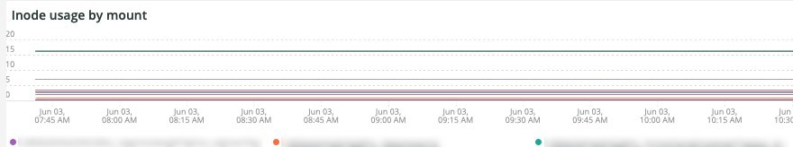
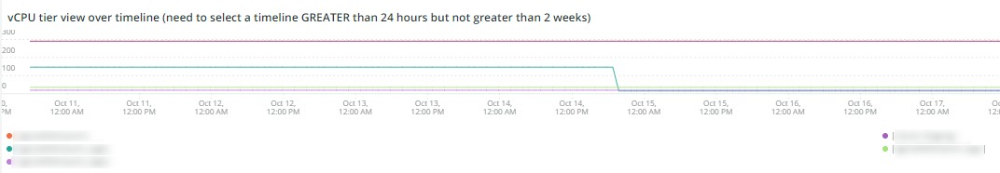
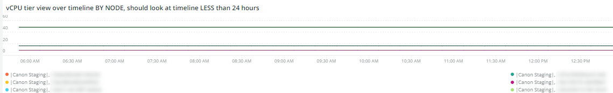

# Die Registerkarte [!DNL Infra]

Auf der Registerkarte **[!DNL Infra]** werden Probleme und Ursachen für Infrastrukturprobleme isoliert. Im Folgenden werden die Frames beschrieben, die Sie auf der Registerkarte sehen können.

## [!UICONTROL Service Alerts – Infrastructure Alerts by Application name]

Das **[!UICONTROL Service Alerts – Infrastructure Alerts by Application name]** Diagramm zeigt die Service-Warnhinweise an, die vom [!DNL New Relic] Infrastructure Agent erfasst wurden. Dadurch werden Dienstneustarts angezeigt, von denen viele mit Bereitstellungen verbunden sind.

## [!UICONTROL Inode usage by mount]

Der **[!UICONTROL Inode usage by mount]** zeigt [!DNL inode] Nutzung nach Bereitstellung über den ausgewählten Zeitraum hinweg an. Auch wenn möglicherweise genügend freier Speicher vorhanden ist, zeigt ein Knoten, dessen [!DNL inodes] erschöpft ist, einen Mangel an verfügbarem Speicher an. Durch das Entfernen von Dateien (insbesondere kleinen Dateien) wird Speicherplatz freigegeben und [!DNL inodes] verfügbar gemacht.

## [!UICONTROL vCPU tier view over timeline GREATER 2 weeks]

Der **[!UICONTROL vCPU tier view over timeline GREATER 2 weeks]** zeigt die vCPU-Stufenansicht für den ausgewählten Zeitraum von mehr als zwei Wochen an. In diesem Frame wird die Anzahl der vCPUs angezeigt, die dem angezeigten [!DNL New Relic] zugewiesen wurden.

## [!UICONTROL vCPU tier view over timeline]

Der **[!UICONTROL vCPU tier view over timeline]** zeigt die vCPU-Stufenansicht für den ausgewählten Zeitraum von mehr als 24 Stunden an. In diesem Frame wird die Anzahl der vCPUs angezeigt, die dem angezeigten [!DNL New Relic] zugewiesen wurden. Es zeigt sowohl Upsizes als auch Downsizes von Clustern an.

## [!UICONTROL vCPU tier view over timeline BY NODE]

Der **[!UICONTROL vCPU tier view over timeline BY NODE]** zeigt die vCPU-Stufenansichten über den ausgewählten Zeitrahmen nach Knoten an. Dieser Frame ist hilfreich, wenn Sie Verlust von Knoten erkennen oder wenn Knoten vergrößert oder verkleinert werden. Die vCPU-Stufenansicht über die Zeitleiste nach Knoten, sollte die Zeitleiste in weniger als 24 Stunden betrachten.

## [!UICONTROL Instance details]

Die **[!UICONTROL Instance details]** Tabelle zeigt Instanzdetails der einzelnen [!DNL New Relic] an.

## [!UICONTROL Logging, if there is a broken line for a node, it indicates non-responsive node during that time period]

Der **[!UICONTROL Logging, if there is a broken line for a node, it indicates non-responsive node during that time period]** zeigt nicht responsive Knoten über einen Zeitraum an.
