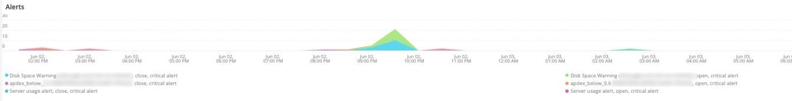
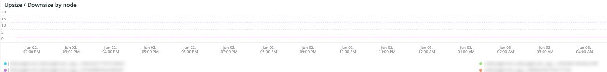

# Die Registerkarte [!DNL QuickView]

Auf der Registerkarte **[!UICONTROL QuickView]** werden die verschiedenen Warnhinweistypen erläutert, einschließlich derjenigen mit geringem Festplattenspeicher und geringer Server-Auslastung. Weiter werden die Rahmen der Registerkarte beschrieben.

## [!UICONTROL Alerts]

Der **[!UICONTROL Alerts]** zeigt verschiedene Warnhinweise an, einschließlich Warnhinweisen zu Festplattenspeicher und Server-Nutzung während eines ausgewählten Zeitraums. Dieser Frame untersucht Datenbanktabellenvorgänge einschließlich `SELECT`, `DELETE` und `UPDATE` über einen ausgewählten Zeitraum.

## [!UICONTROL Upsize / Downsize by node]

Der **[!UICONTROL Upsize / Downsize by node]** zeigt die Vergrößerungen und Verkleinerungen nach Knoten für einen ausgewählten Zeitraum an. Dies wird verwendet, um zu bewerten, ob es eine Änderung der Cluster-Größe während des ausgewählten Zeitraums gab.

## [!UICONTROL CPU Utilization]

Der **[!UICONTROL CPU Utilization]** zeigt die CPU-Auslastung nach Knoten im ausgewählten Zeitraum an.
