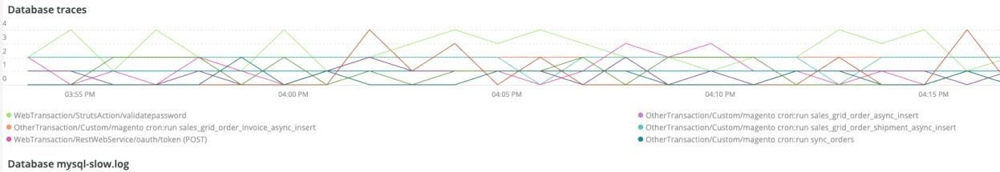

# Die [!UICONTROL PHP] tab

Die **PHP** -Tab zeigt PHP-Prozess-Probleme, um eine tiefere Analyse der PHP-Probleme zu ermöglichen.

## [!UICONTROL PHP active process details]

Die **[!UICONTROL PHP active process details]** frame zeigt die PHP-Prozesse, einschließlich php-fpm, über den ausgewählten Zeitraum hinweg an.

## [!UICONTROL PHP process load (# of PHP processes and % of CPU load)]

Die **[!UICONTROL PHP process load (# of PHP processes and % of CPU load)]** frame zeigt die CPU-Last von PHP-FPM-Prozessen über den ausgewählten Zeitrahmen hinweg an.

## [!UICONTROL PHP Memory detail]

Die **[!UICONTROL PHP Memory detail]** frame zeigt die Speichernutzung von PHP-Prozessen während des ausgewählten Zeitrahmens an.

## [!UICONTROL PHP CPU Utilization]

Die **[!UICONTROL PHP CPU Utilization]** frame zeigt die CPU-prozentuale Auslastung von PHP-Prozessen über den ausgewählten Zeitrahmen.

## [!UICONTROL PHP Process states]

Die **[!UICONTROL PHP Process states]** frame zeigt den PHP-Prozessstatus über den ausgewählten Zeitrahmen hinweg an. Es wird angezeigt, wenn PHP-Prozesse beendet und neu gestartet werden. Vorsicht vor beendeten PHP-Prozessen, die keine Neustarts anzeigen.

* &#39;%NOTICE: Terminating ...%&#39;) as &#39;php_term&#39;
* &#39;% HINWEIS: Beenden, Auf Wiedersehen!%&#39;) als &#39;php_exit&#39;
* &#39;% NOTICE: fpm is running, pid%&#39;) as &#39;fpm_start&#39;
* &#39;%NOTICE: ready to handle connections%&#39;) as &#39;php_ready&#39;

## [!UICONTROL PHP Errors]

Die **[!UICONTROL PHP Errors]** frame zeigt die Anzahl der PHP Worker-Fehler im ausgewählten Zeitraum an. Zu den Fehlermeldungen, die analysiert und angezeigt werden, gehören:

* &#39;%worker_connections are not genug%&#39;) as &#39;worker&#39;
* &#39;%PHP Fatal error: Allowed memory size!%&quot;) als &quot;mem_size&quot;
* &#39;%exited on signal 11 (SIGSEGV)%&#39;) as &#39;sig_11&#39;
* &#39;%exited on signal 7 (SIGBUS)%&#39;) as &#39;sig_7&#39;
* &#39;%increase pm.start_servers%&#39;) as &#39;pmstart_serv&#39;
* &#39;%max_children%&#39;) als &#39;max_children_cnt&#39;
* &#39;%PHP Fatal error: Allowed memory size of%&#39;) as &#39;mem_exhst_coun&#39;
* &#39;%Arbeitsspeicher für pool%&#39;) nicht als &#39;opc_mem_count&#39; zuordnen
* &#39;%Warning Interne Zeichenfolge Pufferüberlauf%&#39;) als &#39;opc_str_buf&#39;
* &#39;%Illegal string offsetl%&#39;) as &#39;opc_sv_comments&#39;
* &#39;%PHP Fatal error: Uncaught RedisException: read error on connection%&#39;) as &#39;php_exc&#39;

## [!UICONTROL PHP processes count]

Die **[!UICONTROL PHP processes count]** frame zeigt eine Anzahl von PHP-Prozessen über den ausgewählten Zeitraum hinweg an.

## [!UICONTROL Database Errors]

Die **[!UICONTROL Database Errors]** -Frame zeigt Datenbankfehler über den ausgewählten Zeitraum hinweg an. Zu den geparsten Fehlern gehören:

* &#39;%Speichergröße, die für die temporäre Tabelle zugewiesen wird, ist mehr als 20% von innodb_buffer_pool_size%&#39;) als &#39;temp_tbl_buff_pool&#39;
* &#39;%\[ERROR\] WSREP: rbr write fail%&#39;) as &#39;rbr_write_fail&#39;
* &#39;%mysqld: Disk full%&#39;) as &#39;disk_full&#39;
* &#39;%Fehlernummer 28%&#39;) als &#39;err_28&#39;
* &#39;%Rollback%&#39;) als &#39;Rollback&#39;
* &#39;%Fremdschlüsseleinschränkung schlägt für table% fehl&#39;) als &#39;Fremdschlüssel-Einschränkung&#39;
* &#39;%Error_code: 114%&#39;) as &#39;sql_1114_full&#39;
* &#39;%CRITICAL: SQLSTATE[HY000] [2006] MySQL Server ist weg%&#39;) als &#39;sql_away&#39;
* &#39;%SQLSTATE[HY000] [1040] Zu viele Verbindungen%&#39;) als &#39;sql_1040&#39;
* &#39;%CRITICAL: SQLSTATE[HY000] [2002]%&#39;) als &#39;sql_2002&#39;
* &#39;%SQLSTATE[08S01]:%&#39;) als &#39;sql_1047&#39;
* &#39;%[Warnung] Verbindung abgebrochen%&#39;) als &#39;aborted_conn&#39;
* &#39;%SQLSTATE[23000]: Verletzung der Integrationsbeschränkung:%&#39;) als &#39;sql_23000&#39;
* &#39;%1205 Lock wait timeout%&#39;) als &#39;sql_1205&#39;
* &#39;%SQLSTATE[HY000] [1049] Unbekannte Datenbank%&#39;) als &#39;sql_1049&#39;
* &#39;%SQLSTATE[42S02]: Basistabelle oder -ansicht nicht gefunden:%&#39;) als &#39;sql_42S02&#39;
* &#39;%Allgemeiner Fehler: 114%&#39;) als &#39;sql_1114&#39;
* &#39;%SQLSTATE[40001]%&#39;) als &#39;sql_1213&#39;
* &#39;%SQLSTATE[42S22]: Spalte nicht gefunden: 1054 Unbekannte Spalte%&#39;) als &#39;sq1_1054&#39;
* &#39;%SQLSTATE[42000]: Syntaxfehler oder Zugriffsverletzung:%&#39;) als &#39;sql_42000&#39;
* &#39;%SQLSTATE[21000]: Kardinalitätsverletzung:%&quot;) als &#39;sql_1241&#39;
* &#39;%SQLSTATE[2003]:%&#39;) als &#39;sql_2003&#39;
* &#39;%SQLSTATE[HY000] [9000] Client mit IP-Adresse%&#39;) als &#39;sql_9000&#39;
* &#39;%SQLSTATE[HY000]: Allgemeiner Fehler: 2014%&quot;) als &quot;sql_2014&quot;
* &#39;%1927 Connection was kill%&#39;) as &#39;sql_1927&#39;
* &#39;%1062 \[ERROR\] InnoDB:%&#39;) as &#39;sql_1062_e&#39;
* &#39;%[Hinweis] WSREP: Speicherzuordnung auf Festplatte leeren..%&#39;) als &quot;mem_map_flush&quot;.
* &#39;%Interner MariaDB-Fehlercode: 1146%&#39;) als &#39;sql_1146&#39;
* &#39;%Interner MariaDB-Fehlercode: 1062%&#39;) als &#39;sql_1062&#39; * &#39;%1062&#39; [Warnung] InnoDB:%&#39;) als &#39;sql_1062_w&#39;
* &#39;%Interner MariaDB-Fehlercode: 1064%&#39;) als &#39;sql_1064&#39;
* &#39;%InnoDB: Assertion failure in file%&#39;) as &#39;assertion_err&#39;
* &#39;%mysqld_safe Anzahl der jetzt ausgeführten Prozesse: 0%&#39;) als &#39;mysql_oom&#39;
* &#39;%\[ERROR\] mysqld hat signal%&#39;) as &#39;mysql_sigterm&#39;
* &#39;%1452 Cannot add%&#39;) as &#39;sql_1452&#39;
* &#39;%ERROR 1698%&#39;) als &#39;sql_1698&#39;
* &#39;%SQLSTATE[HY000]: Allgemeiner Fehler: 3%&#39;) als &#39;cnt_wrt_tmp&#39;
* &#39;%Allgemeiner Fehler: 1 %&#39;) als &#39;sql_syntax&#39;
* &#39;%42S22%&#39;) als &#39;sql_42S22&#39;
* &#39;%InnoDB: Error (Duplicate key)%&#39;) as &#39;innodb_dup_key&#39;

## [!UICONTROL Database traces]

Die **[!UICONTROL Database traces]** frame zeigt Informationen zur Datenbankverfolgung an. Dieser Rahmen wird mit der APM-Transaktionszusammenfassungsansicht für die ausgewählte Timeline abgestimmt.

## [!UICONTROL Database mysql-slow.log]

Die **[!UICONTROL Database mysql-slow.log]** frame zeigt die Typen der Abfrageanweisungen an, die sich im `mysql-slow.log` -Datei über den ausgewählten Zeitrahmen hinweg.
