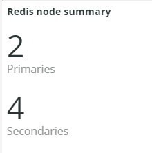
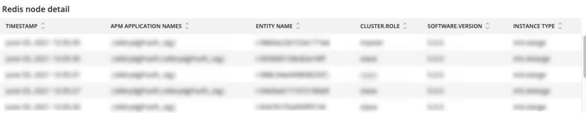
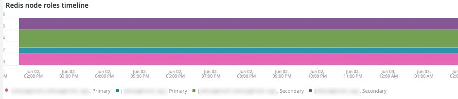
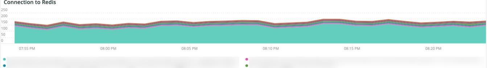
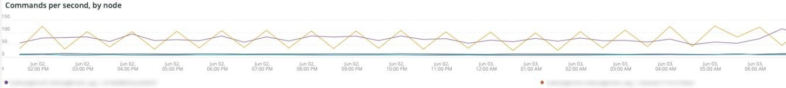
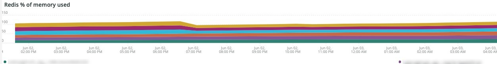
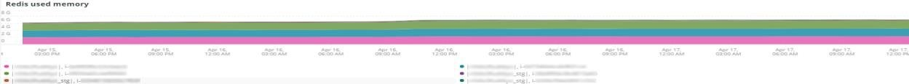
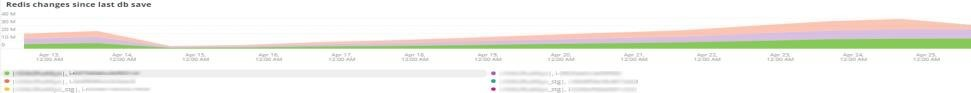
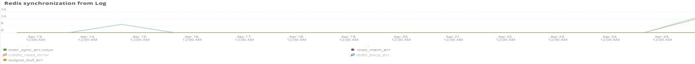

# Die Registerkarte [!DNL Redis]

## [!UICONTROL Redis Node summary]

Die **[!UICONTROL Redis Node summary]** umfasst alle Knoten in einer Umgebung. Das obige Beispiel enthält die Knoten für das gemeinsame Staging. Es gibt eine primäre und zwei sekundäre Instanz in der Produktion sowie eine primäre und zwei sekundäre Instanz in der Staging-Umgebung.

## [!UICONTROL Redis node detail]

Der **[!UICONTROL Redis node detail]** Frame gibt die Umgebung, die [!DNL Redis], die Softwareversion und die Knotengröße an.

## [!UICONTROL Redis node roles timeline]

Der **[!UICONTROL Redis node roles timeline]** zeigt den Verlust [!DNL Redis] Dienstes in bestimmten Rollen an. Wenn eine Linie tiefer wird, zeigt dies an, dass die bestimmte Rolle, die die Linie darstellt, einen oder mehrere Knoten verloren hat.

## [!UICONTROL Connection to Redis]

Der **[!UICONTROL Connection to Redis]** zeigt den Wert net.connecteclients aus den [!DNL New Relic Redis] Beispieldaten an. Es zeigt die Anzahl der Verbindungen nach Anwendung (Umgebung) und Knoten [!DNL New Relic].

## [!UICONTROL Commands per second by node]

Im **[!UICONTROL Commands per second by node]** werden die [!DNL Redis] Befehle nach Knoten pro Sekunde im ausgewählten Zeitraum angezeigt.

## [!UICONTROL Redis % of memory used]

Der **[!UICONTROL Redis % of memory used]** zeigt den Prozentsatz des maximalen Speichers an, der von den [!DNL Redis]-Servern verwendet wird.

## [!UICONTROL Redis used memory]

Der **[!UICONTROL Redis used memory]** zeigt die Knotenauslastung des Speichers in GB/MB an.

## [!UICONTROL Redis changes since last db save]

[!DNL Redis] ist ein speicherresidenter Benutzer und speichert die Informationen im Speicher. Der **[!UICONTROL Redis changes since last db save]** zeigt die Anzahl der Speicheränderungen an, die seit dem letzten Speichern der Datenbank vorgenommen wurden. Unter [Redis-Persistenz](https://redis.io/docs/latest/operate/oss_and_stack/management/persistence/) finden Sie weitere Erläuterungen zur [!DNL Redis's].

## [!UICONTROL Redis synchronization from Log]

Der **[!UICONTROL Redis synchronization from Log]**-Frame konzentriert sich auf die Fehler, die bei [!DNL Redis] Synchronisierung auftreten, oder auf Fehler, die aufgrund von Synchronisierungsproblemen auftreten. Weitere Informationen zu [!DNL Redis] finden Sie unter [[!DNL Redis] Dokumentation](https://redis.io/docs/).
