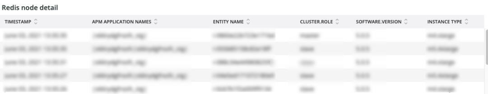

# Die [!DNL Redis] tab

## [!UICONTROL Redis Node summary]

Die **[!UICONTROL Redis Node summary]** umfasst alle Knoten in einer Umgebung. Das obige Beispiel enthält die Knoten für freigegebene Staging. Es gibt eine primäre und zwei sekundäre Produktions- sowie eine primäre und zwei sekundäre Staging-Aktivitäten.

## [!UICONTROL Redis node detail]

Die **[!UICONTROL Redis node detail]** frame die Umgebung angibt, [!DNL Redis] Rolle, Softwareversion und Knotengröße.

## [!UICONTROL Redis node roles timeline]

Die **[!UICONTROL Redis node roles timeline]** Frame zeigt den Verlust von [!DNL Redis] -Dienst in bestimmten Rollen. Wenn eine Zeile sinkt, zeigt dies an, dass die bestimmte Rolle, die die Zeile darstellt, einen oder mehrere Knoten verloren hat.

## [!UICONTROL Connection to Redis]

Die **[!UICONTROL Connection to Redis]** frame zeigt den Wert net.linkedClients aus der [!DNL New Relic Redis] Beispieldaten. Er zeigt die Anzahl der Verbindungen nach [!DNL New Relic] application (environment) und node.

## [!UICONTROL Commands per second by node]

Die **[!UICONTROL Commands per second by node]** -Frame zeigt die [!DNL Redis] -Befehle nach Knoten pro Sekunde über den ausgewählten Zeitraum hinweg.

## [!UICONTROL Redis % of memory used]

Die **[!UICONTROL Redis % of memory used]** frame zeigt den Prozentsatz des maximalen Arbeitsspeichers an, der vom [!DNL Redis] Server.

## [!UICONTROL Redis used memory]

Die **[!UICONTROL Redis used memory]** frame zeigt die Knotennutzung des Speichers in GB/MB an.

## [!UICONTROL Redis changes since last db save]

[!DNL Redis] ist speicherspeicherresidenz und speichert die Informationen für die Speicherung. Die **[!UICONTROL Redis changes since last db save]** frame gibt die Anzahl der Speicheränderungen an, die seit dem Speichern der letzten Datenbank vorgenommen wurden. Siehe Abschnitt [Redis persistence](https://redis.io/docs/manual/persistence/) Weitere Informationen zu [!DNL Redis's] Persistenz.

## [!UICONTROL Redis synchronization from Log]

Die **[!UICONTROL Redis synchronization from Log]** frame konzentriert sich auf Fehler, die während [!DNL Redis] Synchronisation oder Fehler, die aufgrund von Synchronisierungsproblemen auftreten. Weitere Informationen unter [!DNL Redis], siehe [[!DNL Redis] Dokumentation](https://redis.io/docs/).
