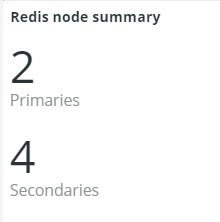

# Registerkarte [!DNL Redis]

## [!UICONTROL Redis Node summary]

Die **[!UICONTROL Redis Node summary]** umfasst alle Knoten in einer Umgebung. Das obige Beispiel enthält die Knoten für freigegebene Staging. Es gibt eine primäre und zwei sekundäre Produktions- sowie eine primäre und zwei sekundäre Staging-Aktivitäten.

## [!UICONTROL Redis node detail]

Der Frame **[!UICONTROL Redis node detail]** gibt die Umgebung, die Rolle [!DNL Redis], die Softwareversion und die Knotengröße an.

## [!UICONTROL Redis node roles timeline]

Der Frame **[!UICONTROL Redis node roles timeline]** zeigt den Verlust des [!DNL Redis] -Dienstes in bestimmten Rollen an. Wenn eine Zeile sinkt, zeigt dies an, dass die bestimmte Rolle, die die Zeile darstellt, einen oder mehrere Knoten verloren hat.

## [!UICONTROL Connection to Redis]

Der Frame **[!UICONTROL Connection to Redis]** zeigt den Wert net.linkedClients aus den Beispieldaten [!DNL New Relic Redis] an. Es zeigt die Anzahl der Verbindungen nach [!DNL New Relic] Anwendung (Umgebung) und Knoten an.

## [!UICONTROL Commands per second by node]

Der Frame **[!UICONTROL Commands per second by node]** zeigt die Befehle [!DNL Redis] pro Knoten und Sekunde über den ausgewählten Zeitraum an.

## [!UICONTROL Redis % of memory used]

Der Frame **[!UICONTROL Redis % of memory used]** zeigt den Prozentsatz des maximalen Arbeitsspeichers an, der von den [!DNL Redis] -Servern verwendet wird.

## [!UICONTROL Redis used memory]

Der Frame **[!UICONTROL Redis used memory]** zeigt die Knotennutzung des Speichers in GB/MB.

## [!UICONTROL Redis changes since last db save]

[!DNL Redis] ist ein speicherresidenter Wert und speichert die Informationen für den Speicher. Der Frame **[!UICONTROL Redis changes since last db save]** gibt die Anzahl der Speicheränderungen an, die seit dem Speichern der letzten Datenbank vorgenommen wurden. Weitere Informationen zur Persistenz von [!DNL Redis's] finden Sie unter [Redis persistence](https://redis.io/docs/latest/operate/oss_and_stack/management/persistence/) .

## [!UICONTROL Redis synchronization from Log]

Der Frame **[!UICONTROL Redis synchronization from Log]** konzentriert sich auf die Fehler, die bei der Synchronisierung von [!DNL Redis] aufgetreten sind, oder Fehler, die aufgrund von Synchronisierungsproblemen auftreten. Weitere Informationen zu [!DNL Redis] finden Sie in der [[!DNL Redis] Dokumentation](https://redis.io/docs/).
