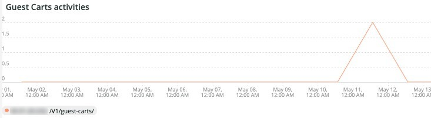

# Die Registerkarte [!UICONTROL Security]

Auf der Registerkarte **[!UICONTROL Security]** werden Sicherheitsprobleme erläutert und deren potenzielle Ursachen isoliert. Weiterhin werden die Rahmen der Registerkarte beschrieben.

## [!UICONTROL API calls by IP, details by URL]

Der **[!UICONTROL API calls by IP, details by URL]** zeigt eine Reihe von API-Aufrufen nach IP für einen ausgewählten Zeitraum an. In diesem Frame werden die IP-Adresse und die API-URL angezeigt, auf die von dieser IP-Adresse zugegriffen wurde.

## [!UICONTROL Forgot Password]

Der **[!UICONTROL Forgot Password]**-Zugriffsrahmen zeigt die Anzahl der Versuche mit vergessenen Passwörtern über einen ausgewählten Zeitraum an. Eine hohe Aktivität gegen eine IP-Adresse kann ein Angriff auf die Website sein.

## [!UICONTROL Create Account access]

Der **[!UICONTROL Create Account access]** zeigt die Anzahl der neuen Kontoaktivitäten über einen ausgewählten Zeitraum an. Eine hohe Aktivität einer einzelnen IP-Adresse kann auf einen Angriff hinweisen.

## [!UICONTROL POST activities]

Der **[!UICONTROL POST activities]** zeigt die `POST` Aktivitäten für die Site an, die aus den `client_ip`-Protokollen [!DNL Fastly] werden. Außerdem wird die URL angezeigt, auf die über die IP-Adresse zugegriffen wird.

## [!UICONTROL POST activities summary table]

Der **[!UICONTROL POST activities summary table]** zeigt die zusammengefassten `POST` Aktivitäten für die Site an, die aus den `client_ip`-Protokollen [!DNL Fastly] werden. Außerdem wird die Anzahl der URLs angezeigt, auf die über die IP-Adresse zugegriffen wird. Die Anzahl gilt für den ausgewählten Zeitraum.

## [!UICONTROL POST activities details table]

Im **[!UICONTROL POST activities details table]** werden die `POST` Aktivitäten für die Site aus den [!DNL Fastly]-Protokollen angezeigt. Außerdem werden alle Details aus dem [!DNL Fastly] für diese Anfragen angezeigt. Sie ist auf die letzten 2.000 Anfragen beschränkt.

## [!UICONTROL Guest Carts activities]

Der **[!UICONTROL Guest Carts activities]** zeigt die Anzahl der Aktivitäten des Gästekorbs innerhalb eines ausgewählten Zeitraums an, facettiert nach IP-Adresse und aufgerufener URL. Gästekarren können bei einem Kardierangriff verwendet werden. Dieser Rahmen zeigt die Gesamtzahl der Anfragen, bei denen auf die URLs der Gästekarten zugegriffen wird.

## [!UICONTROL API – forgot password, create account by Countries]

Der **[!UICONTROL API – forgot password, create account by Countries]** zeigt die Anzahl der erstellten Konten und Anfragen zum Zurücksetzen eines vergessenen Kennworts über einen ausgewählten Zeitraum an. Es ist facettiert, um auch das Ursprungsland des Antrags zu zeigen. Dieser Rahmen konzentriert sich auf das Ursprungsland des Antrags.

## [!UICONTROL API - forgot password, create account by Countries and IP address]

Der **[!UICONTROL API - forgot password, create account by Countries and IP address]** zeigt die Anzahl der erstellten Konten und Anfragen zum Zurücksetzen eines vergessenen Kennworts über einen ausgewählten Zeitraum an. Es ist facettiert, um auch die IP-Adresse, die aufgerufene URL und das Ursprungsland der Anfrage anzuzeigen. Dieser Frame konzentriert sich auf die Anzahl der IPs.

## [!UICONTROL Guest cart activities by IP]

Der **[!UICONTROL Guest cart activities by IP]** zeigt die Aktivitäten des Gästekorbs nach IP innerhalb eines ausgewählten Zeitraums an.

## [!UICONTROL Guest cart activities by Countries]

Der **[!UICONTROL Guest cart activities by Countries]** zeigt die Aktivitäten des Gästekorbs nach Ländern über einen ausgewählten Zeitraum an.

