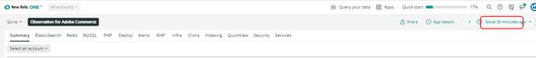

# Konto und Zeitrahmen auswählen:

Wenn Sie auf das [!UICONTROL Observation for Adobe Commerce] klicken, wird das [!DNL Observation for Adobe Commerce]-Nerdlet geöffnet.

1. Klicken Sie auf die **Konto auswählen**. Wenn die Dropdown-Liste **Konto auswählen** nicht angezeigt wird, haben Sie möglicherweise keinen Zugriff. Klicken Sie [hier](https://adobe.sharepoint.com/sites/MG/it/IT%20Services%20Wiki/Requesting%20access%20to%20Magento%20Commerce%20New%20Relic.aspx), um Zugriff anzufordern.

   

1. Sie können die project_id einfügen, die [!DNL New Relic] Kontonummer oder den Kontonamen eingeben oder die Liste der Konten durchsuchen.

   

1. Klicken Sie auf das **hellblau** (oben rechts im Nerdlet-Fenster) Dropdown-Menü mit dem Uhrensymbol.

   

1. Sie sollten die Zeit vor dem Ticketdatum und der Uhrzeit festlegen, um festzustellen, ob vorhergehende Ereignisse/Daten vorhanden sind. Sie können die voreingestellten Zeitrahmen auf der linken Seite verwenden oder einen benutzerdefinierten Zeitrahmen festlegen, indem Sie **Benutzerdefiniert festlegen** auswählen.
