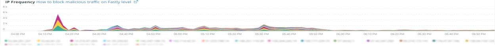

# Die [!UICONTROL Summary] tab

Die [!UICONTROL Summary] Tab von [!DNL Observation for Adobe Commerce] ist dazu gedacht, schnell einige der Probleme zu sehen, die von Sites auftreten, um Ihnen zu helfen, potenzielle Ursachen für Site-Probleme automatisch zu beheben oder zu identifizieren. Die zusätzlichen Registerkarten bieten tiefere Informationen zu Komponentendiensten, Datenbank, Infrastruktur und Prozessstatus.

## [!UICONTROL Transaction Overview]

### [Was ist eine Transaktion?](https://docs.newrelic.com/docs/apm/transactions/intro-transactions/transactions-new-relic-apm/#:%7E:text=transactions%20are%20reported.-,What%20is%20a%20transaction%3F,work%20in%20a%20software%20application.&amp;text=For%20APM%2C%20it%20will%20oft,wenn%20the%20response%20is%20sent)

&quot;At [!DNL New Relic], wird eine Transaktion als eine logische Arbeitseinheit in einer Software-Anwendung definiert. Konkret bezieht er sich auf die Funktionsaufrufe und Methodenaufrufe, aus denen diese Arbeitseinheit besteht. Dies bezieht sich häufig auf eine Webtransaktion, die eine Aktivität darstellt, die von dem Zeitpunkt an erfolgt, zu dem die Anwendung eine Webanfrage erhält, wenn die Antwort gesendet wird.&quot;

### Arten von Transaktionen:

**Web:** Webtransaktionen werden mit einer HTTP-Anfrage initiiert. Für die meisten Unternehmen stellen diese kundenorientierte Interaktionen dar und sind daher die wichtigsten zu überwachenden Transaktionen.

**Nicht Web:** Nicht-Web-Transaktionen werden nicht mit einer Webanfrage initiiert. Sie können Prozesse außerhalb des Webworkers, Hintergrundprozesse, Skripte, Nachrichtenwarteschlangenaktivitäten und andere Aufgaben umfassen.

Wenn Sie sich die **[!UICONTROL Transaction Overview]** obigen Bild waren fast 53.000 Transaktionen mit einem durchschnittlichen APDEX-Wert von 0,76 und 95 % dieser Transaktionen erfolgten in weniger als 2,313 Sekunden. Dies wäre ein Zeitraum, in dem ein engerer Zeitrahmen Abweichungen von diesem aktuellen Durchschnitt anzeigen kann, wenn innerhalb eines kurzen Zeitrahmens ein APDEX-Treffer vorliegt.

## [!UICONTROL 404 page errors frame]

Die **[!UICONTROL 404 page errors]** frame listet die [URI](https://en.wikipedia.org/wiki/Uniform_Resource_Identifier) und die Anzahl von 404 Seitenfehlern für einen ausgewählten Zeitraum.

## [!UICONTROL % of Storage Free frame]

Die **[!UICONTROL % of Storage Free]** frame zeigt den durchschnittlichen prozentualen Anteil an freien Speicherbergen auf allen Knoten Ihres Clusters an. Wenn Sie beispielsweise über einen Cluster mit drei Knoten verfügen, zeigt der Frame den \&lt;mount point=&quot;&quot;>, \&lt;environment name=&quot;&quot;>. Dieser Frame kann trügerisch sein, wenn eine Abweichung zwischen drei Knoten besteht. Ein Beispiel für eine Varianz wäre, wenn die Variable `/data/mysql` Der Bereitstellungspunkt &quot;frei&quot;war ein anderer Wert im Cluster mit drei Knoten. Unter dem [!UICONTROL MySQL] Registerkarte, die die Einhängepunkte nach Knotennamen facettiert, um genauer zu sehen, was die `/data/mysql` Speicher frei auf jedem Knoten tatsächlich ist.

## [!UICONTROL % of system memory that is free frame]

Die **% des freien Systemspeichers** frame zeigt nach Knoten die Menge an Systemspeicher an, die auf jedem Knoten frei ist.

## [!UICONTROL Swap memory free in bytes]

Die **[!UICONTROL Swap memory free in bytes]** frame zeigt nach Knoten die Menge des auf dem Knoten freien SWAP-Speichers an.

## [!UICONTROL CPU % by host]

Das Aggregat aller Umgebungen und Knoten wird im **[!UICONTROL CPU % by host]** Rahmen. Sie sollten die Auswahl der Nicht-Produktionsumgebungen aufheben. Beachten Sie auch alle Fälle, in denen nicht alle Knoten für die Produktionsumgebung vorhanden sind. Weitere Tipps zur hohen CPU-Auslastung finden Sie unter [Fehlerbehebung bei der Leistung mit New Relic on Adobe Commerce](https://experienceleague.adobe.com/docs/commerce-knowledge-base/kb/troubleshooting/miscellaneous/troubleshoot-performance-using-new-relic-on-magento-commerce.html).

## [!UICONTROL Alerts during timeframe]

Die **[!UICONTROL Alerts during timeframe]** zeigt alle Warnhinweise an, einschließlich der [!UICONTROL Managed Alerts] vom Adobe Commerce-Support hinzugefügt.

## [!UICONTROL CPU Usage]

Wenn die Variable **[!UICONTROL CPU Usage]** Rahmen leer ist, ist dies ein Hinweis darauf, dass die Infrastrukturanwendung [!DNL New Relic] nicht aktiviert ist. Wenn sich Ihre Site auf Starter befindet, werden diese Informationen nicht angezeigt. Wenn Ihre Site auf Pro basiert, öffnen Sie eine [Support-Ticket](https://experienceleague.corp.adobe.com/docs/commerce-knowledge-base/kb/help-center-guide/magento-help-center-user-guide.html?lang=en) müssen [!DNL New Relic Infrastructure] aktiviert für Ihre Site.

## [!UICONTROL Average Response Time]

Die **[!UICONTROL Average Response Time]** -Diagramm zeigt die durchschnittliche Reaktionszeit für Transaktionen (Web und andere).

## [!UICONTROL Long duration cron_schedule updates]

Die **[!UICONTROL cron_schedule]** -Tabelle wird am Anfang und Ende von Cron-Aufträgen geschrieben. Cron-Aufträge mit langer Dauer könnten auf eine Wartezeit beim Aktualisieren dieser Tabelle hinweisen, was auf ein Cron-Stackup oder auf ein Problem bei der Planung von Crons hinweisen kann.

## [!UICONTROL Response Code]

Die **[!UICONTROL Response Code]** frame ist ein guter Indikator für Web-Traffic und den Antwort-Code von Anfragen. Es ist [!DNL New Relic's] Transaktionsdaten, und sie werden von der `httpResponseCode` zurückgegeben.

## [!UICONTROL Web Traffic volume compared with one week ago Magento Managed Alerts Information]

Dieser Frame zeigt das vergleichende Web-Traffic-Volumen der letzten und der aktuellen Woche an.

## [!UICONTROL Deployment Log Entries]

Die **[!UICONTROL Deployment Log Entries]** frame zeigt die Anzahl der Implementierungs- und Cloud-Protokolleinträge an und facettiert die Anzahl nach dem Namen des Implementierungsprotokolls.

## [!UICONTROL Deployment State]

Die **[!UICONTROL Deployment State]** frame erfasst bestimmte Bereitstellungsphasen aus den Bereitstellungsprotokollen. Im Folgenden finden Sie einige Beispiele für Phasen, die im Protokoll und im Facettennamen gezählt werden:

**Implementierungsprotokoll-Phasen:**

* &#39;%Starting generate command%&#39;) as &#39;start_gen&#39;
* &#39;%git apply /app/vendor/magento/ece-tools/patches%&#39;) als &#39;apply_patches&#39;
* &#39;%Set flag: .static_content_deploy%&#39;) als &#39;SCD&#39;
* &#39;%NOTICE: Generieren von Befehl completed%&#39;) als &#39;gen_compl&#39;
* &#39;%NOTICE: Implementierung abgeschlossen%&#39;) als &#39;deploy_compl&#39;
* &#39;%NOTICE: Starten nach der Bereitstellung.%&#39;) als &#39;start_pdeploy&#39;
* &#39;%NOTICE: Nach der Bereitstellung ist abgeschlossen%&#39;) als &quot;pdeploy&quot;
* &#39;%deploy-complete%&#39;) als &#39;cl_deploy_compl&#39;

## [!UICONTROL IP Frequency]

Die **[!UICONTROL IP Frequency]** frame zählt die Status (&#39;MISS&#39; und &#39;PASS&#39;) für jede IP aus der [!DNL Fastly] Protokolle. Webanfragen mit diesen Status erreichen den Herkunftsserver und fügen dem Server Ladevorgänge hinzu. Er zeigt die zwanzig häufigsten Adressen in der Häufigkeit. Dieser Frame kann verwendet werden, um IP-Angriffe oder Quellen hoher Belastung auf einer Website zu erkennen.

## [!UICONTROL IP Response – top 20 URLs in duration]

Die **[!UICONTROL IP Response – top 20 URLs in duration]** Frame zeigt die URLs mit der längsten Reaktionsdauer an. Sie kann auf große Bilddateien, Seiten, API oder Seiten mit der längsten Reaktionsdauer hinweisen.

## [!UICONTROL API Calls by IP]

Die **[!UICONTROL API Calls by IP]** Frame hilft, starken Traffic anhand der APIs und IP-Adressen zu identifizieren, die Anfragen von den API-URLs stellen.

## [!UICONTROL API Calls by IP, details by URL]

Die **[!UICONTROL API Calls by IP, details by URL]** frame bietet Details zu hohem Traffic im Vergleich zu den APIs und Details zu den URLs, die die Anfragen stellen.

## [!UICONTROL IP Frequency Rate per minute]

Manchmal ist es schwierig festzustellen, welche IP-Adresse die meisten Anforderungen auf den anderen Frames hat. Die **[!UICONTROL IP Frequency Rate per minute]** frame zeigt die Rate pro Minute und IP-Adresse an.

## [!UICONTROL Potential Bots]

Die **[!UICONTROL Potential Bots]** frame betrachtet Anforderungen mit einem request_user_agent-Namen wie NULL oder &#39;%bot%&#39;. Normalerweise folgt der request_user_agent von &#39;%bot%&#39; der Richtlinieneinrichtung in `robots.txt` -Datei.

## [!UICONTROL Transaction Errors]

Die **[!UICONTROL Transaction Errors]** frame zeigt die Anzahl der Transaktionsfehler von [!DNL New Relic].

## [!UICONTROL Nginx access by node]

Die **[!UICONTROL Nginx access by node]** frame betrachtet die Anzahl der `access.log` nach Knoten. Es ist hilfreich zu sehen, ob die Last gleichmäßig verteilt ist. Es wird oft angezeigt, wenn ein Knoten fällt. Der Rahmen zeigt auch die Belastung der gesamten Site an.

## [!UICONTROL Galera Log]

[[!DNL Galera]](https://galeracluster.com/library/galera-documentation.pdf) wird für den Datenbankcluster verwendet. Dieser Rahmen konzentriert sich auf bestimmte Signale aus dem [!UICONTROL Galera] Cluster. Die Signale konzentrieren sich auf Knoten, die den Cluster aufrufen und beenden. Dies ist ein normales Verhalten zur Wahrung der Integrität der Datenbankdaten. Die Knoten werden als [!UICONTROL Galera] Änderungen am Clusterstatus.

**Liste der [!UICONTROL Galera] Statusänderungen:**

* &#39;%1047 WSREP hat den Knoten noch nicht für die Anwendung vorbereitet (use%&#39;) als &#39;node_not_prep_for_use&#39;
* &#39;%\[ERROR\] WSREP: Fehlgeschlagen aus: wsrep_sst_xtrabackup-v2%&#39;) als &#39;xtrabackup_read_fail&#39;
* &#39;%\[ERROR\] WSREP: Prozess abgeschlossen mit Fehler: wsrep_sst_xtrabackup-v2 %&#39;) als &#39;xtrabackup_compl_w_err&#39;
* &#39;%\[ERROR\] WSREP: rbr write fail%&quot;) als &quot;rbr_write_fail&quot;
* &#39;%self-leave%&#39;) als &#39;susp_node&#39;
* &#39;%member = 3/3 (join/total)%&#39;) as &#39;3of3&#39;
* &#39;%members = 2/3 (join/total)%&#39;) as &#39;2of3&#39;
* &#39;%members = 2/2%&#39;) as &#39;2of2&#39; * &#39;%members = 1/2%&#39;) as &#39;1of2&#39; * &#39;%members = 1/3%&#39;) as &#39;1of3&#39;
* &#39;%members = 1/1%&#39;) als &#39;1of1&#39;
* &#39;%\[Hinweis\] /usr/sbin/mysqld (mysqld 10.%&#39;) als &#39;sql_restart&#39;
* &#39;%Quorum: Kein Knoten mit vollständigem Status:%&#39;) als &#39;no_node_count&#39;
* &#39;%WSREP: Mitglied 0%&#39;) als &quot;mem_0&quot;
* &#39;%WSREP: Mitglied 1,0%&quot;) als &quot;mem_1&quot;
* &#39;%WSREP: Mitglied 2%&quot;) als &quot;mem2&quot;
* &#39;%WSREP: Mit Gruppe synchronisiert, bereit für Verbindungen%&#39;) als &#39;bereit&#39;
* &#39;%/usr/sbin/mysqld, Version:%&#39;) als &#39;mysql_restart_mysql.slow&#39;
* &#39;%\[Hinweis\] WSREP: Neue Cluster-Ansicht: globaler Status:%&#39;) als &#39;galera_cluster_view_chng&#39;

Diese Signale können auf Speicher-, Speicher- oder Abfrageprobleme hinweisen, wenn sich der Status häufig ändert.

## [!UICONTROL Database errors]

**Liste der erkannten Datenbankfehler oder -meldungen:**

* &#39;%Speichergröße, die für die temporäre Tabelle zugewiesen wird, ist mehr als 20% von innodb_buffer_pool_size%&#39;) als &#39;temp_tbl_buff_pool&#39;
* &#39;%\[ERROR\] WSREP: rbr write fail%&quot;) als &quot;rbr_write_fail&quot;
* &#39;%mysqld: Disk full%&#39;) als &#39;disk_full&#39;
* &#39;%Fehlernummer 28%&#39;) als &#39;err_28&#39;
* &#39;%Rollback%&#39;) als &#39;Rollback&#39;
* &#39;%Fremdschlüsseleinschränkung schlägt für table% fehl&#39;) als &#39;external_key_constraint&#39;
* &#39;%Error_code: 1114%&quot;) als &quot;sql_1114_full&quot;
* &#39;%CRITICAL: SQLSTATE\[HY000\] \[2006\] MySQL-Server ist weg%&#39;) als &#39;sql_go&#39;
* &#39;%SQLSTATE\[HY000\] \[1040\] Zu viele Verbindungen%&#39;) als &#39;sql_1040&#39;
* &#39;%CRITICAL: SQLSTATE\[HY000\] \[2002\]%&#39;) as &#39;sql_2002&#39;
* &#39;%SQLSTATE\[08S01\]:%&#39;) as &#39;sql_1047&#39;
* &#39;%\[Warnung\] Abgebrochene Verbindung%&#39;) als &#39;aborted_conn&#39;
* &#39;%SQLSTATE\[23000\]: Integrationsbeschränkungsverletzung:%&#39;) als &#39;sql_23000&#39;
* &#39;%1205 Lock wait timeout%&#39;) als &#39;sql_1205&#39;
* &#39;%SQLSTATE\[HY000\] \[1049\] Unbekannte Datenbank%&#39;) als &#39;sql_1049&#39;
* &#39;%SQLSTATE\[42S02\]: Basistabelle oder -ansicht nicht gefunden:%&#39;) als &#39;sql_42S02&#39;
* &#39;%Allgemeiner Fehler: 1114%&quot;) als &quot;sql_1114&quot;
* &#39;%SQLSTATE\[40001\]%&#39;) as &#39;sql_1213&#39;
* &#39;%SQLSTATE\[42S22\]: Spalte nicht gefunden: 1054 Unbekannte Spalte%&#39;) als &#39;sq1_1054&#39;
* &#39;%SQLSTATE\[42000\]: Syntaxfehler oder Zugriffsverletzung:%&#39;) als &#39;sql_42000&#39;
* &#39;%SQLSTATE\[21000\]: Kardinalitätsverstoß:%&#39;) als &#39;sql_1241&#39;
* &#39;%SQLSTATE\[22003\]:%&#39;) as &#39;sql_22003&#39;
* &#39;%SQLSTATE\[HY000\] \[9000\] Client mit IP-Adresse%&#39;) als &#39;sql_9000&#39;
* &#39;%SQLSTATE\[HY000\]: Allgemeiner Fehler: 2014%&quot;) als &quot;sql_2014&quot;
* &#39;%1927 Connection was kill%&#39;) as &#39;sql_1927&#39;
* &#39;%1062 \[\ERROR\] InnoDB:%&#39;) as &#39;sql_1062_e&#39;
* &#39;%\[Hinweis\] WSREP: Speicherkarte auf Festplatte leeren ...%&quot;) als &quot;mem_map_flush&quot;
* &#39;%Interner MariaDB-Fehlercode: 1146%&quot;) als &quot;sql_1146&quot;
* &#39;%Interner MariaDB-Fehlercode: 1062%&#39;) als &#39;sql_1062&#39; * &#39;%1062 \[Warning\] InnoDB:%&#39;) als &#39;sql_1062_w&#39;
* &#39;%Interner MariaDB-Fehlercode: 1064%&quot;) als &quot;sql_1064&quot;
* &#39;%InnoDB: Assertionsfehler in Datei%&quot;) als &quot;assertion_err&quot;
* &#39;%mysqld_safe Anzahl der jetzt ausgeführten Prozesse: 0%&quot;) als &quot;mysql_oom&quot;
* &#39;%\[ERROR\] mysqld hat signal%&#39;) as &#39;mysql_sigterm&#39;
* &#39;%1452 Cannot add%&#39;) as &#39;sql_1452&#39;
* &#39;%ERROR 1698%&#39;) als &#39;sql_1698&#39;
* &#39;%SQLSTATE\[HY000\]: Allgemeiner Fehler: 3%&#39;) als &#39;cnt_wrt_tmp&#39;
* &#39;%Allgemeiner Fehler: 1 %&quot;) als &quot;sql_syntax&quot;
* &#39;%42S22%&#39;) als &#39;sql_42S22&#39;
* &#39;%InnoDB: Fehler (Duplikatschlüssel)%&#39;) als &#39;innodb_dup_key&#39;

## [!UICONTROL Database traces]

Die **[!UICONTROL Database traces]** Frame betrachtet Daten aus dem [sql trace](https://docs.newrelic.com/docs/apm/transactions/transaction-traces/transaction-traces-database-queries-page/) Entität [!DNL New Relic] und gibt den Pfad der Verfolgung zurück.

## [!UICONTROL Database mysql-slow.log]

Die **[!UICONTROL Database mysql-slow.log]** frame zählt Einträge im [mysql-slow.log](https://dev.mysql.com/doc/refman/5.7/en/slow-query-log.html) nach Abfrageanforderungstyp. Es isoliert visuell die Zeitrahmen, die in der Datei mysql-slow.log (langsames Abfrageprotokoll) von Interesse sein könnten. Abfragen von Tabellen ohne Indizes oder Abfragen, die große Tabellen aktualisieren, können andere Abfragen blockieren.

## [!UICONTROL Redis synchronization from Log]

[[!DNL Redis]](https://redis.io/docs/about/) ist ein Open Source-Datenstrukturspeicher (BSD lizenziert), der als Datenbank-, Cache- und Nachrichtenbroker verwendet wird. Es kann Datenbank- und Sitzungszwischenspeicherung durchführen, sofern konfiguriert. Die **[!UICONTROL Redis synchronization from Log]** Frame konzentriert sich auf [[!DNL Redis] Synchronisierung](https://redis.io/docs/manual/replication/). Je größer die [!DNL Redis] -Datensatz, umso wahrscheinlicher ist, dass es Probleme mit der Synchronisierung gibt (mehr Daten werden synchronisiert).

**[!DNL Redis]Fehler und Meldungen:**

* &#39;%SLAVE-Synchronisation: Kein Speicherplatz auf Gerät%&#39;) als &quot;Leerzeichen&quot;
* &#39;%Server started, Redis version%&#39;) as &#39;serv_start&#39;
* &#39;%Der Server ist jetzt bereit, Verbindungen zu akzeptieren%&#39;) als &#39;bereit&#39;
* &#39;%Verbindung mit Übergeordneten verloren.%&quot;) als &quot;mstr_lost&quot;
* &#39;%+sdown sentinel%&#39;) als &#39;+sentinal&#39;
* &#39;% sdown sentinel%&#39;) als &#39;-sentinal&#39;
* &#39;%-sdown slave%&#39;) als &#39;-slave&#39;, &#39;%+sdown slave%&#39;) als &#39;+slave&#39;
* &#39;%-failover-abort-not-selected Übergeordnet mymaster%&#39;) als &#39;-failover&#39;
* &#39;%+failover-abort-not-selected Übergeordnet mymaster%&#39;) als &#39;+failover&#39;
* &#39;%Teilweise Resynchronisierung nicht möglich (kein Übergeordneter Cache)%&#39;) als &#39;part_sync_err&#39;
* &#39;%ÜBERGEORDNET abgebrochene Replikation mit Fehler: ERR Can%&#39;) als &#39;mstr_sync_err&#39;
* &#39;%Übergeordnet unterstützt PSYNC nicht oder befindet sich im Fehlerstatus%&#39;) als &#39;mstr_psync_err&#39;
* &#39;%SLAVE sync: Abgeschlossen mit success%&#39;) als &#39; slv_sync_suc&#39;
* &#39;%ÜBERGEORDNET abgebrochene Replikation mit Fehler: ERR Can%&#39;) als &#39;mstr_sync_err,coun&#39;
* &#39;%OOM command not allowed when used memory%&#39;) as &#39; max_mem_err&#39;
* &#39;%CredisException(code: 0): Lesefehler bei Verbindung%&#39;) als &#39;credis_read_error&#39;
* &#39;%Uncaught RedisException:%&#39;) as &#39;reredis_excp_err&#39;
* &#39;%psync geplant, um ASAP zur Überwindung des Ausgabepuffers% zu schließen&#39;) als &#39;output_buf_err&#39;

## [!UICONTROL PHP process states]

Wie sich PHP-Prozesse verhalten, hängt von der [Konfiguration](https://www.php.net/manual/en/install.fpm.configuration.php). Die Konfiguration ist komplex und umfasst viele Variablen und Optionen. Die **[!UICONTROL PHP process states]** frame hilft Ihnen zu verstehen, wann PHP-Prozesse beendet und neu gestartet werden.

### [!UICONTROL PHP errors]

Die **[!UICONTROL PHP errors]** frame zeigt die Anzahl von PHP-Fehlern mit Workern während des ausgewählten Zeitrahmens an. Weitere Informationen finden Sie unter [Adobe Commerce PHP-Einstellungen](../../installation/prerequisites/php-settings.md).

**PHP-Fehler und -Meldungen:**

* &#39;%worker_connections are not genug%&#39;) as &#39;worker&#39;
* &#39;%PHP Fatal error: Zulässige Speichergröße!%&quot;) als &quot;mem_size&quot;
* &#39;%exited on signal 11 (SIGSEGV)%&#39;) as &#39;sig_11&#39;
* &#39;%exited on signal 7 (SIGBUS)%&#39;) as &#39;sig_7&#39;
* &#39;%increase pm.start_servers%&#39;) as &#39;pmstart_serv&#39;
* &#39;%max_children%&#39;) als &#39;max_children_cnt&#39;
* &#39;%PHP Fatal error: Zulässige Speichergröße von%&quot;) als &quot;mem_exhst_coun&quot;
* &#39;%Arbeitsspeicher für pool%&#39;) nicht als &#39;opc_mem_count&#39; zuordnen
* &#39;%Warning Interner Zeichenfolgenpuffer overflow%&#39;) als &#39;opc_str_buf&#39;
* &#39;%Illegal string offsetl%&#39;) as &#39;opc_sv_comments&#39;
* &#39;%PHP Fatal error: Uncaught RedisException: Lesefehler bei Verbindung%&#39;) als &#39;php_exc&#39;

## [!UICONTROL PHP processes]

[PHP-FPM](https://php-fpm.org/) ist [!UICONTROL FastCGI Process Manager] verwendet von [!DNL Nginx]. Informationen zu den Systemanforderungen finden Sie unter [Den Adobe Commerce-Versionen zugeordnete PHP-Versionsanforderungen](../../installation/system-requirements.md). Die **[!UICONTROL PHP processes]** frame zeigt die Anzahl von PHP-Prozessen an, die zu einem bestimmten Zeitpunkt in der ausgewählten Timeline ausgeführt werden.

## [!UICONTROL Secondary processes]

Sekundäre Prozesse können sich auf die Antwort der Site auswirken. Die **[!UICONTROL Secondary processes]** frame zeigt einen Prozess oder Prozesse an, die der Site Last hinzufügen können. Die Datenbank verfügt in erster Linie über die am häufigsten ausgeführten Prozesse.

## [!UICONTROL Traffic vs Week Ago]

Die **[!UICONTROL Traffic vs Week Ago]** frame betrachtet den Website-Traffic (Anforderungen) von der [!DNL Fastly] Protokolle mit Cache-Status (&#39;MISS&#39;, &#39;PASS&#39;). Diese Anforderungen erhöhen die Auslastung der Herkunftsserver. Dieser Rahmen zeigt das vergleichende Web-Anforderungsvolumen der aktuellen Woche und der letzten Woche im selben Zeitraum an.

## [!UICONTROL Fastly Cache]

Die **[!UICONTROL Fastly Cache]** frame zeigt eine aggregierte Ansicht des Cache-Status von Anforderungen aus dem [!DNL Fastly] Protokolle. Wenn Sie FEHLER auswählen, wird der Prozentsatz der Fehler in den Anforderungen angezeigt. Dies erhöht sich normalerweise, wenn der Herkunftsserver nicht schnell genug auf Seitenanforderungen reagiert.

## [!UICONTROL Page Rendering]

Die **[!UICONTROL Page Rendering]** frame zeigt die durchschnittliche Seitenwiedergabedauer der aktuellen Woche aus der Seitenansichtsquelle von [!DNL New Relic] im Vergleich zur Vorwoche im selben Zeitraum.

## [!UICONTROL Page loading detail]

Die **[!UICONTROL Page loading detail]** frame beschreibt die Ladeereignisse der Seite. Sie beschreibt die Bedeutung dieser Facetten. Hier finden Sie die Abfrage, die für diesen Frame ausgeführt wird:

`SELECT percentile(timeToResponseStart, 50) AS 'first byte', percentile(firstPaint, 50) as 'First paint', percentile(firstContentfulPaint, 50) as 'First contentful paint', percentile(timeToDomContentLoadedEventEnd, 50) AS 'DOM content loaded', percentile(duration, 50) AS 'Window load + AJAX' FROM BrowserInteraction TIMESERIES`

## [!UICONTROL Transactions – Avg, Max, Min]

Die Transaktionsdauer beträgt in Sekunden. Abhängig von der Transaktion kann es sich auf andere Transaktionen auswirken, wenn diese langfristig laufen. Die unter Name und Dauer aufgelisteten Transaktionen beziehen sich auf den jeweiligen Zeitraum. Wenn es einen kurzen Zeitrahmen für das Problem gibt, ändern Sie die Größe der [!DNL Observation for Adobe Commerce] Datums-/Uhrzeitauswahl auf diesen engen Zeitrahmen fest.

## [!UICONTROL Admin Activities]

Die **[!UICONTROL Admin Activities]** frame identifiziert Transaktionen mit einem Admin-Benutzer.

## [!UICONTROL Order transactions (default?)]

Die **[!UICONTROL Order transactions (default?)]** frame sucht nach Transaktionen `request.headers.host` aus Transaktionen, wobei der Name = `WebTransaction/Action/checkout/onepage/success`. Wenn die Erfolgs-URL der Bestellung unterschiedlich ist, enthält dieser Frame keine Daten.

## [!UICONTROL Elasticsearch Index information]

**[Elasticsearch-Status:](https://www.elastic.co/guide/en/elasticsearch/reference/current/cluster-health.html)**

* Grün: Alle Shards werden zugewiesen.
* Gelb: Alle primären Shards werden zugewiesen, aber eine oder mehrere Replikatshards werden nicht zugewiesen. Wenn ein Knoten im Cluster fehlschlägt, sind einige Daten möglicherweise nicht verfügbar, bis dieser Knoten repariert wurde.
* Rot: Die Zuweisung von einem oder mehreren primären Shards wird aufgehoben, sodass einige Daten nicht verfügbar sind. Dies kann beim Starten des Clusters kurz auftreten, da primäre Shards zugewiesen sind.

## [!UICONTROL Elasticsearch Errors]

**[!DNL Elasticsearch]errors:**

* &#39;%alle Shards failed%&#39; als &#39;all_shards_failed&#39;
* &#39;%NoNodesAvailableException%&#39; as &#39;no_alive_nodes&#39;
* &#39;%PHP Fatal error: Uncaught Error: Falsche Parameter für Elasticsearch% als &#39;falscher_param&#39;
* &#39;%Sie können dieses Problem beheben, indem Sie den Elasticsearch-Dienst in Ihrer Magento Cloud-Infrastruktur auf Version%&#39; als &#39;ver_err&#39; aktualisieren.
* &#39;%Cluster-Gesundheitsstatus geändert von \[YELLOW\] in \[RED\] (Grund:%&#39; als &#39;yel_red&#39;)
* &#39;%Kein Speicherplatz auf Gerät%&#39; als &#39;no_space&#39;
* &#39;% Failed to execute [SearchRequest{searchType=%&#39; as &#39;failed_query&#39;

## [!UICONTROL Cron view]

Die **[!UICONTROL Cron view]** frame betrachtet das Cron-Log auf einen Ausgleich zwischen der Anzahl der gestarteten Kronen und der Anzahl der fertiggestellten Kronen.

## [!UICONTROL Cron error]

**Cron-Fehler von cron.log:**

* &#39;%_stg%&#39; als &#39;stg_crons&#39;
* &#39;%Sperre für Cron-Auftrag konnte nicht erworben werden%&#39; als &#39;cron_lock&#39;
* &#39;%Allgemeiner Fehler: MySQL Server 2006 ist weg%&#39; als &#39;mysql_has_away_away&#39;
* &#39;%error%&#39; as &#39;error&#39;
* &#39;%Allgemeiner Fehler: 1205 Zeitüberschreitung der Sperrwartezeit überschritten%&#39; als sql_1205_cron

## [!UICONTROL cron_schedule table updates]

Die **[!UICONTROL cron_schedule table updates]** frame untersucht die maximale Dauer in Sekunden, in denen Aktualisierungen von Datenspeichervorgängen die Tabelle cron_schedule beinhalten. Sie wird vom SQL-Anfragetyp erfasst.

## [!UICONTROL Datastore Operations Tables]

Diese **[!UICONTROL Datastore Operations Tables]** frame zeigt die 25 wichtigsten Vorgänge nach Dauer, Tabellenname und SQL-Anfragetyp an. Bewegen Sie den Mauszeiger über die Spitzen, um Details zu der Tabelle und dem Anfragetyp anzuzeigen.

## [!UICONTROL Cache Flush]

**Cache-Leerung erkannt:**

* &#39;%config%&#39; als &#39;config_cache_flushed&#39;
* &#39;%layout%&#39; as &#39;layout_cache_flush&#39;
* &#39;%block_html%&#39; as &#39;block_html_cache_flush&#39;
* &#39;%collections%&#39; als &#39;collections_cache_flush&#39;
* &#39;%Reflektion%&#39; als &#39;Reflektion_Cache_flush&#39;
* &#39;%db_ddl%&#39; as &#39;db_ddl_cache_flush&#39;
* &#39;%compiled_config%&#39; as &#39;compiled_config_cache_flush&#39;
* &#39;%eav%&#39; als &#39;eav_cache_flush&#39;
* &#39;%customer_notification%&#39; als &#39;cust_notif_cache_flush&#39;
* &#39;%config_integration%&#39; als &#39;config_integ_cache_flush&#39;
* &#39;%config_integration_api%&#39; als &#39;config_integ_api_cache_flush&#39;
* &#39;%full_page%&#39; als &#39;full_page_cache_flush&#39;
* &#39;%config_webservice%&#39; as &#39;config_webserv_cache_flush&#39;
* &#39;%translate%&#39; as &#39;translate_cache_flush&#39;
