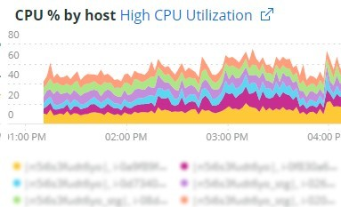
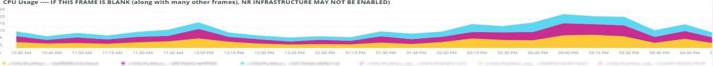

# Registerkarte [!UICONTROL Summary]

Der Tab [!UICONTROL Summary] von [!DNL Observation for Adobe Commerce] ist dazu gedacht, schnell einige der Probleme zu sehen, die von Sites auftreten, um Ihnen bei der automatischen Auflösung oder Identifizierung möglicher Ursachen von Site-Problemen zu helfen. Die zusätzlichen Registerkarten bieten umfassendere Informationen zu Komponentendiensten, Datenbank, Infrastruktur und Prozessstatus.

## [!UICONTROL Transaction Overview]

### [Was ist eine Transaktion?](https://docs.newrelic.com/docs/apm/transactions/intro-transactions/transactions-new-relic-apm/#:%7E:text=transactions%20are%20reported.-,What%20is%20a%20transaction%3F,work%20in%20a%20software%20application.&amp;text=For%20APM%2C%20it%20will%20oft,wenn%20the%20response%20is%20sent)

&quot;Bei [!DNL New Relic] ist eine Transaktion als eine logische Arbeitseinheit in einer Software-Anwendung definiert. Konkret bezieht er sich auf die Funktionsaufrufe und Methodenaufrufe, aus denen diese Arbeitseinheit besteht. Dies bezieht sich häufig auf eine Webtransaktion, die eine Aktivität darstellt, die von dem Zeitpunkt an erfolgt, zu dem die Anwendung eine Webanfrage erhält, wenn die Antwort gesendet wird.&quot;

### Arten von Transaktionen:

**Web:** Web-Transaktionen werden mit einer HTTP-Anfrage initiiert. Für die meisten Unternehmen stellen diese kundenorientierte Interaktionen dar und sind daher die wichtigsten zu überwachenden Transaktionen.

**Nicht-Web:** Nicht-Web-Transaktionen werden nicht mit einer Web-Anforderung initiiert. Sie können Prozesse außerhalb des Webworkers, Hintergrundprozesse, Skripte, Nachrichtenwarteschlangenaktivitäten und andere Aufgaben umfassen.

Wenn Sie sich den obigen **[!UICONTROL Transaction Overview]**-Frame ansehen, gab es fast 53.000 Transaktionen mit einem durchschnittlichen APDEX-Wert von 0,76, und 95 % dieser Transaktionen erfolgten in weniger als 2,313 Sekunden. Dies wäre ein Zeitraum, in dem ein engerer Zeitrahmen Abweichungen von diesem aktuellen Durchschnitt anzeigen kann, wenn innerhalb eines kurzen Zeitrahmens ein APDEX-Treffer vorliegt.

## [!UICONTROL 404 page errors frame]

Der Frame **[!UICONTROL 404 page errors]** listet den [URI](https://en.wikipedia.org/wiki/Uniform_Resource_Identifier) und die Anzahl der 404 Seitenfehler für einen ausgewählten Zeitraum auf.

## [!UICONTROL % of Storage Free frame]

Der Frame &quot;**[!UICONTROL % of Storage Free]**&quot;zeigt den durchschnittlichen Prozentsatz an, der frei von den Speicherbergen ist, über alle Knoten Ihres Clusters hinweg. Wenn Sie beispielsweise über einen Cluster mit drei Knoten verfügen, zeigt der Rahmen den \&lt;Bereitstellungspunkt\>, \&lt;Umgebungsname\>. Dieser Frame kann trügerisch sein, wenn eine Abweichung zwischen drei Knoten besteht. Ein Beispiel für eine Varianz wäre, wenn der Bereitstellungspunkt &quot;`/data/mysql` frei&quot;einen anderen Wert für den gesamten Knoten-Cluster darstellt. Unter der Registerkarte &quot;[!UICONTROL MySQL]&quot;gibt es einen Rahmen, der die Bereitstellungspunkte nach Knotennamen facettiert, um genauer zu sehen, was der Speicherplatz von `/data/mysql` auf jedem Knoten tatsächlich ist.

## [!UICONTROL % of system memory that is free frame]

Der Frame **% des Systemspeichers, der frei ist**, zeigt nach Knoten die Menge des auf jedem Knoten freien Systemspeichers an.

## [!UICONTROL Swap memory free in bytes]

Der Frame **[!UICONTROL Swap memory free in bytes]** zeigt nach Knoten die Menge des auf dem Knoten freien SWAP-Speichers an.

## [!UICONTROL CPU % by host]

Das Aggregat aller Umgebungen und Knoten wird im Frame **[!UICONTROL CPU % by host]** angezeigt. Sie sollten die Auswahl der Nicht-Produktionsumgebungen aufheben. Beachten Sie auch alle Fälle, in denen nicht alle Knoten für die Produktionsumgebung vorhanden sind. Weitere Tipps zur hohen CPU-Auslastung finden Sie unter [Fehlerbehebung bei der Leistung von New Relic auf Adobe Commerce](https://experienceleague.adobe.com/docs/commerce-knowledge-base/kb/troubleshooting/miscellaneous/troubleshoot-performance-using-new-relic-on-magento-commerce.html).

## [!UICONTROL Alerts during timeframe]

Der **[!UICONTROL Alerts during timeframe]** zeigt alle Warnhinweise an, einschließlich des vom Adobe Commerce-Support hinzugefügten [!UICONTROL Managed Alerts].

## [!UICONTROL CPU Usage]

Wenn der Frame **[!UICONTROL CPU Usage]** leer ist, ist dies ein Hinweis darauf, dass die Infrastrukturanwendung von [!DNL New Relic] nicht aktiviert ist. Wenn sich Ihre Site auf Starter befindet, werden diese Informationen nicht angezeigt. Wenn Ihre Site auf Pro basiert, öffnen Sie ein [Support-Ticket](https://experienceleague.adobe.com/docs/commerce-knowledge-base/kb/help-center-guide/magento-help-center-user-guide.html), damit [!DNL New Relic Infrastructure] für Ihre Site aktiviert ist.

## [!UICONTROL Average Response Time]

Das Diagramm **[!UICONTROL Average Response Time]** zeigt die durchschnittliche Antwortzeit für Transaktionen (Web und andere).

## [!UICONTROL Long duration cron_schedule updates]

Die Tabelle **[!UICONTROL cron_schedule]** wird am Anfang und Ende von Cron-Aufträgen geschrieben. Cron-Aufträge mit langer Dauer könnten auf eine Wartezeit beim Aktualisieren dieser Tabelle hinweisen, was auf ein Cron-Stackup oder auf ein Problem bei der Planung von Crons hinweisen kann.

## [!UICONTROL Response Code]

Der Frame **[!UICONTROL Response Code]** ist ein guter Hinweis auf den Web-Traffic und den Antwort-Code von Anfragen. Es handelt sich um [!DNL New Relic's] Transaktionsdaten, die durch die zurückgegebenen `httpResponseCode` erfasst werden.

## [!UICONTROL Web Traffic volume compared with one week ago Magento Managed Alerts Information]

Dieser Frame zeigt das vergleichende Web-Traffic-Volumen der letzten und der aktuellen Woche an.

## [!UICONTROL Deployment Log Entries]

Der Frame **[!UICONTROL Deployment Log Entries]** zeigt die Anzahl der Implementierungs- und Cloud-Protokolleinträge und facettiert die Anzahl nach dem Namen des Bereitstellungsprotokolls.

## [!UICONTROL Deployment State]

Der Frame **[!UICONTROL Deployment State]** facettiert bestimmte Bereitstellungsphasen aus den Bereitstellungsprotokollen. Im Folgenden finden Sie einige Beispiele für Phasen, die im Protokoll und im Facettennamen gezählt werden:

**Phasen des Bereitstellungsprotokolls:**

* &#39;%Starting generate command%&#39;) as &#39;start_gen&#39;
* &#39;%git apply /app/vendor/magento/ece-tools/patches%&#39;) als &#39;apply_patches&#39;
* &#39;%Set flag: .static_content_deploy%&#39;) as &#39;SCD&#39;
* &#39;%NOTICE: Generate command completed%&#39;) as &#39;gen_compl&#39;
* &#39;%NOTICE: Deployment completed%&#39;) as &#39;deploy_compl&#39;
* &#39;%NOTICE: Starten Sie nach der Bereitstellung.%&#39;) als &#39;start_pdeploy&#39;
* &#39;%NOTICE: Post-deploy is complete%&#39;) as &#39;pdeploy&#39;
* &#39;%deploy-complete%&#39;) als &#39;cl_deploy_compl&#39;

## [!UICONTROL IP Frequency]

Der Frame **[!UICONTROL IP Frequency]** zählt die Status (&#39;MISS&#39; und &#39;PASS&#39;) für jede IP-Adresse aus den [!DNL Fastly] -Protokollen. Webanfragen mit diesen Status erreichen den Herkunftsserver und fügen dem Server Ladevorgänge hinzu. Er zeigt die zwanzig häufigsten Adressen in der Häufigkeit. Dieser Frame kann verwendet werden, um IP-Angriffe oder Quellen hoher Belastung auf einer Website zu erkennen.

## [!UICONTROL IP Response – top 20 URLs in duration]

Der Frame **[!UICONTROL IP Response – top 20 URLs in duration]** zeigt die URLs mit der längsten Antwortdauer an. Sie kann auf große Bilddateien, Seiten, APIs oder Seiten mit der längsten Reaktionsdauer hinweisen.

## [!UICONTROL API Calls by IP]

Der Frame **[!UICONTROL API Calls by IP]** hilft, starken Traffic anhand der APIs und IP-Adressen zu identifizieren, die Anfragen von den API-URLs stellen.

## [!UICONTROL API Calls by IP, details by URL]

Der Frame **[!UICONTROL API Calls by IP, details by URL]** enthält Details zu schwerem Traffic im Vergleich zu den APIs und Details zu den URLs, die die Anfragen stellen.

## [!UICONTROL IP Frequency Rate per minute]

Manchmal ist es schwierig festzustellen, welche IP-Adresse die meisten Anforderungen auf den anderen Frames hat. Der Frame **[!UICONTROL IP Frequency Rate per minute]** zeigt die Rate pro Minute und IP-Adresse.

## [!UICONTROL Potential Bots]

Der Frame &quot;**[!UICONTROL Potential Bots]**&quot;untersucht Anforderungen mit einem request_user_agent-Namen wie NULL oder &quot;%bot%&quot;. Normalerweise folgt der request_user_agent &#39;%bot%&#39; der Richtlinieneinrichtung in der Datei `robots.txt`.

## [!UICONTROL Transaction Errors]

Der Frame **[!UICONTROL Transaction Errors]** zeigt die Anzahl der Transaktionsfehler von [!DNL New Relic] an.

## [!UICONTROL Nginx access by node]

Der Frame &quot;**[!UICONTROL Nginx access by node]**&quot; betrachtet die Zählungen aus dem Knoten &quot;`access.log`&quot;nach Knoten. Es ist hilfreich zu sehen, ob die Last gleichmäßig verteilt ist. Es wird oft angezeigt, wenn ein Knoten fällt. Der Rahmen zeigt auch die Belastung der gesamten Site an.

## [!UICONTROL Galera Log]

[[!DNL Galera]](https://galeracluster.com/library/galera-documentation.pdf) wird für den Datenbankcluster verwendet. Dieser Frame konzentriert sich auf bestimmte Signale aus dem [!UICONTROL Galera]-Cluster. Die Signale konzentrieren sich auf Knoten, die den Cluster aufrufen und beenden. Dies ist ein normales Verhalten zur Wahrung der Integrität der Datenbankdaten. Die Knoten werden synchronisiert, wenn sich der Status des [!UICONTROL Galera]-Clusters ändert.

**Liste der Statusänderungen von [!UICONTROL Galera]:**

* &#39;%1047 WSREP hat den Knoten noch nicht für die Anwendung vorbereitet (use%&#39;) als &#39;node_not_prep_for_use&#39;
* &#39;%\[ERROR\] WSREP: Failed read from: wsrep_sst_xtrabackup-v2%&#39;) as &#39;xtrabackup_read_fail&#39;
* &#39;%\[ERROR\] WSREP: Prozess abgeschlossen mit Fehler: wsrep_sst_xtrabackup-v2 %&#39;) als &#39;xtrabackup_compl_w_err&#39;
* &#39;%\[ERROR\] WSREP: rbr write fail%&#39;) as &#39;rbr_write_fail&#39;
* &#39;%self-leave%&#39;) als &#39;susp_node&#39;
* &#39;%member = 3/3 (join/total)%&#39;) as &#39;3of3&#39;
* &#39;%members = 2/3 (join/total)%&#39;) as &#39;2of3&#39;
* &#39;%members = 2/2%&#39;) as &#39;2of2&#39; * &#39;%members = 1/2%&#39;) as &#39;1of2&#39; * &#39;%members = 1/3%&#39;) as &#39;1of3&#39;
* &#39;%members = 1/1%&#39;) als &#39;1of1&#39;
* &#39;%\[Hinweis\] /usr/sbin/mysqld (mysqld 10.%&#39;) als &#39;sql_restart&#39;
* &#39;%Quorum: Kein Knoten mit vollständigem Status:%&#39;) als &#39;no_node_count&#39;
* &#39;%WSREP: Member 0%&#39;) as &#39;mem_0&#39;
* &#39;%WSREP: Member 1.0%&#39;) as &#39;mem_1&#39;
* &#39;%WSREP: Member 2%&#39;) as &#39;mem2&#39;
* &#39;%WSREP: Synchronisiert mit Gruppe, bereit für Verbindungen%&#39;) als &#39;bereit&#39;
* &#39;%/usr/sbin/mysqld, Version:%&#39;) als &#39;mysql_restart_mysql.slow&#39;
* &#39;%\[Hinweis\] WSREP: Neue Cluster-Ansicht: global state:%&#39;) as &#39;galera_cluster_view_chng&#39;

Diese Signale können auf Speicher-, Speicher- oder Abfrageprobleme hinweisen, wenn sich der Status häufig ändert.

## [!UICONTROL Database errors]

**Liste der erkannten Datenbankfehler oder -meldungen:**

* &#39;%Speichergröße, die für die temporäre Tabelle zugewiesen wird, ist mehr als 20% von innodb_buffer_pool_size%&#39;) als &#39;temp_tbl_buff_pool&#39;
* &#39;%\[ERROR\] WSREP: rbr write fail%&#39;) as &#39;rbr_write_fail&#39;
* &#39;%mysqld: Disk full%&#39;) as &#39;disk_full&#39;
* &#39;%Fehlernummer 28%&#39;) als &#39;err_28&#39;
* &#39;%Rollback%&#39;) als &#39;Rollback&#39;
* &#39;%Fremdschlüsseleinschränkung schlägt für table% fehl&#39;) als &#39;Fremdschlüssel-Einschränkung&#39;
* &#39;%Error_code: 114%&#39;) as &#39;sql_1114_full&#39;
* &#39;%CRITICAL: SQLSTATE\[HY000\] \[2006\] MySQL Server has away%&#39;) as &#39;sql_go&#39;
* &#39;%SQLSTATE\[HY000\] \[1040\] Zu viele Verbindungen%&#39;) als &#39;sql_1040&#39;
* &#39;%CRITICAL: SQLSTATE\[HY000\] \[2002\]%&#39;) as &#39;sql_2002&#39;
* &#39;%SQLSTATE\[08S01\]:%&#39;) as &#39;sql_1047&#39;
* &#39;%\[Warnung\] Abgebrochene Verbindung%&#39;) als &#39;aborted_conn&#39;
* &#39;%SQLSTATE\[23000\]: Integrity constraint verletzungen:%&#39;) as &#39;sql_23000&#39;
* &#39;%1205 Lock wait timeout%&#39;) als &#39;sql_1205&#39;
* &#39;%SQLSTATE\[HY000\] \[1049\] Unbekannte Datenbank%&#39;) als &#39;sql_1049&#39;
* &#39;%SQLSTATE\[42S02\]: Basistabelle oder -ansicht nicht gefunden:%&#39;) als &#39;sql_42S02&#39;
* &#39;%Allgemeiner Fehler: 114%&#39;) als &#39;sql_1114&#39;
* &#39;%SQLSTATE\[40001\]%&#39;) as &#39;sql_1213&#39;
* &#39;%SQLSTATE\[42S22\]: Column not found: 1054 Unknown column%&#39;) as &#39;sq1_1054&#39;
* &#39;%SQLSTATE\[42000\]: Syntaxfehler oder Zugriffsverletzung:%&#39;) als &#39;sql_42000&#39;
* &#39;%SQLSTATE\[21000\]: Kardinalverletzung:%&#39;) als &#39;sql_1241&#39;
* &#39;%SQLSTATE\[22003\]:%&#39;) as &#39;sql_22003&#39;
* &#39;%SQLSTATE\[HY000\] \[9000\] Client mit IP-Adresse%&#39;) als &#39;sql_9000&#39;
* &#39;%SQLSTATE\[HY000\]: Allgemeiner Fehler: 2014%&#39;) als &#39;sql_2014&#39;
* &#39;%1927 Connection was kill%&#39;) as &#39;sql_1927&#39;
* &#39;%1062 \[\ERROR\] InnoDB:%&#39;) as &#39;sql_1062_e&#39;
* &#39;%\[Hinweis\] WSREP: Speicherzuordnung auf Festplatte leeren..%&#39;) als &#39;mem_map_flush&#39;.
* &#39;%Interner MariaDB-Fehlercode: 1146%&#39;) als &#39;sql_1146&#39;
* &#39;%Interner MariaDB-Fehlercode: 1062%&#39;) als &#39;sql_1062&#39; * &#39;%1062 \[Warnung\] InnoDB:%&#39;) als &#39;sql_1062_w&#39;
* &#39;%Interner MariaDB-Fehlercode: 1064%&#39;) als &#39;sql_1064&#39;
* &#39;%InnoDB: Assertion failure in file%&#39;) as &#39;assertion_err&#39;
* &#39;%mysqld_safe Anzahl der jetzt ausgeführten Prozesse: 0%&#39;) als &#39;mysql_oom&#39;
* &#39;%\[ERROR\] mysqld hat signal%&#39;) as &#39;mysql_sigterm&#39;
* &#39;%1452 Cannot add%&#39;) as &#39;sql_1452&#39;
* &#39;%ERROR 1698%&#39;) als &#39;sql_1698&#39;
* &#39;%SQLSTATE\[HY000\]: General error: 3%&#39;) as &#39;cnt_wrt_tmp&#39;
* &#39;%Allgemeiner Fehler: 1 %&#39;) als &#39;sql_syntax&#39;
* &#39;%42S22%&#39;) als &#39;sql_42S22&#39;
* &#39;%InnoDB: Error (Duplicate key)%&#39;) as &#39;innodb_dup_key&#39;

## [!UICONTROL Database traces]

Der Frame **[!UICONTROL Database traces]** betrachtet Daten aus der Entität [sql trace](https://docs.newrelic.com/docs/apm/transactions/transaction-traces/transaction-traces-database-queries-page/) von [!DNL New Relic] und gibt den Pfad der Trace zurück.

## [!UICONTROL Database mysql-slow.log]

Der Frame **[!UICONTROL Database mysql-slow.log]** zählt Einträge in der Datei [mysql-slow.log](https://dev.mysql.com/doc/refman/5.7/en/slow-query-log.html) nach Abfrageanforderungstyp. Dadurch werden Zeitrahmen visuell isoliert, die in der Datei mysql-slow.log (langsames Abfrageprotokoll) von Interesse sein könnten. Abfragen von Tabellen ohne Indizes oder Abfragen, die große Tabellen aktualisieren, können andere Abfragen blockieren.

## [!UICONTROL Redis synchronization from Log]

[[!DNL Redis]](https://redis.io/docs/about/) ist ein Open-Source-Datenstrukturspeicher (BSD lizenziert) im Arbeitsspeicher, der als Datenbank, Cache und Nachrichtenbroker verwendet wird. Es kann Datenbank- und Sitzungszwischenspeicherung durchführen, sofern konfiguriert. Der Frame **[!UICONTROL Redis synchronization from Log]** konzentriert sich auf [[!DNL Redis] Synchronisation](https://redis.io/docs/latest/operate/oss_and_stack/management/replication/). Je größer der Datensatz [!DNL Redis] ist, desto wahrscheinlicher sind Synchronisierungsprobleme (mehr Daten werden synchronisiert).

**[!DNL Redis]Fehler und Meldungen:**

* &#39;%SLAVE-Synchronisation: Kein Speicherplatz auf Gerät%&#39;) als &#39;Leerzeichen&#39;
* &#39;%Server started, Redis version%&#39;) as &#39;serv_start&#39;
* &#39;%Der Server ist jetzt bereit, Verbindungen zu akzeptieren%&#39;) als &#39;bereit&#39;
* &#39;%Verbindung mit Master verloren.%&quot;) als &quot;mstr_lost&quot;
* &#39;%+sdown sentinel%&#39;) als &#39;+sentinal&#39;
* &#39;% sdown sentinel%&#39;) als &#39;-sentinal&#39;
* &#39;%-sdown slave%&#39;) als &#39;-slave&#39;, &#39;%+sdown slave%&#39;) als &#39;+slave&#39;
* &#39;%-failover-abort-not-selected master mymaster%&#39;) as &#39;-failover&#39;
* &#39;%+failover-abort-not-selected master mymaster%&#39;) as &#39;+failover&#39;
* &#39;%Teilweise Resynchronisierung nicht möglich (kein zwischengespeicherter Master)%&#39;) als &#39;part_sync_err&#39;
* &#39;%MASTER abortierte Replikation mit einem Fehler: ERR Can%&#39;) als &#39;mstr_sync_err&#39;
* &#39;%Master unterstützt PSYNC nicht oder befindet sich im Fehlerstatus%&#39;) als &#39;mstr_psync_err&#39;
* &#39;%SLAVE sync: Finished with success%&#39;) as &#39; slv_sync_suc&#39;
* &#39;%MASTER hat die Replikation mit einem Fehler abgebrochen: ERR Can%&#39;) als &#39;mstr_sync_err,coun&#39;
* &#39;%OOM command not allowed when used memory%&#39;) as &#39; max_mem_err&#39;
* &#39;%CredisException(code: 0): read error on connection%&#39;) as &#39;credis_read_error&#39;
* &#39;%Uncaught RedisException:%&#39;) as &#39;reredis_excp_err&#39;
* &#39;%psync geplant, um ASAP zur Überwindung des Ausgabepuffers% zu schließen&#39;) als &#39;output_buf_err&#39;

## [!UICONTROL PHP process states]

Wie sich PHP-Prozesse verhalten, hängt von der [Konfiguration](https://www.php.net/manual/en/install.fpm.configuration.php) ab. Die Konfiguration ist komplex und verfügt über viele Variablen und Optionen. Der Frame **[!UICONTROL PHP process states]** hilft Ihnen zu verstehen, wann PHP-Prozesse beendet und neu gestartet werden.

### [!UICONTROL PHP errors]

Der Frame **[!UICONTROL PHP errors]** zeigt die Anzahl der PHP-Fehler mit Workern während des ausgewählten Zeitraums an. Weitere Informationen finden Sie unter [PHP-Einstellungen für Adobe Commerce](../../installation/prerequisites/php-settings.md).

**PHP-Fehler und -Meldungen:**

* &#39;%worker_connections are not genug%&#39;) as &#39;worker&#39;
* &#39;%PHP Fatal error: Allowed memory size!%&quot;) als &quot;mem_size&quot;
* &#39;%exited on signal 11 (SIGSEGV)%&#39;) as &#39;sig_11&#39;
* &#39;%exited on signal 7 (SIGBUS)%&#39;) as &#39;sig_7&#39;
* &#39;%increase pm.start_servers%&#39;) as &#39;pmstart_serv&#39;
* &#39;%max_children%&#39;) als &#39;max_children_cnt&#39;
* &#39;%PHP Fatal error: Allowed memory size of%&#39;) as &#39;mem_exhst_coun&#39;
* &#39;%Arbeitsspeicher für pool%&#39;) nicht als &#39;opc_mem_count&#39; zuordnen
* &#39;%Warning Interne Zeichenfolge Pufferüberlauf%&#39;) als &#39;opc_str_buf&#39;
* &#39;%Illegal string offsetl%&#39;) as &#39;opc_sv_comments&#39;
* &#39;%PHP Fatal error: Uncaught RedisException: read error on connection%&#39;) as &#39;php_exc&#39;

## [!UICONTROL PHP processes]

[PHP-FPM](https://php-fpm.org/) ist eine [!UICONTROL FastCGI Process Manager], die von [!DNL Nginx] verwendet wird. Weitere Informationen zu den Systemanforderungen finden Sie unter [Den Adobe Commerce-Versionen zugeordnete PHP-Versionsanforderungen](../../installation/system-requirements.md). Der Frame **[!UICONTROL PHP processes]** zeigt die Anzahl der PHP-Prozesse an, die zu einem bestimmten Zeitpunkt in der ausgewählten Timeline ausgeführt werden.

## [!UICONTROL Secondary processes]

Sekundäre Prozesse können sich auf die Antwort der Site auswirken. Der Frame &quot;**[!UICONTROL Secondary processes]**&quot;zeigt einen Prozess oder Prozesse an, die der Site eventuell Last hinzufügen. Die Datenbank verfügt in erster Linie über die am häufigsten ausgeführten Prozesse.

## [!UICONTROL Traffic vs Week Ago]

Der Frame **[!UICONTROL Traffic vs Week Ago]** betrachtet den Website-Traffic (Anforderungen) aus den [!DNL Fastly]-Protokollen mit (&#39;MISS&#39;, &#39;PASS&#39;) Cache-Status. Diese Anforderungen erhöhen die Auslastung der Herkunftsserver. Dieser Rahmen zeigt das vergleichende Web-Anforderungsvolumen der aktuellen Woche und der letzten Woche im selben Zeitraum an.

## [!UICONTROL Fastly Cache]

Der Frame **[!UICONTROL Fastly Cache]** zeigt eine aggregierte Ansicht des Cache-Status von Anforderungen aus den [!DNL Fastly] -Protokollen. Wenn Sie FEHLER auswählen, wird der Prozentsatz der Fehler in den Anforderungen angezeigt. Dies erhöht sich normalerweise, wenn der Herkunftsserver nicht schnell genug auf Seitenanforderungen reagiert.

## [!UICONTROL Page Rendering]

Der Frame &quot;**[!UICONTROL Page Rendering]**&quot;zeigt die durchschnittliche Seitenwiedergabedauer der aktuellen Woche aus der Seitenansichtsquelle von &quot;[!DNL New Relic]&quot;im Vergleich zur Vorwoche im selben Zeitraum an.

## [!UICONTROL Page loading detail]

Der Frame **[!UICONTROL Page loading detail]** beschreibt die Seitenladeereignisse. Sie beschreibt die Bedeutung dieser Facetten. Hier finden Sie die Abfrage, die für diesen Frame ausgeführt wird:

`SELECT percentile(timeToResponseStart, 50) AS 'first byte', percentile(firstPaint, 50) as 'First paint', percentile(firstContentfulPaint, 50) as 'First contentful paint', percentile(timeToDomContentLoadedEventEnd, 50) AS 'DOM content loaded', percentile(duration, 50) AS 'Window load + AJAX' FROM BrowserInteraction TIMESERIES`

## [!UICONTROL Transactions – Avg, Max, Min]

Die Transaktionsdauer beträgt in Sekunden. Abhängig von der Transaktion kann es sich auf andere Transaktionen auswirken, wenn diese langfristig laufen. Die unter Name und Dauer aufgelisteten Transaktionen beziehen sich auf den jeweiligen Zeitraum. Wenn es einen kurzen Zeitrahmen für ein Problem gibt, ändern Sie die Größe der Datums-/Uhrzeitauswahl [!DNL Observation for Adobe Commerce] auf diesen engen Zeitrahmen.

## [!UICONTROL Admin Activities]

Der Frame **[!UICONTROL Admin Activities]** identifiziert Transaktionen mit einem Admin-Benutzer.

## [!UICONTROL Order transactions (default?)]

Der Frame **[!UICONTROL Order transactions (default?)]** sucht nach Transaktionen `request.headers.host` aus Transaktionen, wobei der Name = `WebTransaction/Action/checkout/onepage/success` ist. Wenn die Erfolgs-URL der Bestellung unterschiedlich ist, enthält dieser Frame keine Daten.

## [!UICONTROL Elasticsearch Index information]

**[Elasticsearch-Status:](https://www.elastic.co/guide/en/elasticsearch/reference/current/cluster-health.html)**

* Grün: Alle Shards werden zugewiesen.
* Gelb: Alle primären Shards werden zugewiesen, aber eine oder mehrere Replikatshards werden nicht zugewiesen. Wenn ein Knoten im Cluster fehlschlägt, sind einige Daten möglicherweise nicht verfügbar, bis dieser Knoten repariert wurde.
* Rot: Die Zuweisung von einem oder mehreren primären Shards wird aufgehoben, sodass einige Daten nicht verfügbar sind. Dies kann kurz während des Starts des Clusters auftreten, da primäre Shards zugewiesen sind.

## [!UICONTROL Elasticsearch Errors]

**[!DNL Elasticsearch]errors:**

* &#39;%alle Shards failed%&#39; als &#39;all_shards_failed&#39;
* &#39;%NoNodesAvailableException%&#39; as &#39;no_alive_nodes&#39;
* &#39;%PHP Fatal error: Uncaught Error: Frong parameters for Elasticsearch%&#39; as &#39;right_param&#39;
* &#39;%Sie können dieses Problem beheben, indem Sie den Elasticsearch-Dienst in Ihrer Magento Cloud-Infrastruktur auf Version%&#39; als &#39;ver_err&#39; aktualisieren.
* &#39;%Cluster-Gesundheitsstatus geändert von \[GELB\] in \[RED\] (Grund:%&#39; als &#39;yel_red&#39;)
* &#39;%Kein Speicherplatz auf Gerät%&#39; als &#39;no_space&#39;
* &#39;% Failed to execute [SearchRequest{searchType=%&#39; as &#39;failed_query&#39;

## [!UICONTROL Cron view]

Der Frame &quot;**[!UICONTROL Cron view]**&quot;betrachtet das Cron-Log auf einen Ausgleich zwischen der Anzahl der gestarteten Kronen und der Anzahl der fertiggestellten Kronen.

## [!UICONTROL Cron error]

**Cron-Fehler aus cron.log:**

* &#39;%_stg%&#39; als &#39;stg_crons&#39;
* &#39;%Lock für Cron Job%&#39; konnte nicht als &#39;cron_lock&#39; erworben werden
* &#39;%Allgemeiner Fehler: MySQL Server 2006 ist weg%&#39; als &#39;mysql_has_away_away&#39;
* &#39;%error%&#39; as &#39;error&#39;
* &#39;%Allgemeiner Fehler: 1205 Lock wait timeout exceeded%&#39; as sql_1205_cron

## [!UICONTROL cron_schedule table updates]

Der Frame **[!UICONTROL cron_schedule table updates]** betrachtet die maximale Dauer in Sekunden, in denen Aktualisierungen von Datenspeichervorgängen die Tabelle cron_schedule betreffen. Sie wird vom SQL-Anfragetyp erfasst.

## [!UICONTROL Datastore Operations Tables]

In diesem **[!UICONTROL Datastore Operations Tables]** -Frame werden die 25 wichtigsten Vorgänge nach Dauer, Tabellenname und SQL-Anfragetyp angezeigt. Bewegen Sie den Mauszeiger über die Spitzen, um Details zu der Tabelle und dem Anfragetyp anzuzeigen.

## [!UICONTROL Cache Flush]

**Cache-Leerung erkannt:**

* &#39;%config%&#39; als &#39;config_cache_flushed&#39;
* &#39;%layout%&#39; as &#39;layout_cache_flush&#39;
* &#39;%block_html%&#39; as &#39;block_html_cache_flush&#39;
* &#39;%collections%&#39; als &#39;collections_cache_flush&#39;
* &#39;%Reflektion%&#39; als &#39;Reflektion_Cache_flush&#39;
* &#39;%db_ddl%&#39; as &#39;db_ddl_cache_flush&#39;
* &#39;%compiled_config%&#39; as &#39;compiled_config_cache_flush&#39;
* &#39;%eav%&#39; als &#39;eav_cache_flush&#39;
* &#39;%customer_notification%&#39; als &#39;cust_notif_cache_flush&#39;
* &#39;%config_integration%&#39; als &#39;config_integ_cache_flush&#39;
* &#39;%config_integration_api%&#39; als &#39;config_integ_api_cache_flush&#39;
* &#39;%full_page%&#39; als &#39;full_page_cache_flush&#39;
* &#39;%config_webservice%&#39; as &#39;config_webserv_cache_flush&#39;
* &#39;%translate%&#39; as &#39;translate_cache_flush&#39;
