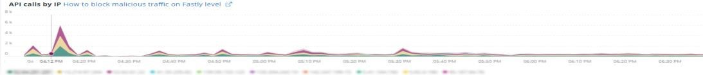
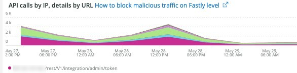
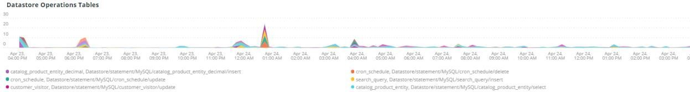

# Die Registerkarte [!UICONTROL Summary]

Die [!UICONTROL Summary] Registerkarte von [!DNL Observation for Adobe Commerce] soll einige der Probleme, die auf Sites auftreten, schnell erkennen, damit Sie potenzielle Grundursachen von Site-Problemen automatisch beheben oder identifizieren können. Die zusätzlichen Registerkarten bieten detailliertere Informationen zu Komponentendiensten, Datenbank, Infrastruktur und Prozessstatus.

## [!UICONTROL Transaction Overview]

### [Was ist eine Transaktion?](https://docs.newrelic.com/docs/apm/transactions/intro-transactions/transactions-new-relic-apm/#:%7E:text=transactions%20are%20reported.-,Was%20is%20a%20transaction%3F,Arbeit%20in%20a%20software%20application.&text=Für%20APM%2C%20it%20will%20oft, wenn%20die%20Antwort%20is%20gesendet wird)

&quot;[!DNL New Relic] wird eine Transaktion als eine logische Arbeitseinheit in einer Softwareanwendung definiert. Insbesondere bezieht er sich auf die Funktionsaufrufe und Methodenaufrufe, aus denen diese Arbeitseinheit besteht. Häufig handelt es sich um eine Web-Transaktion. Dies stellt eine Aktivität dar, die stattfindet, wenn das Programm eine Web-Anfrage erhält, bis zum Zeitpunkt des Versands der Antwort.“

### Transaktionsarten:

**Web:** Web-Transaktionen werden mit einer HTTP-Anfrage initiiert. Für die meisten Unternehmen stellen diese kundenorientierten Interaktionen dar und sind daher die wichtigsten Transaktionen, die überwacht werden müssen.

**Nicht-Web:** Nicht-Web-Transaktionen werden nicht mit einer Web-Anfrage initiiert. Sie können Nicht-Web-Worker-Prozesse, Hintergrundprozesse, Skripte, Nachrichtenwarteschlangenaktivitäten und andere Aufgaben umfassen.

Wenn Sie sich das **[!UICONTROL Transaction Overview]** Bild oben ansehen, gab es fast 53.000 Transaktionen mit einem durchschnittlichen APDEX-Score von 0,76, und 95 % dieser Transaktionen fanden in weniger als 2.313 Sekunden statt. Dies wäre ein Rahmen, bei dem ein engerer Zeitrahmen eine Abweichung von diesem aktuellen Durchschnitt anzeigen könnte, wenn während eines kurzen Zeitrahmens ein APDEX-Treffer auftritt.

## [!UICONTROL 404 page errors frame]

Im **[!UICONTROL 404 page errors]** werden der [URI](https://en.wikipedia.org/wiki/Uniform_Resource_Identifier) und die Anzahl der 404 Seitenfehler für einen ausgewählten Zeitraum aufgeführt.

## [!UICONTROL % of Storage Free frame]

Der **[!UICONTROL % of Storage Free]** zeigt den durchschnittlichen Prozentsatz der freien Speicherbereitstellungen für alle Knoten des Clusters an. Bei einem Cluster mit drei Knoten zeigt der Rahmen beispielsweise \&lt;Bereitstellungspunkt\>, \&lt;Umgebungsname\>. Dieser Rahmen kann trügen, wenn es eine Varianz zwischen drei Knoten gibt. Ein Beispiel für eine Varianz wäre, wenn der `/data/mysql` Bereitstellungspunkt frei über den Cluster mit drei Knoten hinweg ein anderer Wert wäre. Unter der Registerkarte [!UICONTROL MySQL] befindet sich ein Frame, der die Bereitstellungspunkte nach Knotenname facettiert, um genauer zu sehen, was der auf jedem Knoten freie `/data/mysql` tatsächlich ist.

## [!UICONTROL % of system memory that is free frame]

Der **% des freien Systemspeichers (Frame** zeigt für jeden Knoten den Umfang des Systemspeichers an, der auf jedem Knoten frei ist.

## [!UICONTROL Swap memory free in bytes]

Der **[!UICONTROL Swap memory free in bytes]** zeigt die Menge des ausgelagerten Speichers (aufgeschlüsselt nach Knoten) an, die auf dem jeweiligen Knoten frei ist.

## [!UICONTROL CPU % by host]

Das Aggregat aller Umgebungen und Knoten wird im **[!UICONTROL CPU % by host]** angezeigt. Sie sollten die Auswahl der produktionsfremden Umgebungen aufheben. Beachten Sie außerdem alle Instanzen, bei denen nicht alle Knoten für die Produktionsumgebung vorhanden sind. Weitere Tipps zur hohen CPU-Auslastung finden Sie unter [Leistungsprobleme mit New Relic auf Adobe Commerce](https://experienceleague.adobe.com/docs/commerce-knowledge-base/kb/troubleshooting/miscellaneous/troubleshoot-performance-using-new-relic-on-magento-commerce.html).

## [!UICONTROL Alerts during timeframe]

Die **[!UICONTROL Alerts during timeframe]** zeigt alle Warnhinweise an, einschließlich der von der Adobe Commerce-Unterstützung hinzugefügten [!UICONTROL Managed Alerts].

## [!UICONTROL CPU Usage]

Wenn der **[!UICONTROL CPU Usage]** leer ist, bedeutet dies, dass die Infrastrukturanwendung von [!DNL New Relic] nicht aktiviert ist. Wenn sich Ihre Site auf Starter befindet, werden diese Informationen nicht angezeigt. Wenn sich Ihre Site auf Pro befindet, öffnen Sie ein [Support-Ticket](https://experienceleague.adobe.com/docs/commerce-knowledge-base/kb/help-center-guide/magento-help-center-user-guide.html), um [!DNL New Relic Infrastructure] für Ihre Site zu aktivieren.

## [!UICONTROL Average Response Time]

Das **[!UICONTROL Average Response Time]** Diagramm zeigt die durchschnittliche Reaktionszeit für Transaktionen (Web und andere).

## [!UICONTROL Long duration cron_schedule updates]

Die **[!UICONTROL cron_schedule]** wird zu Beginn und am Ende von Cron-Aufträgen geschrieben. Lange Cron-Aufträge können auf eine Latenz bei der Aktualisierung dieser Tabelle hinweisen, was auf ein Cron-Stackup oder ein Problem mit der Planung von Crons hinweisen kann.

## [!UICONTROL Response Code]

Der **[!UICONTROL Response Code]**-Frame ist ein guter Hinweis auf den Web-Traffic und den Antwort-Code von Anfragen. Es handelt sich um [!DNL New Relic's] Transaktionsdaten, und sie werden von den zurückgegebenen `httpResponseCode` facettiert.

## [!UICONTROL Web Traffic volume compared with one week ago Magento Managed Alerts Information]

Dieser Frame zeigt den Vergleich des Web-Traffic-Volumens der letzten Woche und der aktuellen Woche an.

## [!UICONTROL Deployment Log Entries]

Der **[!UICONTROL Deployment Log Entries]** zeigt die Anzahl der Bereitstellungs- und Cloud-Protokolleinträge an und facettiert die Anzahl anhand des Bereitstellungsprotokollnamens.

## [!UICONTROL Deployment State]

Der **[!UICONTROL Deployment State]** Rahmen facettiert bestimmte Bereitstellungsphasen aus den Bereitstellungsprotokollen. Im Folgenden finden Sie einige Beispiele für die im Protokoll gezählten Phasen und den Facettennamen:

**Bereitstellungsprotokollphasen:**

* &#39;%Generate-Befehl wird gestartet%&#39;) als &#39;start_gen&#39;
* &#39;%git apply /app/vender/magento/ece-tools/patches%&#39;) als &#39;apply_patches&#39;
* &#39;%Set Flag: .static_content_deploy%&#39;) als &#39;SCD&#39;
* &#39;%NOTICE: Generate-Befehl abgeschlossen%&#39;) als &#39;gen_compl&#39;
* &#39;%NOTICE: Bereitstellung abgeschlossen%&#39;) als &#39;deploy_compl&#39;
* &#39;%NOTICE: Nach der Bereitstellung wird gestartet.%&#39;) als &#39;start_pdeploy&#39; angegeben
* &#39;%NOTICE: Post-deploy is complete%&#39;) as &#39;pdeploy&#39;
* &#39;%deploy-complete%&#39;) als &#39;CL_deploy_compl&#39;

## [!UICONTROL IP Frequency]

Der **[!UICONTROL IP Frequency]** Frame zählt die Status („MISS“ und „PASS„) für jede IP aus den [!DNL Fastly]. Webanforderungen mit diesen Status erreichen den Ursprungsserver und laden den Server. Es zeigt die zwanzig Top-Adressen in der Häufigkeit. Dieser Frame kann verwendet werden, um IP-Angriffe oder Quellen hoher Auslastung auf einer Website zu erkennen.

## [!UICONTROL IP Response – top 20 URLs in duration]

Der **[!UICONTROL IP Response – top 20 URLs in duration]** zeigt die URLs mit der längsten Dauer in der Antwort an. Dies kann auf große Bilddateien oder Seiten, API oder Seiten mit der längsten Reaktionsdauer hinweisen.

## [!UICONTROL API Calls by IP]

Der **[!UICONTROL API Calls by IP]** Frame hilft bei der Identifizierung von hohem Traffic auf den APIs und den IP-Adressen, die Anfragen von den API-URLs stellen.

## [!UICONTROL API Calls by IP, details by URL]

Der **[!UICONTROL API Calls by IP, details by URL]** Frame enthält Details zum hohen Traffic an den APIs und zu den URLs, von denen die Anfragen stammen.

## [!UICONTROL IP Frequency Rate per minute]

Manchmal ist es schwer zu sagen, welche IP-Adresse die meisten Anfragen auf den anderen Frames hat. Der **[!UICONTROL IP Frequency Rate per minute]** Frame zeigt die Rate pro Minute pro IP-Adresse an.

## [!UICONTROL Potential Bots]

Der **[!UICONTROL Potential Bots]**-Frame betrachtet Anfragen mit dem Namen request_user_agent wie NULL oder &#39;%bot%&#39;. Normalerweise folgt der &#39;%BOT%&#39; request_user_agent&#39; der Richtlinieneinrichtung in `robots.txt` Datei.

## [!UICONTROL Transaction Errors]

Der **[!UICONTROL Transaction Errors]** zeigt die Anzahl der Transaktionsfehler von [!DNL New Relic] an.

## [!UICONTROL Nginx access by node]

Der **[!UICONTROL Nginx access by node]** zeigt die Anzahl der `access.log` nach Knoten an. Es ist hilfreich zu sehen, ob die Last gleichmäßig verteilt ist. Oft wird angezeigt, wenn ein Knoten abfällt. Der Frame zeigt auch die Last auf der gesamten Site an.

## [!UICONTROL Galera Log]

[[!DNL Galera]](https://galeracluster.com/library/galera-documentation.pdf) wird für den Datenbank-Cluster verwendet. Dieser Rahmen ist auf bestimmte Signale aus dem [!UICONTROL Galera]-Cluster fokussiert. Die Signale konzentrieren sich auf Knoten, die in den Cluster eintreten und ihn verlassen. Dies ist ein normales Verhalten, um die Integrität der Datenbankdaten zu wahren. Die Knoten werden synchronisiert, wenn sich der [!UICONTROL Galera] Cluster-Status ändert.

**Liste der [!UICONTROL Galera] Statusänderungen:**

* &#39;%1047 WSREP hat den Knoten noch nicht für die Anwendungsverwendung vorbereitet (%) als &#39;node_not_prep_for_use&#39;
* &#39;%\[ERROR\] WSREP: Lesen von: wsrep_sst_xtrabackup-v2%&#39;) als &#39;xtrabackup_read_fail&#39; fehlgeschlagen
* &#39;%\[ERROR\] WSREP: Prozess abgeschlossen mit Fehler: wsrep_sst_xtrabackup-v2 %&#39;) als &#39;xtrabackup_compl_w_err&#39;
* &#39;%\[ERROR\] WSREP: rbr write fail%&#39;) als &#39;rbr_write_fail&#39;
* &#39;%self-leave%&#39;) als &#39;susp_node&#39;
* &#39;%members = 3/3 (verbunden/insgesamt)%&#39;) als &#39;3of3&#39;
* &#39;%members = 2/3 (verbunden/insgesamt)%&#39;) als &#39;2of3&#39;
* &#39;%members = 2/2%&#39;) als &#39;2of2&#39; * &#39;%members = 1/2%&#39;) als &#39;1of2&#39; * &#39;%members = 1/3%&#39;) als &#39;1of3&#39;
* &#39;%members = 1/1%&#39;) als &#39;1of1&#39;
* &#39;%\[Hinweis\] /usr/sbin/mysqld (mysqld 10.%&#39;) als &#39;SQL_RESTART&#39;
* &#39;%Quorum: Kein Knoten mit vollständigem Status:%&#39;) als &#39;no_node_count&#39;
* %WSREP: Mitglied 0%) als &#39;mem_0&#39;
* &#39;%WSREP: Mitglied 1.0%&#39;) als &#39;mem_1&#39;
* &#39;%WSREP: Mitglied 2%&#39;) als &#39;mem2&#39;
* &#39;%WSREP: Mit Gruppe synchronisiert, für Verbindungen bereit%&#39;) als &#39;bereit&#39;
* &#39;%/usr/sbin/mysqld, Version:%&#39;) als &#39;mysql_restart_mysql.slow&#39;
* &#39;%\[Note\] WSREP: Neue Cluster-Ansicht: globaler Status:%&#39;) als &#39;galera_cluster_view_change&#39;

Diese Signale können auf Speicher-, Speicher- oder Abfrageprobleme hinweisen, wenn sich der Status häufig ändert.

## [!UICONTROL Database errors]

**Liste der erkannten Datenbankfehler oder Nachrichten:**

* &#39;%Speichergröße zugewiesen für die temporäre Tabelle ist mehr als 20% von innodb_buffer_pool_size%&#39;) als &#39;temp_tbl_buff_pool&#39;
* &#39;%\[ERROR\] WSREP: rbr write fail%&#39;) als &#39;rbr_write_fail&#39;
* &#39;%mysqld: Datenträger voll%&#39;) als &#39;disk_full&#39; angegeben
* &#39;%Error number 28%&#39;) als &#39;err_28&#39;
* &#39;%rollback%&#39;) als &#39;rollback&#39;
* &#39;%Foreign key constraint failed for table%&#39;) as &#39;Foreign_key_constraint&#39;
* &#39;%ERROR_CODE: 1114%&#39;) als &#39;sql_1114_full&#39;
* &#39;%CRITICAL: SQLSTATE\[HY000\] \[2006\] MySQL-Server ist verschwunden%&#39;) als &#39;sql_gone&#39;
* &#39;%SQLSTATE\[HY000\] \[1040\] Zu viele Verbindungen%&#39;) als &#39;sql_1040&#39;
* &#39;%CRITICAL: SQLSTATE\[HY000\] \[2002\]%&#39;) als &#39;sql_2002&#39;
* &#39;%SQLSTATE\[08S01\]:%&#39;) als &#39;sql_1047&#39;
* &#39;%\[WARNUNG\] abgebrochene Verbindung%&#39;) als &#39;aborted_conn&#39;
* &#39;%SQLSTATE\[23000\]: Verletzung der Integritätsbedingung:%&#39;) als &#39;sql_23000&#39;
* &#39;%1205 Sperrwartezeitlimit%&#39;) als &#39;SQL_1205&#39;
* &#39;%SQLSTATE\[HY000\] \[1049\] Unbekannte Datenbank%&#39;) als &#39;sql_1049&#39;
* &#39;%SQLSTATE\[42S02\]: Basistabelle oder Ansicht nicht gefunden:%&#39;) als &#39;sql_42S02&#39;
* &#39;%Allgemeiner Fehler: 1114%&#39;) als &#39;sql_1114&#39;
* &#39;%SQLSTATE\[40001\]%&#39;) als &#39;sql_1213&#39;
* &#39;%SQLSTATE\[42S22\]: Spalte nicht gefunden: 1054 Unbekannte Spalte%&#39;) als &#39;sq1_1054&#39;
* &#39;%SQLSTATE\[42000\]: Syntaxfehler oder Zugriffsverletzung:%&#39;) als &#39;sql_42000&#39;
* &#39;%SQLSTATE\[21000\]: Kardinalitätsverletzung:%&#39;) als &#39;sql_1241&#39;
* &#39;%SQLSTATE\[22003\]:%&#39;) als &#39;sql_22003&#39;
* &#39;%SQLSTATE\[HY000\] \[9000\] Client mit IP-Adresse%&#39;) als &#39;sql_9000&#39;
* &#39;%SQLSTATE\[HY000\]: Allgemeiner Fehler: 2014%&#39;) als &#39;sql_2014&#39;
* &#39;%1927 Verbindung wurde abgebrochen%&#39;) als &#39;sql_1927&#39;
* &#39;%1062 \[\ERROR\] InnoDB:%&#39;) als &#39;sql_1062_e&#39;
* &#39;%\[Hinweis\] WSREP: Speicherzuordnung wird auf Festplatte geleert …%&#39;) als &#39;mem_map_flush&#39;
* &#39;%Interner MariaDB-Fehler-Code: 1146%&#39;) als &#39;sql_1146&#39;
* &#39;%Interner MariaDB-Fehler-Code: 1062%&#39;) als &#39;sql_1062&#39; * &#39;%1062 \[Warnung\] InnoDB:%&#39;) als &#39;sql_1062_w&#39;
* &#39;%Interner MariaDB-Fehler-Code: 1064%&#39;) als &#39;sql_1064&#39;
* &#39;%InnoDB: Assertionsfehler in Datei &#39;%&#39;) als &#39;Assertion_err&#39;
* %mysqld_safe Anzahl der laufenden Prozesse: 0%) als &#39;mysql_oom&#39;
* &#39;%\[ERROR\] mysqld hat das Signal%&#39;) als &#39;mysql_sigterm&#39; erhalten
* &#39;%1452 Cannot add%&#39;) as &#39;sql_1452&#39;
* &#39;%ERROR 1698%&#39;) als &#39;sql_1698&#39;
* &#39;%SQLSTATE\[HY000\]: Allgemeiner Fehler: 3%&#39;) als &#39;cnt_wrt_tmp&#39;
* &#39;%Allgemeiner Fehler: 1 %&#39;) als &#39;sql_syntax&#39;
* &#39;%42S22%&#39;) als &#39;sql_42S22&#39;
* &#39;%InnoDB: Fehler (doppelter Schlüssel)%&#39; als &#39;InnoDB_dup_key&#39;

## [!UICONTROL Database traces]

Der **[!UICONTROL Database traces]**-Frame betrachtet Daten aus der [SQL-Trace](https://docs.newrelic.com/docs/apm/transactions/transaction-traces/transaction-traces-database-queries-page/)-Entität von [!DNL New Relic] und gibt den Pfad des Trace zurück.

## [!UICONTROL Database mysql-slow.log]

Der **[!UICONTROL Database mysql-slow.log]** Frame enthält die Anzahl der Einträge im [mysql-slow.log](https://dev.mysql.com/doc/refman/5.7/en/slow-query-log.html) nach Abfrageanfragetyp. Sie isoliert visuell Zeitrahmen, die im mysql-slow.log von Interesse sein könnten (langsames Abfrageprotokoll). Abfragen von Tabellen ohne Indizes oder Abfragen, die große Tabellen aktualisieren, können andere Abfragen blockieren.

## [!UICONTROL Redis synchronization from Log]

[[!DNL Redis]](https://redis.io/docs/about/) ist ein Open-Source-Datenstrukturspeicher (BSD-lizenziert), der als Datenbank, Cache und Nachrichtenbroker verwendet wird. Er kann Datenbank- und Sitzungs-Caching durchführen, falls konfiguriert. Der **[!UICONTROL Redis synchronization from Log]**-Frame konzentriert sich auf [[!DNL Redis] Synchronisierung](https://redis.io/docs/latest/operate/oss_and_stack/management/replication/). Je größer der [!DNL Redis] Datensatz ist, desto wahrscheinlicher ist es, dass Probleme bei der Synchronisierung auftreten (mehr Daten müssen synchronisiert werden).

**[!DNL Redis]Fehler und Meldungen:**

* &#39;%SLAVE-Synchronisation: Auf dem Gerät &#39;%&#39; ist kein Speicherplatz mehr vorhanden.&#39;) als &#39;Leerzeichen&#39;
* %Server gestartet, Redis-Version%) als &#39;serv_start&#39;
* &#39;%Der Server ist jetzt bereit, Verbindungen (%) als &#39;bereit&#39; zu akzeptieren.
* &#39;%Verbindung mit Master verloren.%&#39;) als &#39;mstr_lost&#39;
* &#39;%+Sdown%&#39;) als &#39;+Sentinel&#39;
* &#39;%-sdown%&#39;) als &#39;-sentinal&#39;
* &#39;%-Sdown Slave%&#39;) als &#39;-Slave&#39;, &#39;%+Sdown Slave%&#39;) als &#39;+Slave&#39;
* &#39;%-failover-abort-not-selected master%&#39;) als &#39;-failover&#39;
* &#39;%+failover-abort-not-selected master%&#39;) als &#39;+failover&#39;
* &#39;%Partielle Resynchronisation nicht möglich (kein zwischengespeicherter Master)%&#39;) als &#39;part_sync_err&#39;
* &#39;%MASTER hat die Replikation mit einem Fehler abgebrochen: ERR CAN%&#39;) als &#39;mstr_sync_err&#39;
* &#39;%Master unterstützt PSYNC nicht oder befindet sich im Fehlerstatus%&#39;) als &#39;mstr_psync_err&#39;
* &#39;%SLAVE-Synchronisation: Beendet mit Erfolg%&#39;) als &#39; slv_sync_suc&#39;
* &#39;%MASTER hat die Replikation mit einem Fehler abgebrochen: ERR CAN%&#39;) als &#39;mstr_sync_err,count&#39;
* &#39;%OOM-Befehl bei Verwendung von Memory%&#39;) als &#39; max_mem_err&#39; nicht zulässig
* &#39;%CredisException(code: 0): Lesefehler bei Verbindung%&#39;) als &#39;credis_read_error&#39;
* &#39;%Nicht erfasste RedisException:%&#39;) als &#39;redis_excp_err&#39;
* &#39;%psync wird so bald wie möglich geschlossen, um den Ausgabepuffer zu überwinden (%) als &#39;output_buf_err&#39;

## [!UICONTROL PHP process states]

Wie sich PHP-Prozesse verhalten, hängt von der [ ab](https://www.php.net/manual/en/install.fpm.configuration.php). Die Konfiguration ist komplex mit vielen Variablen und Optionen. Der **[!UICONTROL PHP process states]**-Frame hilft zu verstehen, wann PHP-Prozesse beendet und neu gestartet werden.

### [!UICONTROL PHP errors]

Der **[!UICONTROL PHP errors]** zeigt die Anzahl der PHP-Fehler mit Workern im ausgewählten Zeitraum an. Weitere Informationen finden Sie unter [PHP-Einstellungen für Adobe Commerce](../../installation/prerequisites/php-settings.md).

**PHP-Fehler und -Meldungen:**

* &#39;%WORKER_CONNECTIONS&#39; sind nicht genug%&#39;) als &#39;Worker&#39;
* &#39;%PHP Schwerwiegender Fehler: Zulässige Speichergröße!%&#39;) als &#39;mem_size&#39; angegeben
* &#39;%bei Signal 11 (SIGSEGV)%&#39; als &#39;sig_11&#39; beendet
* &#39;%beendet am Signal 7 (SIGBUS)%&#39;) als &#39;sig_7&#39;
* &#39;%PM.START_SERVERS%&#39; erhöhen) als &#39;PMSTART_SERV&#39;
* &#39;%MAX_CHILDS%&#39;) als &#39;MAX_CHILDS_CNT&#39; angegeben
* &#39;%PHP Schwerwiegender Fehler: Zulässige Speichergröße von%&#39;) als &#39;mem_ext_count&#39;
* &#39;%Speicher für Pool%&#39; kann nicht als &#39;opc_mem_count&#39; zugewiesen werden
* &#39;%Warning Interned String Buffer Overflow%&#39;) als &#39;opc_str_buf&#39;
* &#39;%Illegal string offset%&#39;) als &#39;opc_sv_comments&#39;
* &#39;%PHP Schwerwiegender Fehler: Nicht erfasste RedisException: Lesefehler bei Verbindung%&#39;) als &#39;php_exc&#39;

## [!UICONTROL PHP processes]

[PHP-FPM](https://php-fpm.org/) ist ein [!UICONTROL FastCGI Process Manager], der von [!DNL Nginx] verwendet wird. Weitere Informationen zu den Systemanforderungen finden Sie unter [PHP-Versionsanforderungen, die Adobe Commerce-Versionen zugeordnet sind](../../installation/system-requirements.md). Der **[!UICONTROL PHP processes]** zeigt die Anzahl der PHP-Prozesse an, die zu einer bestimmten Zeit in der ausgewählten Zeitleiste laufen.

## [!UICONTROL Secondary processes]

Sekundäre Prozesse können die Site-Reaktion beeinträchtigen. Der **[!UICONTROL Secondary processes]** zeigt einen Prozess oder mehrere Prozesse an, die der Site möglicherweise zusätzliche Last hinzufügen. Die Datenbank verfügt hauptsächlich über die meisten sekundären Prozesse, die ausgeführt werden.

## [!UICONTROL Traffic vs Week Ago]

Der **[!UICONTROL Traffic vs Week Ago]** Frame betrachtet den Website-Traffic (Anfragen) aus den [!DNL Fastly]-Protokollen mit Cache-Status („MISS“, „PASS„). Diese Anfragen laden die Ursprungs-Server zusätzlich. Dieser Frame zeigt das vergleichende Web-Anforderungsvolumen der aktuellen Woche und der letzten Woche im selben Zeitraum an.

## [!UICONTROL Fastly Cache]

Der **[!UICONTROL Fastly Cache]** Frame zeigt eine aggregierte Ansicht des Cache-Status von Anfragen aus den [!DNL Fastly]. Wenn Sie FEHLER auswählen, wird der Prozentsatz der Fehler in den Anfragen angezeigt. Dies erhöht sich in der Regel, wenn der Ursprungs-Server nicht schnell genug auf Seitenanfragen reagiert.

## [!UICONTROL Page Rendering]

Der **[!UICONTROL Page Rendering]** zeigt die durchschnittliche Dauer des Seiten-Renderings der aktuellen Woche aus der Seitenansichtsquelle des [!DNL New Relic] im Vergleich zur Vorwoche im selben Zeitraum an.

## [!UICONTROL Page loading detail]

Der **[!UICONTROL Page loading detail]**-Frame beschreibt die Seitenladeereignisse. Es beschreibt die Bedeutung dieser Facetten. Hier finden Sie die Abfrage, die für diesen Frame ausgeführt wird:

`SELECT percentile(timeToResponseStart, 50) AS 'first byte', percentile(firstPaint, 50) as 'First paint', percentile(firstContentfulPaint, 50) as 'First contentful paint', percentile(timeToDomContentLoadedEventEnd, 50) AS 'DOM content loaded', percentile(duration, 50) AS 'Window load + AJAX' FROM BrowserInteraction TIMESERIES`

## [!UICONTROL Transactions – Avg, Max, Min]

Die Transaktionsdauer ist in Sekunden. Je nach Transaktion kann sich dies auf andere Transaktionen auswirken, wenn es sich um eine langfristige Transaktion handelt. Die unter Name aufgelisteten Transaktionen und die Dauer beziehen sich auf den jeweiligen Zeitraum. Wenn es einen kurzen Problemzeitrahmen gibt, ändern Sie die Größe der [!DNL Observation for Adobe Commerce] Datums-/Zeitauswahl in diesen engen Zeitrahmen.

## [!UICONTROL Admin Activities]

Der **[!UICONTROL Admin Activities]** Rahmen identifiziert Transaktionen mit einem Admin-Benutzer.

## [!UICONTROL Order transactions (default?)]

Der **[!UICONTROL Order transactions (default?)]** Rahmen sucht nach Transaktionen, die aus Transaktionen `request.headers.host` werden, wobei der Name = `WebTransaction/Action/checkout/onepage/success` ist. Wenn die Auftragserfolgs-URL unterschiedlich ist, enthält dieser Frame keine Daten.

## [!UICONTROL Elasticsearch Index information]

**[Elasticsearch-Status:](https://www.elastic.co/guide/en/elasticsearch/reference/current/cluster-health.html)**

* Grün: Alle Shards werden zugewiesen.
* Gelb: Alle primären Shards werden zugewiesen, aber die Zuweisung von einer oder mehreren Replikatshards wird aufgehoben. Wenn ein Knoten im Cluster ausfällt, sind einige Daten möglicherweise nicht verfügbar, bis dieser Knoten repariert ist.
* Rot: Die Zuweisung von mindestens einer primären Freigabe ist aufgehoben, sodass einige Daten nicht verfügbar sind. Dies kann während des Cluster-Starts kurzzeitig auftreten, da primäre Shards zugewiesen werden.

## [!UICONTROL Elasticsearch Errors]

**[!DNL Elasticsearch]:**

* &#39;%all_shards fehlgeschlagen%&#39; als &#39;all_shards_failed&#39;
* &#39;%NoNodesAvailableException%&#39; als &#39;no_alive_nodes&#39;
* &#39;%PHP Schwerwiegender Fehler: Nicht abgefangener Fehler: Falsche Parameter für Elasticsearch%&#39; als &#39;error_param&#39;
* &#39;%Sie können dieses Problem beheben, indem Sie den Elasticsearch-Service in Ihrer Magento Cloud-Infrastruktur auf Version%&#39; als &#39;ver_err&#39; aktualisieren.
* &#39;%cluster health status changed from \[YELLOW\] to \[RED\] (reason:%&#39; as &#39;yel_red&#39;
* &#39;%Kein Speicherplatz mehr auf dem Gerät%&#39; als &#39;no_space&#39;
* &#39;% konnte &lbrack;SearchRequest=%&#39; nicht als &#39;failed_query&#39; ausführen

## [!UICONTROL Cron view]

Der **[!UICONTROL Cron view]**-Frame betrachtet das Cron-Protokoll, um ein Gleichgewicht zwischen der Anzahl der gestarteten Crons und der Anzahl der Crons-Fertigstellungen zu erzielen.

## [!UICONTROL Cron error]

**Cron-Fehler aus cron.log:**

* &#39;%_stg%&#39; als &#39;stg_crons&#39;
* &#39;%CRON_LOCK&#39; für Cron-Auftrag &#39;%&#39; konnte nicht abgerufen werden
* &#39;%Allgemeiner Fehler: MySQL Server 2006 ist verschwunden%&#39; als &#39;mysql_has_gone_away&#39;
* &#39;%ERROR%&#39; als &#39;Fehler&#39;
* &#39;%Allgemeiner Fehler: 1205 Sperrwartezeitlimit überschritten%&#39; als sql_1205_cron

## [!UICONTROL cron_schedule table updates]

Der **[!UICONTROL cron_schedule table updates]**-Frame betrachtet die maximale Dauer in Sekunden, bei denen Datenspeicher-Vorgänge die cron_schedule-Tabelle betreffen. Er wird beim SQL-Anfragetyp facettiert.

## [!UICONTROL Datastore Operations Tables]

Dieser **[!UICONTROL Datastore Operations Tables]** zeigt die 25 wichtigsten Vorgänge nach Dauer, Tabellenname und SQL-Anfragetyp an. Bewegen Sie den Mauszeiger über die Spitzen, um Details dazu anzuzeigen, auf welche Tabelle zugegriffen wurde und nach welchem Anfragetyp.

## [!UICONTROL Cache Flush]

**Cache-Leerungen erkannt:**

* &#39;%config%&#39; als &#39;config_cache_flushed&#39;
* &#39;%layout%&#39; als &#39;layout_cache_flush&#39;
* &#39;%BLOCK_HTML%&#39; als &#39;block_html_cache_flush&#39;
* &#39;%collections%&#39; als &#39;collections_cache_flush&#39;
* &#39;%Reflection%&#39; als &#39;Reflection_Cache_Flush&#39;
* &#39;%db_ddl%&#39; als &#39;db_ddl_cache_flush&#39;
* &#39;%COMPILED_CONFIG%&#39; als &#39;COMPILED_CONFIG_CACHE_FLUSH&#39;
* &#39;%EAV%&#39; als &#39;eav_cache_flush&#39;
* &#39;%CUSTOMER_NOTIFICATION%&#39; als &#39;CUST_NOTIF_CACHE_FLUSH&#39;
* &#39;%CONFIG_INTEGRATION%&#39; als &#39;config_integer_cache_flush&#39;
* &#39;%CONFIG_INTEGRATION_API%&#39; als &#39;CONFIG_INTEGER_API_CACHE_FLUSH&#39;
* &#39;%full_page%&#39; als &#39;full_page_cache_flush&#39;
* &#39;%CONFIG_WEBSERVICE%&#39; als &#39;config_webserv_cache_flush&#39;
* &#39;%translate%&#39; als &#39;translate_cache_flush&#39;
