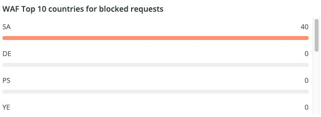
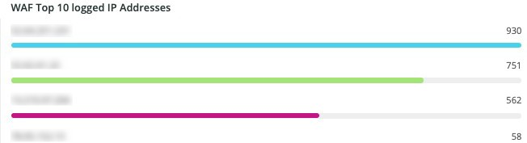
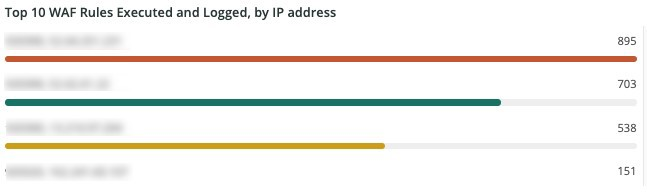

# Die Registerkarte [!DNL WAF]

Auf der Registerkarte **[!DNL WAF]** wird Traffic angezeigt, der vom [!DNL firewall] weitergeleitet und blockiert wird.

## [!DNL WAF traffic summary]

Der **[!DNL WAF traffic summary]** zeigt die Anzahl der übergebenen, protokollierten, blockierten und fehlgeschlagenen Traffics durch den [!DNL firewall] an.

## [!DNL WAF Top 10 blocked IP Addresses]

Der **[!DNL WAF Top 10 blocked IP Addresses]** Frame zeigt die zehn am häufigsten blockierten IP-Adressen der [!DNL firewall] an.

## [!DNL WAF Top 10 countries for blocked requests]

Der **[!DNL WAF Top 10 countries for blocked requests]** zeigt die Anzahl der blockierten Anfragen für Länder unter den Top 10 für blockierte Anfragen durch die [!DNL firewall] an.

## [!DNL WAF Top 10 logged IP Addresses]

Der **[!DNL WAF Top 10 logged IP Addresses]** Rahmen zeigt IP-Adressen in den 10 am häufigsten protokollierten IP-Adressen, die von der [!DNL firewall] angegeben werden.

## [!DNL Top 10 WAF Rules Executed and Logged by IP address]

Der **[!DNL Top 10 WAF Rules Executed and Logged by IP address]** Rahmen zeigt IP-Adressen an, die zu den zehn am häufigsten übereinstimmenden [!DNL firewall] gehören.

## [!DNL WAF Logged Details]

Der **[!DNL WAF Logged Details]** zeigt die vom [!DNL firewall] protokollierten Anfragen an, einschließlich Details wie Zeitstempel, Stadt, Region und Rechenzentrum.

## [!DNL WAF Blocked Details]

Der **[!DNL WAF Blocked Details]** zeigt Anfragen an, die vom [!DNL firewall] blockiert wurden, einschließlich Details wie Zeitstempel, Stadt, Region und Rechenzentrum.
