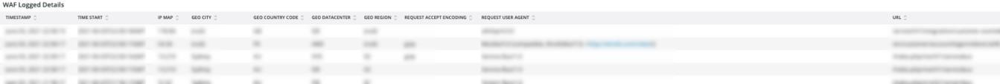

# Registerkarte [!DNL WAF]

Der Tab **[!DNL WAF]** zeigt Traffic an, der von der [!DNL firewall] übergeben und blockiert wird.

## [!DNL WAF traffic summary]

Der Frame &quot;**[!DNL WAF traffic summary]**&quot;zeigt die Anzahl des von [!DNL firewall] verarbeiteten, protokollierten, blockierten und fehlgeschlagenen Traffics an.

## [!DNL WAF Top 10 blocked IP Addresses]

Der Frame **[!DNL WAF Top 10 blocked IP Addresses]** zeigt die 10 am meisten blockierten IP-Adressen der [!DNL firewall].

## [!DNL WAF Top 10 countries for blocked requests]

Der Frame **[!DNL WAF Top 10 countries for blocked requests]** zeigt die Anzahl der blockierten Anfragen für Länder innerhalb der Top 10 für blockierte Anfragen der [!DNL firewall].

## [!DNL WAF Top 10 logged IP Addresses]

Der Frame **[!DNL WAF Top 10 logged IP Addresses]** zeigt IP-Adressen in den 10 am häufigsten protokollierten IP-Adressen durch die [!DNL firewall] an.

## [!DNL Top 10 WAF Rules Executed and Logged by IP address]

Der Frame **[!DNL Top 10 WAF Rules Executed and Logged by IP address]** zeigt IP-Adressen an, die sich in den Top-10-Regeln befinden, die am häufigsten mit den [!DNL firewall] -Regeln übereinstimmen.

## [!DNL WAF Logged Details]

Der Frame **[!DNL WAF Logged Details]** zeigt die von [!DNL firewall] protokollierten Anforderungen, einschließlich Details wie Zeitstempel, Stadt, Region und Rechenzentrum.

## [!DNL WAF Blocked Details]

Der Frame **[!DNL WAF Blocked Details]** zeigt Anforderungen, die von [!DNL firewall] blockiert werden, einschließlich Details wie Zeitstempel, Stadt, Region und Rechenzentrum.
