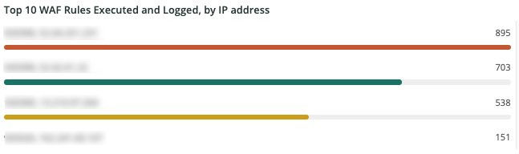

# Die [!UICONTROL WAF] tab

Die **[!UICONTROL WAF]** zeigt Traffic an, der von der Firewall übergeben und blockiert wird.

## [!UICONTROL WAF traffic summary]

Die **[!UICONTROL WAF traffic summary]** frame zeigt die Anzahl des von der Firewall verarbeiteten, protokollierten, blockierten und fehlgeschlagenen Traffics an.

## [!UICONTROL WAF Top 10 blocked IP Addresses]

Die **[!UICONTROL WAF Top 10 blocked IP Addresses]** frame zeigt die 10 am meisten blockierten IP-Adressen der Firewall.

## [!UICONTROL WAF Top 10 countries for blocked requests]

Die **[!UICONTROL WAF Top 10 countries for blocked requests]** frame zeigt die Anzahl der blockierten Anfragen für Länder innerhalb der Top 10 für blockierte Anfragen durch die Firewall.

## [!UICONTROL WAF Top 10 logged IP Addresses]

Die **[!UICONTROL WAF Top 10 logged IP Addresses]** frame zeigt IP-Adressen in den 10 am häufigsten von der Firewall protokollierten IP-Adressen an.

## [!UICONTROL Top 10 WAF Rules Executed and Logged by IP address]

Die **[!UICONTROL Top 10 WAF Rules Executed and Logged by IP address]** Frame zeigt IP-Adressen an, die sich in den 10 beliebtesten Firewall-Regeln befinden.

## [!UICONTROL WAF Logged Details]

Die **[!UICONTROL WAF Logged Details]** frame zeigt die von der Firewall protokollierten Anforderungen, einschließlich Details wie Zeitstempel, Stadt, Region und Rechenzentrum.

## [!UICONTROL WAF Blocked Details]

Die **[!UICONTROL WAF Blocked Details]** Frame zeigt Anforderungen an, die von der Firewall blockiert werden, einschließlich Details wie Zeitstempel, Stadt, Region und Rechenzentrum.
