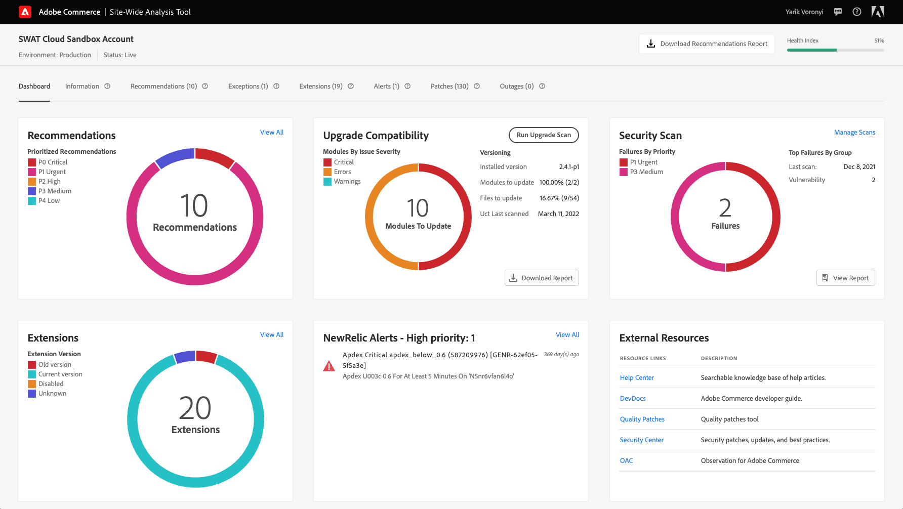

# Zugriff auf die [!DNL Site-Wide Analysis Tool]

Die [!DNL Site-Wide Analysis Tool] -Dienst verfügbar unter [Produktionsmodus](https://docs.magento.com/user-guide/magento/installation-modes.html) für [!DNL Admin] Benutzer mit Zugriffsberechtigung für Benutzer [Rollenressourcen](https://docs.magento.com/user-guide/system/permissions-user-roles.html).

>[!NOTE]
>
>Wenn Sie eine lokale Installation von Adobe Commerce haben, müssen Sie eine [Agent](../site-wide-analysis-tool/installation.md) in Ihrer Infrastruktur, um das Tool zu verwenden.

*[!DNL Site-Wide Analysis Tool]Dashboard*

## Schritt 1: Berechtigungen überprüfen

Stellen Sie sicher, dass [!DNL Admin] Das Benutzerkonto hat Zugriff auf die [!DNL Site-Wide Analysis Tool] durch [zugewiesene Benutzerrolle](https://docs.magento.com/user-guide/system/permissions-user-roles.html).

>[!IMPORTANT]
>
>Die [!DNL Site-Wide Analysis Tool] Benutzerressource (Berechtigung) ist **not** automatisch zugewiesen. Sie MUSS für die Benutzerrolle und die Rolle aktiviert werden, die jedem Benutzerkonto im [!UICONTROL Admin].

Für die benutzerdefinierte Rolle, die benötigt wird [!DNL Site-Wide Analysis Tool] -Zugriff verwenden, führen Sie folgende Schritte aus:

1. Wählen Sie die **[!UICONTROL Reports]** > *[!UICONTROL System Insights]* > **[!UICONTROL Site-Wide Analysis Tool]** Rolle.

   
   *[!DNL Site-Wide Analysis Tool]für die Rolle ausgewählte Berechtigung*

1. Klicken **[!UICONTROL Save Role]**.

1. Benachrichtigen Sie alle Benutzer, denen diese Rolle zugewiesen wurde, über die Abmeldung von der [!DNL Admin]und melden Sie sich erneut an.

>[!NOTE]
>
>Wenn Sie überprüft haben, ob das Benutzerkonto über die Berechtigung zum Zugriff auf die [!DNL Site-Wide Analysis Tool] und der Benutzer beim Versuch, auf das Tool zuzugreifen, einen 403-Fehler von der [!DNL Admin]festlegen, kann für Ihre Adobe Commerce-Instanz in der Cloud-Infrastruktur die HTTP-Zugriffssteuerung aktiviert sein. Die [!DNL Site-Wide Analysis Tool] Dashboard wird NICHT unterstützt, wenn HTTP Auth aktiviert ist. Weitere Informationen zur Behebung dieses Problems finden Sie in der [Support-Artikel](https://support.magento.com/hc/en-us/articles/360057400172-403-errors-when-accessing-Site-Wide-Analysis-Tool-on-Magento?_ga=2.168901729.117144580.1649172612-1623400270.1640858671).

## Schritt 2: Zugriff [!DNL Site-Wide Analysis Tool]

1. Im *[!UICONTROL Admin]* Seitenleiste, navigieren Sie zu **[!UICONTROL Reports]** > *[!UICONTROL System Insights]* > **[!UICONTROL Site-Wide Analysis Tool]**.

1. Lesen Sie die *Nutzungsbedingungen* für [!DNL Site-Wide Analysis Tool] und klicken Sie auf **[!UICONTROL Accept]** , um fortzufahren.

   Jeder Benutzer muss die Nutzungsbedingungen für die Sitzung akzeptieren. Dieser Schritt wird für jede angemeldete Sitzung wiederholt.

   
   *Nutzungsbedingungen*

1. Klicken Sie oben im Dashboard auf die gewünschte Registerkarte.

   
   *[!DNL Site-Wide Analysis Tool]Informationen*

## Schritt 3: Bericht erstellen

1. Klicken Sie in der rechten oberen Ecke des Dashboards auf **[!UICONTROL Generate Report]**.

1. Aktivieren Sie für jede **[!UICONTROL Type]** und **[!UICONTROL Priority]** festlegen, die Sie in den Bericht aufnehmen möchten.

1. Klicken **[!UICONTROL Generate Report]**.

   
   *Berichtseinstellungen*

| TAB | BESCHREIBUNG |
| --- | --- |
| Dashboard | Zeigt den Systemzustand mit aktuellen Benachrichtigungen und Empfehlungen nach Priorität an. |
| Informationen | Bietet Kontaktinformationen für Kunden und eine Zusammenfassung der aktuellen Tickets mit detaillierten Informationen zu den einzelnen installierten Adobe Commerce-Produkten. |
| Recommendations | Listet Empfehlungen auf, die auf Best Practices basieren, um auf Ihrer Site erkannte Probleme zu beheben. |
| Ausnahmen | Listet von der Anwendung ausgelöste Fehler auf, die durch anormale Bedingungen ohne Fehler-Handler verursacht wurden. |
| Erweiterungen | Listet alle Drittanbietererweiterungen und Drittanbieterbibliotheken auf. |

>[!NOTE]
>
>Nach Anwendung einer Empfehlung kann es einige Tage dauern, bis sie im [!DNL Site-Wide Analysis Tool] Dashboard oder generierter Bericht.
