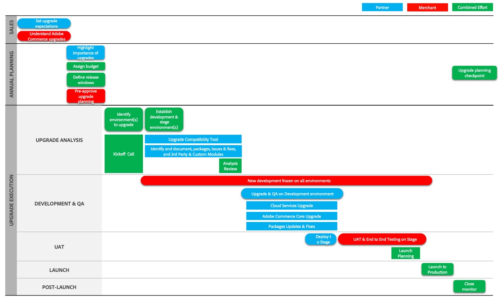

# Upgrade von Journey-Phasen

Upgrades erfordern besondere Aufmerksamkeit, Planung und Verwaltung. Damit Sie die Upgrade-Journey für Adobe Commerce besser verstehen, beschreiben wir den Prozess in drei Hauptphasen:

- [Projektstart](project-launch.md)
- [Jahresplanung](annual-planning.md)
- [Implementierung](implementation.md)

