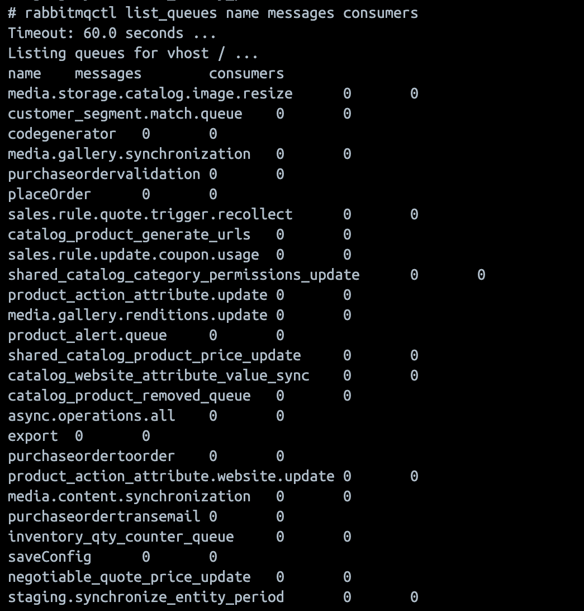

# Migration zu ActiveMQ

ActiveMQ (Apache ActiveMQ Artemis) ist ein leistungsstarker Multiprotokoll-Nachrichtenbroker, der eine Alternative zu RabbitMQ für die Verarbeitung von Nachrichtenwarteschlangen in Adobe Commerce bietet.

Ab den Versionen 2.4.8-p3, 2.4.7-p8, 2.4.6-p13 und 2.4.5-p16 unterstützt Adobe Commerce ActiveMQ als Nachrichtenwarteschlangen-Broker. Dies bietet zusätzlichen Spielraum für lokale Installationen, die basierend auf ihren Infrastrukturanforderungen und ihrem Fachwissen zwischen RabbitMQ und ActiveMQ wählen können.

## Bevor Sie beginnen

Stellen Sie vor Beginn der Migration Folgendes sicher:

1. Überprüfen Sie Ihre aktuelle RabbitMQ-Konfiguration in `app/etc/env.php`.
1. Erstellen Sie eine vollständige Sicherung Ihrer Datenbank und Codebasis.
1. Stellen Sie sicher, dass Ihre Installation die Systemanforderungen für ActiveMQ erfüllt.
1. Planen Sie ein Wartungsfenster, um die Migration abzuschließen.

## Migrationspfad

Die Migration zu ActiveMQ ist ein unkomplizierter Prozess, aber es ist wichtig sicherzustellen, dass alle ausstehenden Nachrichten verarbeitet werden, bevor der Broker gewechselt wird.

Bei diesen Migrationsanweisungen wird davon ausgegangen, dass Adobe Commerce die einzige Anwendung ist, die den Nachrichtenwarteschlangen-Broker verwendet.

### Schritt 1: Setzen Sie die Site in den Wartungsmodus

1. Setzen Sie die Site in [Wartungsmodus](../../installation/tutorials/maintenance-mode.md):

   ```shell
   bin/magento maintenance:enable
   ```

1. Überprüfen Sie, ob der Wartungsmodus aktiviert ist:

   ```shell
   bin/magento maintenance:status
   ```

### Schritt 2: RabbitMQ-Nachrichtenanzahl überprüfen

Bevor Sie fortfahren, überprüfen Sie, ob alle Nachrichten in RabbitMQ verarbeitet wurden. Verwenden Sie eine der folgenden Methoden:

#### Methode A: Verwenden des Kaninchen-MQ-Management-Dashboards

1. Zugriff auf die RabbitMQ-Verwaltungsoberfläche unter `http://<host>:15672`
1. Standardmäßige Anmeldedaten: `guest/guest`
1. Navigieren Sie zur Registerkarte **Warteschlangen**.
1. Überprüfen, ob alle Warteschlangen **0 Nachrichten anzeigen**

   

#### Methode B: Verwenden der Befehlszeile rabbitmqctl

1. Überprüfen Sie alle Warteschlangen und ihre Nachrichtenanzahl:

   ```shell
   rabbitmqctl list_queues name messages consumers
   ```

   

1. Überprüfen Sie die detaillierten Warteschlangeninformationen:

   ```shell
   rabbitmqctl list_queues name messages messages_ready messages_unacknowledged consumers
   ```

   

### Schritt 3: Ausstehende Nachrichten verarbeiten

Wenn Nachrichten in Warteschlangen ausstehen, verarbeiten Sie sie, bevor Sie fortfahren.

1. Abrufen der Liste der verfügbaren Verbraucher:

   ```shell
   bin/magento queue:consumers:list
   ```

1. Verbraucher als Gruppe oder nach einzelner Nachrichtenwarteschlange verarbeiten:

   - **Verbraucher als Gruppe verarbeiten**

     ```shell
     bin/magento cron:run --group=consumers
     ```

     >[!NOTE]
     >
     >Wenn Cron bereits in Ihrem System ausgeführt wird, müssen Sie `bin/magento cron:run --group=consumers` nicht manuell ausführen. Überprüfen Sie stattdessen mithilfe der Befehle aus Schritt 2, ob Nachrichten verarbeitet werden, indem Sie die Anzahl der Nachrichten überprüfen.

   - **Verarbeiten Sie eine bestimmte Nachrichtenwarteschlange**

     ```shell
     bin/magento queue:consumers:start <consumer_name> --max-messages=<number>
     ```

     So verarbeiten Sie beispielsweise asynchrone Vorgänge:

     ```shell
     bin/magento queue:consumers:start async.operations.all --max-messages=1000
     ```

     >[!NOTE]
     >
     >Der Parameter `--max-messages` begrenzt die Anzahl der zu verarbeitenden Nachrichten, bevor der Verbraucher stoppt. Passen Sie diesen Wert basierend auf Ihrer Warteschlangengröße an.

   - **Überwachen der Nachrichtenverarbeitung**

     Kontinuierliche Überprüfung der Nachrichtenanzahl, bis alle Warteschlangen leer sind:

     ```shell
     # Check every few seconds until 0 messages remain
     watch -n 5 "rabbitmqctl list_queues name messages | grep -v '^Listing' | grep -v '0$'"
     ```

### Schritt 4: Überprüfen, ob alle Nachrichten verarbeitet werden

Bevor Sie mit dem nächsten Schritt fortfahren, stellen Sie sicher **dass „Alle Warteschlangen 0 Nachrichten anzeigen**. Führen Sie die Überprüfungsbefehle aus Schritt 2 erneut aus.

>[!WARNING]
>
>Fahren Sie nicht mit dem nächsten Schritt fort, wenn Nachrichten unverarbeitet bleiben. Datenverlust kann auftreten, wenn Sie den Broker wechseln, während die Nachrichten noch ausstehen.

### Schritt 5: Verbraucher und Cron-Jobs stoppen

1. Alle ausgeführten Nachrichtenwarteschlangen-Verbraucher anhalten:

   ```shell
   # If using supervisor
   supervisorctl stop all
   
   # Or manually kill consumer processes
   pkill -f "queue:consumers:start"
   ```

1. Cron-Aufträge deaktivieren:

   ```shell
   bin/magento cron:remove
   ```

1. Überprüfen Sie, ob Cron-Aufträge entfernt werden:

   ```shell
   crontab -l
   ```

### Schritt 6: Aktuelle Konfiguration sichern

Erstellen Sie eine Sicherungskopie Ihrer aktuellen Konfiguration:

```shell
cp app/etc/env.php app/etc/env.php.backup.rabbitmq
```

### Schritt 7: Optional RabbitMQ deinstallieren

Sie können RabbitMQ deinstallieren, wenn es nicht mehr benötigt wird.

### Schritt 8: Installieren und Konfigurieren von ActiveMQ in Adobe Commerce

Informationen zum Durchführen von ActiveMQ-Installations- und Konfigurationsaufgaben, wie z. B. Konfigurieren des STOMP-Protokolls und Überprüfen der Verbindung, finden Sie [ „Installations- und Konfigurationshandbuch](../../installation/prerequisites/activemq.md).

### Schritt 9: Cron-Aufträge neu installieren

1. Installieren Sie nach erfolgreichem Abschluss des Tests die Cron-Aufträge neu:

   ```shell
   bin/magento cron:install
   ```

1. Überprüfen, ob Cron-Aufträge geplant sind:

   ```shell
   crontab -l
   ```

### Schritt 10: Deaktivieren des Wartungsmodus

1. Nachdem Sie überprüft haben, ob alles ordnungsgemäß funktioniert, deaktivieren Sie den Wartungsmodus:

   ```shell
   bin/magento maintenance:disable
   ```

1. Stellen Sie sicher, dass der Wartungsmodus deaktiviert ist:

   ```shell
   bin/magento maintenance:status
   ```

### Schritt 11: Überwachen des Systems

Überwachen Sie Ihr System für 24-48 Stunden nach der Migration, um sicherzustellen, dass alle Warteschlangenvorgänge ordnungsgemäß funktionieren:

- Überprüfen Sie die ActiveMQ-Web-Konsole regelmäßig auf den Nachrichtendurchsatz.
- Überwachen von Anwendungsprotokollen auf Warteschlangenfehler
- Überprüfen, ob asynchrone Vorgänge (Speichern der Konfiguration, Exporte usw.) funktionieren
- Cron-Protokolle überprüfen, um sicherzustellen, dass Verbraucher

```shell
# Monitor system logs for queue activity
tail -f var/log/system.log | grep -i queue

# Monitor cron logs
tail -f var/log/cron.log

# Check running consumer processes
ps aux | grep "queue:consumers:start"
```

## Rollback

Wenn während oder nach der Migration Probleme auftreten, können Sie ein Rollback auf RabbitMQ durchführen:

1. Wartungsmodus aktivieren:

   ```shell
   bin/magento maintenance:enable
   ```

1. Alle Verbraucher stoppen und Cron deaktivieren:

   ```shell
   pkill -f "queue:consumers:start"
   bin/magento cron:remove
   ```

1. Wiederherstellen der vorherigen Konfiguration:

   ```shell
   cp app/etc/env.php.backup.rabbitmq app/etc/env.php
   ```

1. RabbitMQ starten (falls gestoppt):

   ```shell
   sudo systemctl start rabbitmq-server
   ```

1. Cache löschen:

   ```shell
   bin/magento cache:flush
   ```

1. Cron neu installieren:

   ```shell
   bin/magento cron:install
   ```

1. Wartungsmodus deaktivieren:

   ```shell
   bin/magento maintenance:disable
   ```

Nach Abschluss der Migration sind keine weiteren Änderungen des Konfigurationswerts erforderlich.

