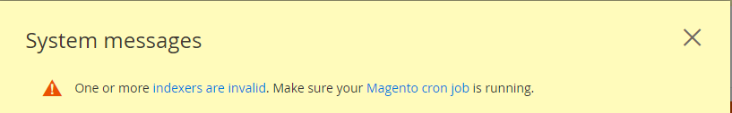

# Vollständige Upgrade-Voraussetzungen

Es ist wichtig zu verstehen, was zum Ausführen von Adobe Commerce erforderlich ist. Sie müssen zunächst die [Systemanforderungen](../../installation/system-requirements.md) für die Version, auf die Sie ein Upgrade durchführen möchten.

Nachdem Sie die Systemanforderungen überprüft haben, müssen Sie die folgenden Voraussetzungen erfüllen, bevor Sie das System aktualisieren:

* Alle Software aktualisieren
* Überprüfen, ob eine unterstützte Suchmaschine installiert ist
* Tabellenformat der Datenbank konvertieren
* Legen Sie die Grenze für geöffnete Dateien fest
* Überprüfen, ob Cron-Aufträge ausgeführt werden
* Satz `DATA_CONVERTER_BATCH_SIZE`
* Überprüfen der Dateisystemberechtigungen
* Legen Sie die `pub/` Ordnerstamm
* Installieren des Composer-Aktualisierungs-Plug-ins

## Alle Software aktualisieren

Die [Systemanforderungen](../../installation/system-requirements.md) Beschreiben Sie genau, welche Versionen von Drittanbietersoftware mit Adobe Commerce-Versionen getestet wurden.

Stellen Sie sicher, dass Sie alle Systemanforderungen und Abhängigkeiten in Ihrer Umgebung aktualisiert haben. Siehe PHP [7,4](https://www.php.net/manual/en/migration74.php), PHP [8,0](https://www.php.net/manual/en/migration80.php), PHP [8,1](https://www.php.net/manual/en/migration81.php)und [erforderliche PHP-Einstellungen](../../installation/prerequisites/php-settings.md#php-settings).

>[!NOTE]
>
>Für Adobe Commerce in Cloud Infrastructure Pro-Projekten müssen Sie eine [Support](https://experienceleague.adobe.com/docs/commerce-knowledge-base/kb/help-center-guide/magento-help-center-user-guide.html#submit-ticket) Ticket zum Installieren oder Aktualisieren von Diensten in Staging- und Produktionsumgebungen. Geben Sie die erforderlichen Dienständerungen an und fügen Sie Ihre aktualisierte `.magento.app.yaml` und `services.yaml` Dateien und PHP-Version im Ticket. Es kann bis zu 48 Stunden dauern, bis das Cloud-Infrastruktur-Team Ihr Projekt aktualisiert. Siehe [Unterstützte Software und Dienste](https://experienceleague.adobe.com/docs/commerce-cloud-service/user-guide/architecture/cloud-architecture.html#supported-software-and-services).

## Überprüfen, ob eine unterstützte Suchmaschine installiert ist

Adobe Commerce erfordert die Installation von Elasticsearch oder OpenSearch, um die Software verwenden zu können.

**Wenn Sie ein Upgrade von 2.3.x auf 2.4 durchführen** müssen Sie überprüfen, ob Sie MySQL, Elasticsearch oder eine Drittanbietererweiterung als Ihre Katalogsuchmaschine in Ihrer 2.3.x-Instanz verwenden. Das Ergebnis bestimmt, was Sie tun müssen _before_ Aktualisierung auf 2.4.

**Wenn Sie ein Upgrade der Patch-Versionen in den Release-Zeilen 2.3.x oder 2.4.x durchführen** Wenn Elasticsearch 7.x bereits installiert ist, können Sie optional [zu OpenSearch migrieren](opensearch-migration.md).

Sie können die Befehlszeile oder den Admin verwenden, um Ihre Katalogsuchmaschine zu bestimmen:

* Geben Sie die `bin/magento config:show catalog/search/engine` Befehl. Der Befehl gibt den Wert `mysql`, `elasticsearch` (dies zeigt an, dass Elasticsearch 2 konfiguriert ist), `elasticsearch5`, `elasticsearch6`, `elasticsearch7`oder einen benutzerdefinierten Wert, der angibt, dass Sie eine Suchmaschine eines Drittanbieters installiert haben. Für Versionen vor 2.4.6 verwenden Sie die `elasticsearch7` -Wert für die Elasticsearch 7- oder OpenSearch-Engine. Verwenden Sie für Version 2.4.6 und höher den `opensearch` -Wert für die OpenSearch-Engine.

* Überprüfen Sie im Admin den Wert der **[!UICONTROL Stores]** > [!UICONTROL Settings] > **[!UICONTROL Configuration]** > **[!UICONTROL Catalog]** > **[!UICONTROL Catalog]** > **[!UICONTROL Catalog Search]** > **[!UICONTROL Search Engine]** -Feld.

In den folgenden Abschnitten werden die Aktionen beschrieben, die Sie vor der Aktualisierung auf Version 2.4.0 ausführen müssen.

### MySQL

Ab Version 2.4 wird MySQL nicht mehr als Katalogsuchmaschine unterstützt. Vor der Aktualisierung müssen Sie Elasticsearch oder OpenSearch installieren und konfigurieren. Verwenden Sie die folgenden Ressourcen, um Sie durch diesen Prozess zu führen:

* [Installieren und Konfigurieren von Elasticsearch](../../configuration/search/overview-search.md)
* [Installieren von Elasticsearch](https://www.elastic.co/guide/en/elasticsearch/reference/current/install-elasticsearch.html)
* Konfigurieren [nginx](../../installation/prerequisites/search-engine/configure-nginx.md) oder [Apache](../../installation/prerequisites/search-engine/configure-apache.md) , um mit Ihrer Suchmaschine zu arbeiten
* [Commerce für die Verwendung von Elasticsearch konfigurieren](../../configuration/search/configure-search-engine.md) und reindex

Einige Katalogsuchmaschinen von Drittanbietern werden über der Adobe Commerce-Suchmaschine ausgeführt. Wenden Sie sich an Ihren Anbieter, um festzustellen, ob Sie Ihre Erweiterung aktualisieren müssen.

#### MariaDB

{{$include /help/_includes/maria-db-config.md}}

### Suchmaschine

Sie müssen entweder Elasticsearch 7.6 oder höher oder OpenSearch 1.2 installieren und konfigurieren, bevor Sie auf 2.4.0 aktualisieren. Adobe unterstützt nicht mehr Elasticsearch 2.x, 5.x und 6.x. [Suchmaschinenkonfiguration](../../configuration/search/configure-search-engine.md) im _Konfigurationshandbuch_ beschreibt die Aufgaben, die Sie nach dem Upgrade von Elasticsearch auf eine unterstützte Version ausführen müssen.

Siehe [Upgrade von Elasticsearch](https://www.elastic.co/guide/en/elasticsearch/reference/current/setup-upgrade.html) umfassende Anweisungen zum Sichern Ihrer Daten, zur Erkennung potenzieller Migrationsprobleme und zum Testen von Upgrades vor der Bereitstellung in der Produktion. Abhängig von Ihrer aktuellen Version von Elasticsearch ist möglicherweise ein vollständiger Neustart des Clusters erforderlich.

Elasticsearch erfordert Java Development Kit (JDK) 1.8 oder höher. Siehe [Java Software Development Kit (JDK) installieren](../../installation/prerequisites/search-engine/overview.md#install-the-java-software-development-kit-jdk) um zu überprüfen, welche Version von JDK installiert ist.

#### OpenSearch

OpenSearch ist eine Open-Source-Abspaltung von Elasticsearch 7.10.2 nach der Lizenzänderung von Elasticsearch. In den folgenden Versionen von Adobe Commerce wird OpenSearch unterstützt:

* 2.4.6 (OpenSearch verfügt über ein eigenes Modul und separate Einstellungen)
* 2.4.5
* 2.4.4
* 2.4.3-p2
* 2.3.7-p3

Sie können [von Elasticsearch zu OpenSearch migrieren](opensearch-migration.md) nur dann, wenn Sie auf eine oben aufgeführte (oder höhere) Version von Adobe Commerce aktualisieren.

OpenSearch erfordert JDK 1.8 oder höher. Siehe [Java Software Development Kit (JDK) installieren](../../installation/prerequisites/search-engine/overview.md#install-the-java-software-development-kit-jdk) um zu überprüfen, welche Version von JDK installiert ist.

[Suchmaschinenkonfiguration](../../configuration/search/configure-search-engine.md) beschreibt die Aufgaben, die Sie nach dem Ändern von Suchmaschinen ausführen müssen.

#### Upgrade-Elasticsearch

Die Unterstützung für Elasticsearch 8.x wurde in Adobe Commerce 2.4.6 eingeführt. Die folgenden Anweisungen zeigen ein Beispiel für die Aktualisierung von Elasticsearch von 7.x auf 8.x:

1. Aktualisieren Sie den Elasticsearch 7.x-Server auf 8.x und stellen Sie sicher, dass ausgeführt wird. Siehe [Dokumentation zu Elasticsearch](https://www.elastic.co/guide/en/elasticsearch/reference/current/install-elasticsearch.html).

1. Aktivieren Sie die `id_field_data` durch Hinzufügen der folgenden Konfiguration zu Ihrer `elasticsearch.yml` und starten Sie den Dienst Elasticsearch 8.x neu.

   ```yaml
   indices:
     id_field_data:
       enabled: true
   ```

   >[!INFO]
   >
   >Um Elasticsearch 8.x zu unterstützen, deaktiviert Adobe Commerce 2.4.6 die `indices.id_field_data` -Eigenschaft standardmäßig verwendet und `_id` im Feld `docvalue_fields` -Eigenschaft.

1. Aktualisieren Sie im Stammverzeichnis Ihres Adobe Commerce-Projekts Ihre Composer-Abhängigkeiten, um die `Magento_Elasticsearch7` -Modul und installieren Sie die `Magento_Elasticsearch8` -Modul.

   ```bash
   composer require magento/module-elasticsearch-8 --update-with-all-dependencies
   ```

1. Aktualisieren Sie Ihre Projektkomponenten.

   ```bash
   bin/magento setup:upgrade
   ```

1. [Elasticsearch konfigurieren](../../configuration/search/configure-search-engine.md#configure-your-search-engine-from-the-admin) im [!DNL Admin].

1. Neuindizieren des Katalogindex.

   ```bash
   bin/magento indexer:reindex catalogsearch_fulltext
   ```

1. Löschen Sie alle Elemente aus den aktivierten Cache-Typen.

   ```bash
   bin/magento cache:clean
   ```

#### Elasticsearch herunterladen

Wenn Sie versehentlich die Elasticsearch-Version auf Ihrem Server aktualisieren oder feststellen, dass Sie aus anderen Gründen ein Upgrade durchführen müssen, müssen Sie auch Ihre Adobe Commerce-Projektabhängigkeiten aktualisieren. So aktualisieren Sie beispielsweise von Elasticsearch 8.x auf 7.x

1. Aktualisieren Sie den Server von Elasticsearch 8.x auf 7.x und stellen Sie sicher, dass ausgeführt wird. Siehe [Dokumentation zu Elasticsearch](https://www.elastic.co/guide/en/elasticsearch/reference/current/install-elasticsearch.html).

1. Aktualisieren Sie im Stammverzeichnis Ihres Adobe Commerce-Projekts Ihre Composer-Abhängigkeiten, um die `Magento_Elasticsearch8` -Modul und dessen Composer-Abhängigkeiten verwenden und die `Magento_Elasticsearch7` -Modul.

   ```bash
   composer remove magento/module-elasticsearch-8
   ```

1. Aktualisieren Sie Ihre Projektkomponenten.

   ```bash
   bin/magento setup:upgrade
   ```

1. [Elasticsearch konfigurieren](../../configuration/search/configure-search-engine.md#configure-your-search-engine-from-the-admin) im [!DNL Admin].

1. Neuindizieren des Katalogindex.

   ```bash
   bin/magento indexer:reindex catalogsearch_fulltext
   ```

1. Löschen Sie alle Elemente aus den aktivierten Cache-Typen.

   ```bash
   bin/magento cache:clean
   ```

### Drittanbietererweiterungen

Wir empfehlen Ihnen, sich an Ihren Suchmaschinenanbieter zu wenden, um zu ermitteln, ob Ihre Erweiterung vollständig mit einer Adobe Commerce-Version kompatibel ist.

## Tabellenformat der Datenbank konvertieren

Sie müssen das Format aller Datenbanktabellen aus `COMPACT` nach `DYNAMIC`. Sie müssen außerdem den Speicher-Engine-Typ von `MyISAM` nach `InnoDB`. Siehe [Best Practices](../../implementation-playbook/best-practices/maintenance/commerce-235-upgrade-prerequisites-mariadb.md).

## Legen Sie die Grenze für geöffnete Dateien fest

Das Festlegen der Grenze für offene Dateien (ulimit) kann dabei helfen, Fehler durch mehrere rekursive Aufrufe langer Abfragezeichenfolgen oder Probleme mit der Verwendung der `bin/magento setup:rollback` Befehl. Dieser Befehl unterscheidet sich für verschiedene UNIX-Shells. Lesen Sie Ihren individuellen Geschmack, um mehr über die `ulimit` Befehl.

Adobe empfiehlt, die geöffneten Dateien festzulegen [ulimit](https://ss64.com/bash/ulimit.html) auf einen Wert von `65536` oder mehr, Sie können jedoch bei Bedarf einen größeren Wert verwenden. Sie können die ulimit in der Befehlszeile festlegen oder sie zu einer permanenten Einstellung für die Shell des Benutzers machen.

So legen Sie die ulimit über die Befehlszeile fest:

1. Wechseln Sie zu [Dateisysteminhaber](../../installation/prerequisites/file-system/overview.md).
1. Setzen Sie die ulimit auf `65536`.

   ```bash
   ulimit -n 65536
   ```

So legen Sie den Wert in Ihrer Bash-Shell fest:

1. Wechseln Sie zu [Dateisysteminhaber](../../installation/prerequisites/file-system/overview.md).
1. Öffnen `/home/<username>/.bashrc` in einem Texteditor.
1. Fügen Sie die folgende Zeile hinzu:

   ```bash
   ulimit -n 65536
   ```

1. Speichern Sie Ihre Änderungen in der `.bashrc` und beenden Sie den Texteditor.

>[!IMPORTANT]
>
>Es wird empfohlen, die Festlegung eines Werts für `pcre.recursion_limit` -Eigenschaft in `php.ini` -Datei, da dies zu unvollständigen Rollbacks ohne Fehlermeldung führen kann.

## Überprüfen, ob Cron-Aufträge ausgeführt werden

Die UNIX-Aufgabenplanung `cron` ist für die laufenden Adobe Commerce-Vorgänge von entscheidender Bedeutung. Er plant Dinge wie Neuindizierung, Newsletter, E-Mails und Sitemaps. Mehrere Funktionen erfordern mindestens einen Cron-Auftrag, der als Dateisysteminhaber ausgeführt wird.

Um sicherzustellen, dass Ihr Cron-Auftrag ordnungsgemäß eingerichtet ist, überprüfen Sie die Registerkarte &quot;crontab&quot;, indem Sie den folgenden Befehl als Dateisysteminhaber eingeben:

>[!NOTE]
>
>Die Crontab ist die Konfigurationsdatei, die für die Ausführung von Cron-Aufträgen verantwortlich ist.

```bash
crontab -l
```

Ergebnisse, die dem Folgenden ähneln, sollten angezeigt werden:

```cron
#~ MAGENTO START c5f9e5ed71cceaabc4d4fd9b3e827a2b
* * * * * /usr/bin/php /var/www/html/magento2/bin/magento cron:run 2>&1 | grep -v "Ran jobs by schedule" >> /var/www/html/magento2/var/log/magento.cron.log
#~ MAGENTO END c5f9e5ed71cceaabc4d4fd9b3e827a2b
```

Ein weiteres Symptom dafür, dass Cron nicht ausgeführt wird, ist der folgende Fehler im Admin:



Um den Fehler anzuzeigen, klicken Sie auf **Systemmeldungen** am oberen Rand des Fensters wie folgt:


Siehe [Cron konfigurieren und ausführen](../../configuration/cli/configure-cron-jobs.md) für weitere Informationen.

## DATA_CONVERTER_BATCH_SIZE festlegen

Adobe Commerce 2.4 umfasst Sicherheitsverbesserungen, bei denen einige Daten von serialisierten Daten in JSON konvertiert werden müssen. Diese Konvertierung erfolgt während des Upgrades und kann abhängig von der Datenmenge in Ihrer Datenbank lange dauern.

Die folgenden Tabellen sind am stärksten betroffen:

* `catalogrule`
* `core_config_data`
* `magento_reward_history`
* `quote_payment`
* `quote`
* `sales_order_payment`
* `sales_order`
* `salesrule`
* `url_rewrite`

Wenn Sie über eine große Datenmenge verfügen, können Sie die Leistung verbessern, indem Sie den Wert einer Umgebungsvariablen festlegen. `DATA_CONVERTER_BATCH_SIZE`. Standardmäßig ist der Wert auf `50,000`.

So legen Sie die Umgebungsvariable fest:

1. Wechseln Sie zu [Dateisysteminhaber](../../installation/prerequisites/file-system/overview.md).
1. Legen Sie die Variable fest:

   ```bash
   export DATA_CONVERTER_BATCH_SIZE=100000
   ```

   >[!NOTE]
   >
   > `DATA_CONVERTER_BATCH_SIZE` Speicher benötigt; vermeiden Sie, den Wert auf einen großen Wert (ca. 1 GB) festzulegen, ohne ihn zuerst zu testen.

1. Nach Abschluss des Upgrades können Sie die -Variable deaktivieren:

   ```bash
   unset DATA_CONVERTER_BATCH_SIZE
   ```

## Überprüfen der Dateisystemberechtigungen

Aus Sicherheitsgründen erfordert Adobe Commerce bestimmte Berechtigungen für das Dateisystem. Berechtigungen unterscheiden sich von _[Eigentum](../../upgrade/prepare/prerequisites.md#verify-file-system-permissions)_. Der Inhaber bestimmt, wer Aktionen im Dateisystem durchführen kann. -Berechtigungen bestimmen, was der Benutzer tun kann.

Verzeichnisse im Dateisystem müssen von der [des Dateisysteminhabers](../../installation/prerequisites/file-system/overview.md) hinzugefügt.

Um zu überprüfen, ob Ihre Dateisystemberechtigungen richtig eingerichtet sind, melden Sie sich entweder beim Anwendungsserver an oder verwenden Sie die Dateiverwaltungsanwendung Ihres Hosting-Providers.

Geben Sie beispielsweise den folgenden Befehl ein, wenn die Anwendung in `/var/www/html/magento2`:

```bash
ls -l /var/www/html/magento2
```

Beispielausgabe:

```console
total 1028
drwxrwx---. 12 magento_user apache   4096 Jun  7 07:55 .
drwxr-xr-x.  3 root         root     4096 May 11 14:29 ..
drwxrwx---.  4 magento_user apache   4096 Jun  7 07:53 app
drwxrwx---.  2 magento_user apache   4096 Jun  7 07:53 bin
-rw-rw----.  1 magento_user apache 439792 Apr 27 21:23 CHANGELOG.md
-rw-rw----.  1 magento_user apache   3422 Apr 27 21:23 composer.json
-rw-rw----.  1 magento_user apache 425214 Apr 27 21:27 composer.lock
-rw-rw----.  1 magento_user apache   3425 Apr 27 21:23 CONTRIBUTING.md
-rw-rw----.  1 magento_user apache  10011 Apr 27 21:23 CONTRIBUTOR_LICENSE_AGREEMENT.html
-rw-rw----.  1 magento_user apache    631 Apr 27 21:23 COPYING.txt
drwxrwx---.  4 magento_user apache   4096 Jun  7 07:53 dev
-rw-rw----.  1 magento_user apache   2926 Apr 27 21:23 Gruntfile.js
-rw-rw----.  1 magento_user apache   7592 Apr 27 21:23 .htaccess
-rw-rw----.  1 magento_user apache   6419 Apr 27 21:23 .htaccess.sample
drwxrwx---.  4 magento_user apache   4096 Jun  7 07:53 lib
-rw-rw----.  1 magento_user apache  10376 Apr 27 21:23 LICENSE_AFL.txt
-rw-rw----.  1 magento_user apache  30634 Apr 27 21:23 LICENSE_EE.txt
-rw-rw----.  1 magento_user apache  10364 Apr 27 21:23 LICENSE.txt
-rw-rw----.  1 magento_user apache   4108 Apr 27 21:23 nginx.conf.sample
-rw-rw----.  1 magento_user apache   1427 Apr 27 21:23 package.json
-rw-rw----.  1 magento_user apache   1659 Apr 27 21:23 .php_cs
-rw-rw----.  1 magento_user apache    804 Apr 27 21:23 php.ini.sample
drwxrwx---.  2 magento_user apache   4096 Jun  7 07:53 phpserver
drwxrwx---.  6 magento_user apache   4096 Jun  7 07:53 pub
-rw-rw----.  1 magento_user apache   2207 Apr 27 21:23 README_EE.md
drwxrwx---.  7 magento_user apache   4096 Jun  7 07:53 setup
-rw-rw----.  1 magento_user apache   3731 Apr 27 21:23 .travis.yml
drwxrwx---.  7 magento_user apache   4096 Jun  7 07:53 update
drwxrws---. 11 magento_user apache   4096 Jun 13 16:05 var
drwxrws---. 29 magento_user apache   4096 Jun  7 07:53 vendor
```

Eine Erläuterung der Beispielausgabe finden Sie im Folgenden:

* Die meisten Dateien sind `-rw-rw----`, der `660`
* `drwxrwx---` = `770`
* `-rw-rw-rw-` = `666`
* Der Dateisysteminhaber ist `magento_user`

Um genauere Informationen zu erhalten, können Sie den folgenden Befehl eingeben:

```bash
ls -la /var/www/html/magento2/pub
```

Da Adobe Commerce statische Datei-Assets in Unterverzeichnissen von bereitstellt `pub`, ist es eine gute Idee, auch dort Berechtigungen und Eigentumsrechte zu überprüfen.

Weitere Informationen finden Sie unter [Dateisystemberechtigungen und -berechtigungen](../../installation/prerequisites/file-system/overview.md).

## Legen Sie die `pub/` Ordnerstamm

Siehe [Basisverzeichnis zur Verbesserung der Sicherheit ändern](../../installation/tutorials/docroot.md) für weitere Details.

## Installieren des Composer-Aktualisierungs-Plug-ins

Die [`magento/composer-root-update-plugin`](https://github.com/magento/composer-root-update-plugin) Das Composer-Plug-in löst Änderungen auf, die am Stammprojekt vorgenommen werden müssen `composer.json` -Datei vor der Aktualisierung auf eine neue Produktanforderung.

Das Plug-in automatisiert die manuelle Aktualisierung teilweise, indem es Abhängigkeitskonflikte identifiziert und unterstützt, anstatt sie manuell zu identifizieren und zu beheben.

Installieren des Plug-ins:

1. Fügen Sie das Paket zu Ihrem `composer.json` -Datei.

   ```bash
   composer require magento/composer-root-update-plugin ~2.0 --no-update
   ```

1. Aktualisieren Sie die Abhängigkeiten:

   ```bash
   composer update
   ```
