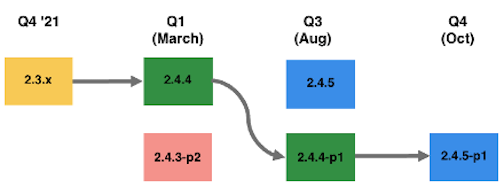

# Empfohlene Aktualisierungspfade für 2022

Eine E-Commerce-Implementierung ist eine Weiterentwicklung - sie ist nie wirklich fertig. Ihr Unternehmen muss den Trends einen Schritt voraus bleiben, indem es die neuesten Funktionen einführt, die Ihre Kunden binden. Im Laufe der Zeit erhöhen diese zusätzlichen Funktionen den Platzbedarf und die Gesamtkomplexität der Implementierung.

Zu den allgemeinen Faktoren, die sich auf den erforderlichen Aufwand für Ihr Aktualisierungsprojekt auswirken, gehören unter anderem:

| Technische Komplexität | Planung und Strategie |
|-----------------------------------------------------------|--------------------------------------------------------------|
| Umfang der Anpassungen | Klarheit der Anforderungen, schwindende Entscheidungen und Schlupflöcher |
| Anzahl der Erweiterungen | Aktualisierungshäufigkeit |
| Anzahl der Integrationen mit Drittanbietern (OMS, ERP) | Ihre Teststrategie |
| Kodierung mit Best Practices |  |

Im Folgenden finden Sie Pfade, die von Adobe Commerce empfohlen werden, um die Sicherheit und Leistung Ihrer Site im Laufe des Jahres 2022 zu gewährleisten.

## Upgrade von Version 2.3.0-2.3.6 (Option 1)

Sie können von jeder Zeile von 2.3.x auf 2.4.3 wechseln. Je länger Sie jedoch ohne Upgrade arbeiten, desto mehr Aufwand ist es, direkt auf 2.4.3 zu wechseln, da sich die Codebasis mehr geändert hat.

Wenn Sie beispielsweise mit Version 2.3.4 arbeiten, die im Januar 2020 veröffentlicht wurde, befinden Sie sich in einer Version, die fast zwei Jahre alt ist. Daher ist die Codebasis von 2.4.3 im Vergleich zu 2.3.4 viel größer. Daher empfiehlt Adobe, häufig ein Upgrade durchzuführen, da der Aufwand in der Regel sogar noch höher ist, wenn Sie die Aktualisierung über einen längeren Zeitraum verzögern.

Sobald Sie 2.4.3 haben, können Sie in Q1 weiterhin sicher sein, indem Sie 2.4.3-p2 verwenden. Dies ist ein geringer Aufwand, da es sich um eine leichte Sicherheitsversion handelt. Dann können Sie in Q3 den vollständigen Patch 2.4.5 und einen weiteren leichten Sicherheits-Patch nehmen, um in Q4 sicher zu bleiben. Für diesen Pfad sind bis Ende 2022 zwei Upgrades mit hohem Aufwand erforderlich.

## Upgrade von Version 2.3.0-2.3.6 (Option 2)

Alternativ können Sie im März 2022 direkt von 2.3.x auf 2.4.4 aktualisieren. Ab Version 2.4.4 können Sie dann den leichten Sicherheitspatch im 3. Quartal verwenden und dann auf die Version 2.4.5-p1 in Q4 aktualisieren, die alle Aktualisierungen der Version 2.4.5 sowie zusätzliche Sicherheits-Patches enthält.

Wichtige Aspekte bei der Entscheidung zwischen diesen beiden Optionen:

| Option 1: Upgrade auf 2.4.3-p1 oder -p2 | Option 2: Upgrade auf 2.4.4 oder 2.4.4-p1 |
|--------------------------------------------------------------------------------------------------------------------|--------------------------------------------------------------------------------------------------------------------------------------------------|
| Erfordert zwei wichtige Upgrades vor Ende 2022, um sicher und PCI-kompatibel zu bleiben und Qualitätsunterstützung zu erhalten | Erfordert vor Ende 2022 ein signifikantes Upgrade und ein Upgrade mit geringem Aufwand, um sicher und PCI-kompatibel zu bleiben und Qualitätsunterstützung zu erhalten. |
| Ermöglicht es Ihnen, schneller potenziell zu einer unterstützten, PCI-kompatiblen Version zu gelangen. | Möglicherweise wird ein längeres Fenster angezeigt, bis Sie zu einer unterstützten, PCI-kompatiblen Version gelangen, da die 2.3-Zeile im April 2022 EOL erreicht hat. |
| Zeitliche Überlegungen: kann die Umstellung auf eine neue PHP-Version auf einen späteren Zeitpunkt im Jahr (August) verzögern. | Zeitliche Überlegungen: kann Anfang des Jahres (März) mit der Umstellung auf eine neue PHP-Version beginnen. |

## Upgrade von 2.3.7 (Option 1)

Da Sie die neueste Version 2.3.7 verwenden, befinden Sie sich in einer Zeile, die nur Sicherheitsversionen erhält. Im ersten Quartal 22 veröffentlicht Adobe die letzte Version von 2.3, die 2.3.7-p3 lautet, zusammen mit einer Sicherheitsversion (2.4.3-p2) und einer Vollversion (2.4.4).

Ihre erste Option wäre es, die 2.3.7-p3 zu nehmen und die neuesten Sicherheitskorrekturen zu erhalten. Im August könnten Sie dann die Version 2.4.5 annehmen. Schließlich können Sie in Q4 die Light-Security-Version basierend auf der vollständigen Version 2.4.5 verwenden. In diesem Szenario würden Sie eine EOL-Version für einige Monate verwenden, bis Sie 2.4.5 einsetzen. 2.3.x bietet jedoch derzeit keine Qualitätsunterstützung und Sie würden die neuesten Sicherheitslücken gepatcht haben.

## Upgrade von 2.3.7 (Option 2)

Ihre zweite Option bestünde darin, die Version 2.3.7-p3 zu verwenden, um die neuesten Sicherheitskorrekturen schnell zu erhalten, da die Implementierung von Sicherheits-Patches für Ihre aktuelle Zeile mit geringem Aufwand erfolgt. Dann können Sie das Upgrade auf 2.4.4 starten.

Im August könnten Sie dann 2.4.4-p1 verwenden, was eine leichte Sicherheitsversion wäre, und im 4. Quartal 2.4.5-p1 ausführen, das alle in 2.4.5 enthaltenen Updates und die neuesten Sicherheitsversionen enthält.

Sie können auch von 2.3.7-p3 zu 2.4.4-p1 wechseln. Beachten Sie jedoch, dass 2.4.4-p1 eine &quot;starke Steigerung&quot;ist, da Sie im Wesentlichen alle Aktualisierungen erhalten, die in 2.4.4 enthalten sind, und die Sicherheitsaktualisierungen in 2.4.4-p1. Die Entscheidung, ob Sie diese stärkere Steigerung im März oder August auf die 2.4.4-Linie starten möchten, liegt bei Ihnen und Ihrem Team.

Wichtige Aspekte bei der Entscheidung zwischen diesen beiden Optionen:

| Option 1: Upgrade auf 2.3.7-p3, dann auf 2.4.5 | Option 2: Upgrade auf 2.3.7-p3, dann auf 2.4.4 |
|--------------------------------------------------------------------------------------------------------------------|-----------------------------------------------------------------------------------------------------------------------------------------------------|
| Erhalten Sie zuerst die neuesten Sicherheitsupdates mit einem Sicherheitspatch mit geringem Aufwand | Erhalten Sie zuerst die neuesten Sicherheitsupdates mit einem Sicherheitspatch mit geringem Aufwand |
| Erfordert ein wichtiges Upgrade vor Ende 2022, um sicher und PCI-kompatibel zu bleiben und Qualitätsunterstützung zu erhalten. | Erfordert vor Ende 2022 ein signifikantes Upgrade und ein Upgrade mit geringem Aufwand, um sicher und PCI-kompatibel zu bleiben und Qualitätsunterstützung zu erhalten. |
| Ein längeres Fenster steht zur Verfügung, bis Sie zu einer unterstützten, PCI-kompatiblen Version gelangen, da die 2.3-Zeile im April EOL erreicht | Zeitliche Überlegungen: kann Anfang des Jahres (März) mit der Umstellung auf eine neue PHP-Version beginnen. |
| Zeitliche Aspekte: kann die Aktualisierung mit höherem Aufwand bis August verzögern | Zeitliche Aspekte: kann im März mit einem Upgrade mit höherem Aufwand beginnen und dann im Oktober ein langsames Upgrade durchführen |

## Upgrade von 2.4.0 auf 2.4.2

Da Sie Version 2.4.0-2.4.2 verwenden, empfehlen wir, in Q1 auf 2.4.4 zu aktualisieren. Dies ist ein relativ hoher Aufwand aufgrund der durchbrechenden Änderungen in 2.4.4, die durch die Umstellung auf PHP 8.1 verursacht werden. Die restlichen Upgrades für das Jahr sind jedoch weniger Aufwand, sodass Sie nur eine Upgrade auf höherer Ebene im Jahr 2022 durchführen müssen.

## Upgrade von 2.4.3

Da Sie auf 2.4.3 sind, wäre die Einnahme von 2.4.3-p2 im 1. Quartal der geringste Aufwand. Im August könnten Sie dann die Version 2.4.5 annehmen. Schließlich können Sie in Q4 die Light-Security-Version basierend auf der vollständigen Version 2.4.5 verwenden. In diesem Szenario führen Sie 2022 nur ein Upgrade auf höherer Ebene durch.
