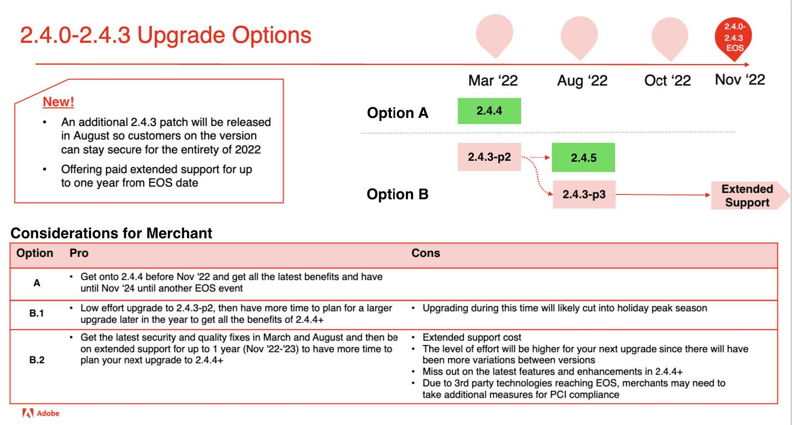

# Empfohlene Aktualisierungspfade für 2022

Eine E-Commerce-Implementierung ist eine Weiterentwicklung - sie ist nie wirklich fertig. Ihr Unternehmen muss den Trends einen Schritt voraus bleiben, indem es die neuesten Funktionen einführt, die Ihre Kunden binden. Die Aktualisierung auf Adobe Commerce 2.4.4 oder höher ermöglicht es Ihnen, mit erstklassigen Innovationen und zukunftssicherem Unternehmen stets auf dem neuesten Stand zu sein:

- Schnellerer Zugriff auf innovative Funktionen, die als SaaS-Dienste bereitgestellt werden
- Einfachere und kostengünstigere Wartung und Upgrades
- Kontinuierliche Flexibilität und Anpassung zur Erfüllung individueller Geschäftsanforderungen
- Erhebliche Steigerungen der Leistung und Skalierbarkeit
- Verbesserte Entwicklererfahrung und -werkzeuge
- Möglichkeit einer tieferen Integration mit anderen Adobe Experience Cloud-Anwendungen

Um unseren Händlern mehr Flexibilität bei der Planung ihres Upgrades auf Version 2.4.4 oder höher zu bieten, haben wir kürzlich unsere [Versionsplanung 2022](https://devdocs.magento.com/release/), verlängerte das Datum des 2.3 Ende des Supports (EOS) und kündigte neue erweiterte Support-Optionen für ausgewählte Versionen unserer Software an. Weitere Informationen zu diesen Updates finden Sie in unserem Blog.

Im Folgenden finden Sie von Adobe Commerce empfohlene Pfade zu 2.4.4 oder höher, um die Sicherheit und Leistung Ihrer Site beim Upgrade auf eine der neuesten Versionen zu gewährleisten.

## Upgrade von Versionen 2.3.6 und niedriger

## Upgrade von 2.3.7

## Upgrade von 2.4.0 auf 2.4.3

## Upgrade von 2.4.3 (oder neu aktualisiert)

