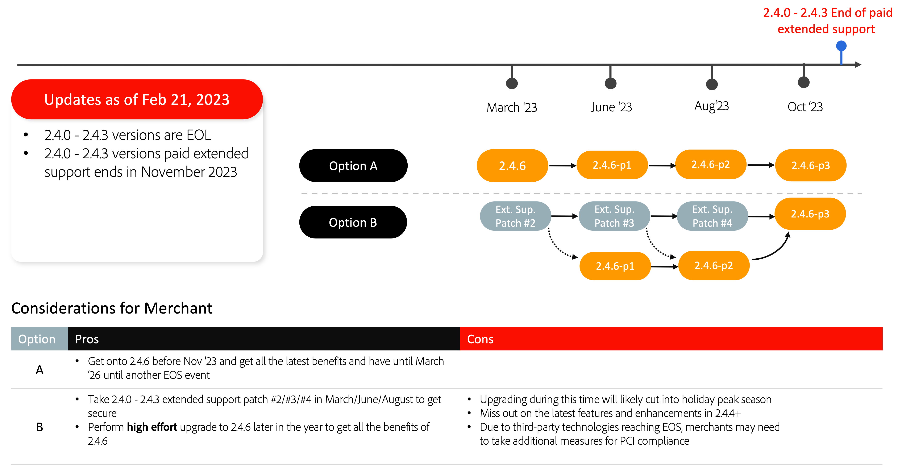

# Empfohlene Aktualisierungspfade

Eine eCommerce-Implementierung ist eine Weiterentwicklung - sie ist nie wirklich abgeschlossen. Ihr Unternehmen muss den Trends immer einen Schritt voraus sein, indem es die neuesten Funktionen und Möglichkeiten einführt, mit denen Ihre Kunden interagieren können. Durch die Aktualisierung auf die neueste Adobe Commerce-Version sind Sie mit erstklassigen Innovationen immer einen Schritt voraus und können Ihr Unternehmen zukunftssicher machen mit:

- Schnellerer Zugriff auf innovative SaaS-Funktionen
- Einfachere und kostengünstigere Wartung und Upgrades
- Kontinuierliche Flexibilität und Anpassung an individuelle Geschäftsanforderungen
- Deutliche Steigerung der Leistung und Skalierbarkeit
- Besseres Entwicklererlebnis und Tools
- Möglichkeit einer tieferen Integration in andere Adobe Experience Cloud-Programme

Im Folgenden finden Sie von Adobe Commerce empfohlene Aktualisierungspfade, um Ihre Website sicher und leistungsfähig zu halten, während Sie auf eine der neuesten Versionen aktualisieren.

## Aktualisieren von 2.3.7

## Aktualisieren von 2.4.0-2.4.3

## Aktualisieren von 2.4.4 und 2.4.5

