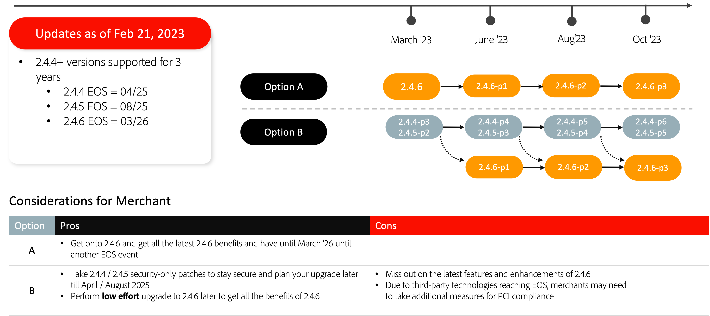

# Empfohlene Aktualisierungspfade

Eine E-Commerce-Implementierung ist eine Weiterentwicklung - sie ist nie wirklich fertig. Ihr Unternehmen muss den Trends einen Schritt voraus bleiben, indem es die neuesten Funktionen einführt, die Ihre Kunden binden. Durch die Aktualisierung auf die neueste Adobe Commerce-Version können Sie das Paket mit den besten Innovationen und dem zukunftssicheren Unternehmen überzeugen:

- Schnellerer Zugriff auf innovative Funktionen, die als SaaS-Dienste bereitgestellt werden
- Einfachere und kostengünstigere Wartung und Upgrades
- Kontinuierliche Flexibilität und Anpassung zur Erfüllung individueller Geschäftsanforderungen
- Erhebliche Verbesserungen bei Leistung und Skalierbarkeit
- Verbesserte Entwicklererfahrung und -werkzeuge
- Möglichkeit einer tieferen Integration mit anderen Adobe Experience Cloud-Anwendungen

Um unseren Händlern mehr Flexibilität bei der Planung von Upgrades zu bieten, haben wir kürzlich die Adobe Commerce aktualisiert [Veröffentlichungszeitplan](../../release/schedule.md), verlängerte das Datum des 2.3 Ende des Supports (EOS) und kündigte neue erweiterte Support-Optionen für ausgewählte Versionen unserer Software an. Weitere Informationen zu diesen Aktualisierungen finden Sie unter [Erweiterte Unterstützung für Adobe Commerce](https://business.adobe.com/blog/the-latest/adobe-announces-expanded-support).

Im Folgenden finden Sie die von Adobe Commerce empfohlenen Aktualisierungspfade, um die Sicherheit und Leistung Ihrer Site beim Upgrade auf eine der neuesten Versionen zu gewährleisten.

## Upgrade von 2.3.7

## Upgrade von 2.4.0 auf 2.4.3

## Upgrade von 2.4.4 und 2.4.5

