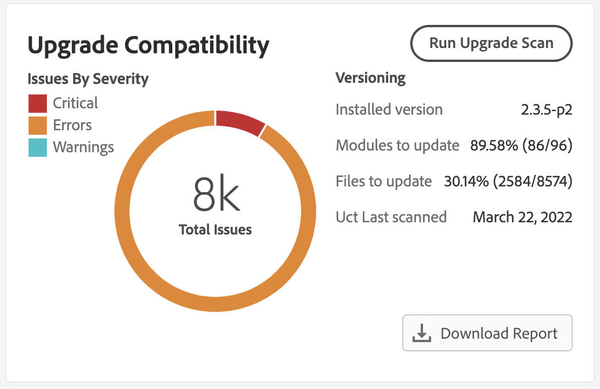

# [!DNL Site-Wide Analysis Tool] integrieren

Die [!DNL Site-Wide Analysis Tool] bietet rund um die Uhr Echtzeit-Leistungsüberwachung, Berichte und Empfehlungen, um die Sicherheit und Bedienbarkeit von Adobe Commerce-Instanzen zu gewährleisten.

Der [!DNL Upgrade Compatibility Tool] ist jetzt in den [!DNL Site-Wide Analysis Tool] integriert, um auch technisch nicht versierten Personen die Möglichkeit zu geben, den [!DNL Upgrade Compatibility Tool] auszuführen und einen [Bericht](../upgrade-compatibility-tool/reports.md) mit einer Liste von Problemen für jede Datei zu erhalten.

Weitere Informationen finden Sie [[!DNL Site-Wide Analysis Tool] Benutzerhandbuch](https://experienceleague.adobe.com/de/docs/commerce-operations/tools/site-wide-analysis-tool/access) .

## Ausführen des [!DNL Upgrade Compatibility Tool] über die [!DNL Site-Wide Analysis Tool]

Navigieren Sie zum [!DNL Site-Wide Analysis Tool]-Dashboard für Ihr Projekt und suchen Sie nach dem [!DNL Upgrade Compatibility Tool] Widget.

Klicken Sie auf **[!UICONTROL Run Upgrade Scan]**. Die Überprüfung kann je nach Projektgröße einige Zeit in Anspruch nehmen. Ein Spinner zeigt an, dass der Scan ausgeführt wird.

Nach Abschluss des Scans werden die allgemeinen Ergebnisse im Widget angezeigt.

Klicken Sie auf **[!UICONTROL Download Report]** , um den [!DNL Upgrade Compatibility Tool] [HTML-](../upgrade-compatibility-tool/reports.md#html-report) abzurufen und die Details zu überprüfen.

>[!NOTE]
>
> Wenn Sie die [!DNL Upgrade Compatibility Tool] durch die [!DNL Site-Wide Analysis Tool] ausführen, werden Ihre Ergebnisse optimiert und Sie können sich auf Probleme konzentrieren, die neu und für Ihr Target-Upgrade wichtig sind. Sie verwendet die Option [`--ignore-current-version-compatibility-errors`](run.md#optimize-your-results) und zeigt immer Ergebnisse an, indem die Version Ihres Projekts mit der neuesten veröffentlichten Version verglichen wird.
