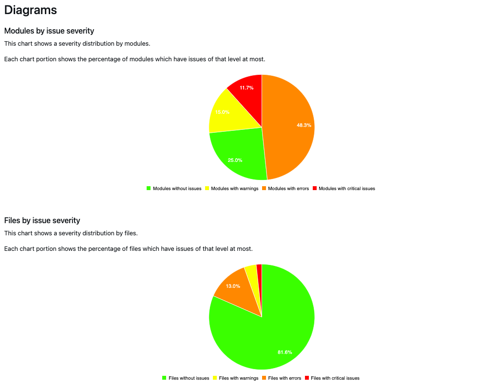

# Berichte

{{commerce-only}}

Die Analyse hat ergeben, dass die [!DNL Upgrade Compatibility Tool] kann einen Bericht mit einer Liste von Problemen für jede Datei exportieren, in dem der Schweregrad, der Fehlercode und die Fehlerbeschreibung angegeben sind. Die [!DNL Upgrade Compatibility Tool] exportiert den Bericht in zwei verschiedene Formate:

- A [JSON-Datei](reports.md#json-file).
- Ein [HTML-Bericht](reports.md#html-report).

Siehe folgendes Beispiel für die Befehlszeilenschnittstelle eines Berichts:

```terminal
File: /app/code/Custom/CatalogExtension/Controller/Index/Index.php
------------------------------------------------------------------
 * [WARNING][1131] Line 10: Extending from class 'Magento\Framework\App\Action\Action' that is @deprecated on version '2.4.4'
 * [ERROR][1328] Line 10: Implemented interface 'Magento\Framework\App\Action\HttpGetActionInterface' that is non API on version '2.4.4'
```

Überprüfen Sie die [Fehlermeldungsreferenz](../upgrade-compatibility-tool/error-messages.md) für weitere Informationen zu den verschiedenen Fehlern, die dieser Bericht erzeugen kann.

Dieser Bericht enthält auch eine detaillierte Zusammenfassung, die Folgendes zeigt:

- *Aktuelle Version*: die derzeit installierte Version.
- *Zielversion*: die Version, auf die Sie aktualisieren möchten.
- *Ausführungszeit*: die Zeit, die die Analyse für die Erstellung des Berichts benötigte (mm:ss).
- *Module, die aktualisiert werden müssen*: der Prozentsatz der Module, die Kompatibilitätsprobleme enthalten und aktualisiert werden müssen.
- *Dateien, die aktualisiert werden müssen*: den Prozentsatz der Dateien, die Kompatibilitätsprobleme enthalten und aktualisiert werden müssen.
- *Kritische Fehler insgesamt*: die Anzahl der gefundenen kritischen Fehler.
- *Fehler insgesamt*: die Anzahl der gefundenen Fehler.
- *Warnhinweise insgesamt*: die Anzahl der gefundenen Warnungen.
- *Speicherspitzenauslastung*: die maximale Speicherkapazität der [!DNL Upgrade Compatibility Tool] hat während der Ausführung erreicht.

Siehe folgendes Beispiel für die Befehlszeilenschnittstelle:

```terminal
 ----------------------------- ----------------- 
  Current version               2.4.1            
  Target version                2.4.4            
  Execution time                1m:8s            
  Modules that require update   71.67% (43/60)   
  Files that require update     18.05% (96/532)  
  Total critical issues         24               
  Total errors                  159              
  Total warnings                53               
  Memory peak usage             902.00 MB        
 ----------------------------- ----------------- 
```

## JSON-Datei

Sie können die JSON-Dateiausgabe abrufen, während Sie die [!DNL Upgrade Compatibility Tool] auf einer Befehlszeilenschnittstelle. Die `JSON` enthält genau die gleichen Informationen, die auf der [!DNL Upgrade Compatibility Tool] Ausgabe:

- Eine Liste der festgestellten Probleme.
- Eine Zusammenfassung der Analyse.

Für jedes aufgetretene Problem enthält der Bericht detaillierte Informationen wie den Schweregrad und die Beschreibung des Problems.

Exportieren `JSON` in einen anderen Ausgabeordner:

```bash
bin/uct upgrade:check <dir> --json-output-path[=JSON-OUTPUT-PATH]
```

Wenn die Argumente wie folgt lauten:

- `<dir>`: Installationsordner von Adobe Commerce.
- `[=JSON-OUTPUT-PATH]`: Pfad-Verzeichnis zum Exportieren `JSON` Ausgabedatei.

>[!NOTE]
>
> Der Standardpfad für den Ausgabeordner ist `var/output/[TIME]-results.json`.

## HTML-Bericht

Sie können den HTML-Bericht abrufen, während Sie das Tool auf einer Befehlszeilenschnittstelle oder über die [!DNL Site-Wide Analysis Tool]. Der HTML-Bericht enthält außerdem:

- Eine Liste der festgestellten Probleme.
- Eine Zusammenfassung der Analyse.


Sie können einfach durch die identifizierten Probleme navigieren während der [!DNL Upgrade Compatibility Tool] Analyse.

Sie können die im Bericht angezeigten Probleme nach der minimalen Problemstufe filtern (der Standardwert ist `WARNING`).

Oben rechts befindet sich ein Dropdown-Menü, in dem Sie eine andere Ebene auswählen können. Die Liste der identifizierten Probleme wird entsprechend gefiltert.


>[!NOTE]
>
> Die Probleme mit einer niedrigeren Problemstufe werden entfernt, Sie erhalten jedoch eine Benachrichtigung, damit Sie die identifizierten Probleme pro Modul immer kennen.

Der HTML-Bericht enthält außerdem vier verschiedene Diagramme:

- **Schweregrad von Modulen nach Problem**: Zeigt die Schweregrad-Verteilung nach Modulen an.
- **Schweregrad der Dateien nach Problem**: Zeigt die Schweregrad-Verteilung nach Dateien an.
- **Nach Gesamtanzahl der Probleme sortierte Module**: Zeigt die 10 am stärksten kompromittierten Module unter Berücksichtigung von Warnungen, Fehlern und kritischen Fehlern an.
- **Module mit relativen Größen und Problemen**: Je mehr Dateien ein Modul enthält, desto größer ist sein Kreis. Je mehr Probleme ein Modul hat, desto roter erscheint sein Kreis.

In diesen Diagrammen können Sie ermitteln, welche Module am stärksten gefährdet sind und welche die Durchführung eines Upgrades erfordern.



Die HTML-Berichtsdiagramme werden ebenfalls entsprechend aktualisiert, mit Ausnahme der `Modules with relative sizes and issues`, der mit der `min-issue-level` das ursprünglich eingerichtet wurde.

Wenn Sie unterschiedliche Ergebnisse für die `Modules with relative sizes and issues` -Diagramm verwenden, müssen Sie den Befehl erneut ausführen und einen anderen Wert für die `--min-issue-level` -Option.


So exportieren Sie diesen HTML-Bericht in einen anderen Ausgabeordner:

```bash
bin/uct upgrade:check <dir> --html-output-path[=HTML-OUTPUT-PATH]
```

Wenn die Argumente wie folgt lauten:

- `<dir>`: Installationsordner von Adobe Commerce.
- `[=HTML-OUTPUT-PATH]`: Pfad-Verzeichnis zum Exportieren `.html` Ausgabedatei.

>[!NOTE]
>
> Der Standardpfad für den Ausgabeordner ist `var/output/[TIME]-results.html`.
