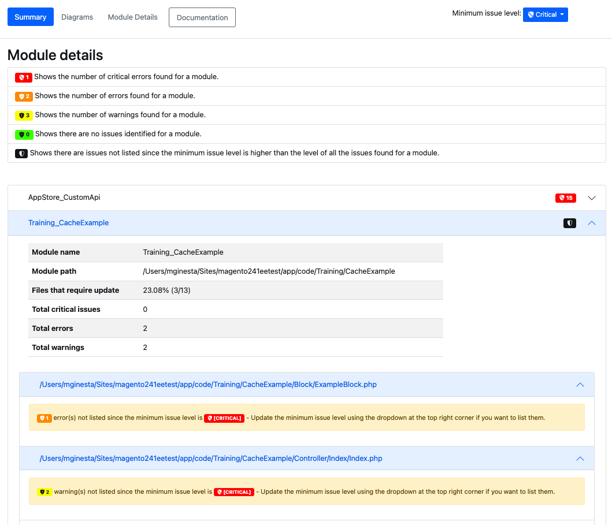

# Berichte

{{commerce-only}}

Als Ergebnis der Analyse kann der [!DNL Upgrade Compatibility Tool] einen Bericht exportieren, der eine Liste von Problemen für jede Datei enthält, wobei der Schweregrad, der Fehler-Code und die Fehlerbeschreibung angegeben werden. Der [!DNL Upgrade Compatibility Tool] exportiert den Bericht in zwei verschiedene Formate:

- Eine [JSON-Datei](reports.md#json-file).
- Ein [HTML-Bericht](reports.md#html-report).

Siehe folgendes Beispiel für eine Befehlszeilenschnittstelle eines Berichts:

```
File: /app/code/Custom/CatalogExtension/Controller/Index/Index.php
------------------------------------------------------------------
 * [WARNING][1131] Line 10: Extending from class 'Magento\Framework\App\Action\Action' that is @deprecated on version '2.4.4'
 * [ERROR][1328] Line 10: Implemented interface 'Magento\Framework\App\Action\HttpGetActionInterface' that is non API on version '2.4.4'
```

Weitere Informationen zu den verschiedenen Fehlern[ die dieser Bericht verursachen kann, finden Sie ](../upgrade-compatibility-tool/error-messages.md) Thema „Fehlermeldungsreferenz“.

Dieser Bericht enthält auch eine detaillierte Zusammenfassung, die Folgendes enthält:

- *Aktuelle Version*: Die derzeit installierte Version.
- *Target-Version*: die Version, auf die Sie ein Upgrade durchführen möchten.
- *Ausführungszeit*: Die Zeit, die die Analyse zum Erstellen des Berichts benötigte (mm:ss).
- *Module, die eine Aktualisierung erfordern*: Der Prozentsatz der Module, die Kompatibilitätsprobleme enthalten und eine Aktualisierung erfordern.
- *Dateien, die aktualisiert werden müssen*: Der Prozentsatz der Dateien, die Kompatibilitätsprobleme enthalten und eine Aktualisierung erfordern.
- *Kritische Fehler insgesamt*: Die Anzahl der gefundenen kritischen Fehler.
- *Fehler insgesamt*: die Anzahl der gefundenen Fehler.
- *Warnhinweise insgesamt*: die Anzahl der gefundenen Warnungen.
- *Speicherspitzenauslastung*: Die maximale Speicherkapazität, die der [!DNL Upgrade Compatibility Tool] während der Ausführung erreicht hat.

Siehe folgendes Beispiel für eine Befehlszeilenschnittstelle:

```
 ----------------------------- ----------------- 
  Current version               2.4.1            
  Target version                2.4.4            
  Execution time                1m:8s            
  Modules that require update   71.67% (43/60)   
  Files that require update     18.05% (96/532)  
  Total critical issues         24               
  Total errors                  159              
  Total warnings                53               
  Memory peak usage             902.00 MB        
 ----------------------------- ----------------- 
```

## JSON-Datei

Sie können die JSON-Dateiausgabe abrufen, während Sie den [!DNL Upgrade Compatibility Tool] auf einer Befehlszeilenschnittstelle ausführen. Die `JSON` enthält exakt dieselben Informationen, die in der [!DNL Upgrade Compatibility Tool] Ausgabe angezeigt werden:

- Eine Liste der festgestellten Probleme.
- Eine Zusammenfassung der Analyse.

Für jedes aufgetretene Problem enthält der Bericht detaillierte Informationen wie den Schweregrad und die Beschreibung des Problems.

So exportieren Sie diese `JSON` in einen anderen Ausgabeordner:

```bash
bin/uct upgrade:check <dir> --json-output-path[=JSON-OUTPUT-PATH]
```

Dabei gelten folgende Argumente:

- `<dir>`: Adobe Commerce-Installationsverzeichnis.
- `[=JSON-OUTPUT-PATH]`: Pfadverzeichnis, in das die `JSON` Ausgabedatei exportiert wird.

>[!NOTE]
>
> Der Standardpfad für den Ausgabeordner lautet `var/output/[TIME]-results.json`.

## HTML-Bericht

Sie können den HTML-Bericht abrufen, während Sie das Tool auf einer Befehlszeilenschnittstelle oder über die [!DNL Site-Wide Analysis Tool] ausführen. Der HTML-Bericht enthält außerdem:

- Eine Liste der festgestellten Probleme.
- Eine Zusammenfassung der Analyse.


Sie können während der [!DNL Upgrade Compatibility Tool]-Analyse einfach durch die identifizierten Probleme navigieren.

Sie können im Bericht angezeigte Probleme nach der Mindestproblemstufe filtern (der Standardwert ist `WARNING`).

In einem Dropdown-Menü oben rechts können Sie eine andere Ebene auswählen. Die Liste der identifizierten Probleme wird entsprechend gefiltert.



>[!NOTE]
>
> Die Probleme mit niedrigerer Anfrageebene werden entfernt, Sie erhalten jedoch eine Benachrichtigung, damit Sie immer über die identifizierten Probleme pro Modul informiert sind.

Der HTML-Bericht enthält außerdem vier verschiedene Diagramme:

- **Module nach Problemschweregrad**: Zeigt die Schweregradverteilung nach Modulen an.
- **Dateien nach Schweregrad des Problems**: Zeigt die Verteilung des Schweregrads nach Dateien an.
- **Module sortiert nach Gesamtzahl der Probleme**: Zeigt die 10 am stärksten gefährdeten Module unter Berücksichtigung von Warnungen, Fehlern und kritischen Fehlern.
- **Module mit relativen Größen und Problemen**: Je mehr Dateien ein Modul enthält, desto größer ist sein Kreis. Je mehr Probleme ein Modul hat, desto roter erscheint sein Kreis.

Anhand dieser Diagramme können Sie die Module ermitteln, die am stärksten gefährdet sind, sowie die Module, die mehr Arbeit benötigen, um ein Upgrade durchzuführen.


Die HTML-Berichtsdiagramme werden ebenfalls entsprechend aktualisiert, mit Ausnahme des `Modules with relative sizes and issues`, der mit dem ursprünglich eingerichteten `min-issue-level` generiert wird.

Wenn Sie für das `Modules with relative sizes and issues` andere Ergebnisse sehen möchten, müssen Sie den Befehl erneut ausführen und dabei einen anderen Wert für die Option `--min-issue-level` angeben.


So exportieren Sie diesen HTML-Bericht in einen anderen Ausgabeordner:

```bash
bin/uct upgrade:check <dir> --html-output-path[=HTML-OUTPUT-PATH]
```

Dabei gelten folgende Argumente:

- `<dir>`: Adobe Commerce-Installationsverzeichnis.
- `[=HTML-OUTPUT-PATH]`: Pfadverzeichnis, in das die `.html` Ausgabedatei exportiert wird.

>[!NOTE]
>
> Der Standardpfad für den Ausgabeordner lautet `var/output/[TIME]-results.html`.
